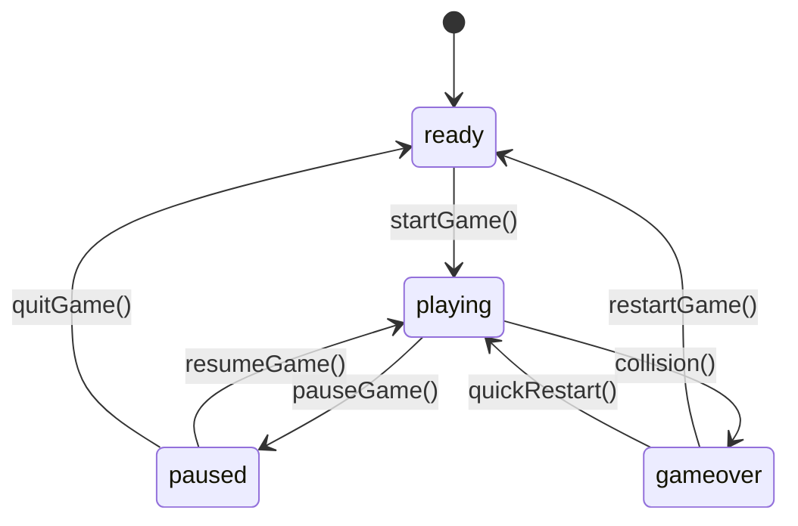

# Requirements Specification: 장애물 피하기 게임

## Meta
- 작성일: 2025-11-07
- 작성자: Portfolio Project
- 버전: 1.0
- 목적: 07번 State Management Frontend 에이전트 기반 설계

---

## 🎯 프로젝트 개요

### 비즈니스 목표
**포트폴리오 기술 역량 어필**:
- Frontend 상태 관리 전문성 증명
- 실시간 애플리케이션 구현 능력
- Vanilla JavaScript 고급 기술 활용
- 성능 최적화 및 메모리 관리 역량

### 기술적 목표
- **60FPS 안정적 유지**: 부드러운 게임 경험
- **실시간 상태 동기화**: UI와 게임 로직 완벽 연동
- **메모리 효율성**: 장시간 플레이 시에도 안정성 보장
- **확장 가능한 아키텍처**: 향후 기능 추가 용이

---

## 📋 기능 요구사항

### FR-001: 게임 상태 관리
**Priority**: Critical
**Complexity**: High

#### 상태 분류
```typescript
interface GameStates {
  // 핵심 게임 상태
  playState: 'ready' | 'playing' | 'paused' | 'gameover'

  // 진행 상태
  score: number        // 0 ~ 999,999
  level: number        // 1 ~ 99
  playTime: number     // 초 단위

  // 엔티티 상태
  player: PlayerState
  obstacles: ObstacleState[]

  // 시스템 상태
  performance: PerformanceMetrics
  input: InputState
}
```

#### 상태 전환 규칙


### FR-002: 실시간 플레이어 제어
**Priority**: Critical
**Complexity**: Medium

#### 입력 처리 요구사항
- **키보드 입력**: 방향키 (←, →, ↑, ↓)
- **마우스 제어**: 마우스 위치 따라 부드러운 이동
- **터치 제어**: 터치 위치로 즉시 이동
- **다중 입력**: 최신 입력 우선순위
- **입력 지연**: 16ms 이내 응답

#### 플레이어 상태
```typescript
interface PlayerState {
  position: { x: number, y: number }
  targetPosition: { x: number, y: number }
  velocity: { x: number, y: number }
  size: number
  speed: number
  hitbox: Rectangle
}
```

### FR-003: 동적 장애물 시스템
**Priority**: Critical
**Complexity**: High

#### 장애물 생성 규칙
- **생성 위치**: 화면 상단 랜덤 X 좌표
- **생성 빈도**: 레벨에 따라 동적 조정
  ```javascript
  spawnRate = BASE_RATE + (level - 1) * RATE_INCREASE
  maxSpawnRate = Math.min(spawnRate, MAX_RATE)
  ```
- **장애물 속도**: 레벨 진행에 따라 증가
- **최대 동시 존재**: 50개 제한 (성능 고려)

#### 장애물 상태
```typescript
interface ObstacleState {
  id: string           // 고유 식별자
  position: { x: number, y: number }
  velocity: { x: number, y: number }
  size: number
  type: 'normal' | 'fast' | 'large'
  hitbox: Rectangle
  isActive: boolean
}
```

### FR-004: 충돌 감지 시스템
**Priority**: Critical
**Complexity**: Medium

#### 성능 요구사항
- **감지 정확도**: 픽셀 단위 정밀 충돌
- **처리 시간**: 매 프레임 3ms 이내
- **최적화**: AABB + 공간 분할 알고리즘
- **즉시성**: 충돌 감지 즉시 게임 정지

#### 충돌 영역 정의
```typescript
interface CollisionArea {
  x: number
  y: number
  width: number
  height: number
}

interface CollisionResult {
  hasCollision: boolean
  collidedObject?: ObstacleState
  collisionPoint?: { x: number, y: number }
  collisionTime: number
}
```

### FR-005: 점수 및 레벨 시스템
**Priority**: Medium
**Complexity**: Low

#### 점수 계산
```javascript
// 시간 기반 점수
timeScore = playTime * SCORE_PER_SECOND  // 1초당 10점

// 레벨 보너스
levelBonus = Math.floor(level / 5) * 250  // 5레벨마다 250점

// 총 점수
totalScore = timeScore + levelBonus
```

#### 레벨 진행
- **레벨업 조건**: 30초마다 자동 레벨업
- **최대 레벨**: 99레벨
- **난이도 조정**: 레벨에 따른 장애물 속도/빈도 증가

### FR-006: UI 상태 관리
**Priority**: Medium
**Complexity**: Medium

#### UI 요소별 상태
- **점수 표시**: 실시간 업데이트, 애니메이션 효과
- **레벨 표시**: 레벨업 시 강조 애니메이션
- **시간 표시**: MM:SS 형식, 실시간 갱신
- **일시정지 메뉴**: 오버레이 상태, 투명도 조절
- **게임오버 화면**: 최종 결과, 신기록 여부

#### 반응형 요구사항
- **데스크톱**: 1920x1080 기준 최적화
- **태블릿**: 1024x768 대응
- **모바일**: 375x667 (iPhone SE) 이상 지원

---

## 🔧 비기능 요구사항

### NFR-001: 성능 요구사항
**Priority**: Critical

#### 프레임레이트 요구사항
- **목표 FPS**: 60 FPS 안정적 유지
- **최소 FPS**: 55 FPS (임계치)
- **프레임 드롭**: 연속 3프레임 이상 드롭 시 자동 최적화

#### 응답 시간 요구사항
| 작업 | 목표 시간 | 임계 시간 |
|------|-----------|-----------|
| 입력 처리 | < 16ms | < 20ms |
| 충돌 감지 | < 3ms | < 5ms |
| 렌더링 | < 8ms | < 12ms |
| 상태 업데이트 | < 2ms | < 4ms |

### NFR-002: 메모리 요구사항
**Priority**: High

#### 메모리 사용량
- **초기 할당**: < 10MB
- **최대 사용량**: < 50MB
- **가비지 컬렉션**: 5초마다 자동 정리
- **메모리 누수**: 1시간 플레이 시 증가량 < 5MB

#### 객체 관리
- **객체 풀링**: 장애물, 파티클 등 재사용
- **즉시 해제**: 화면 밖 객체 즉시 제거
- **참조 관리**: 순환 참조 방지

### NFR-003: 호환성 요구사항
**Priority**: Medium

#### 브라우저 호환성
- **Chrome**: 90+ (주 타겟)
- **Firefox**: 88+
- **Safari**: 14+
- **Edge**: 90+

#### 디바이스 호환성
- **데스크톱**: Windows, macOS, Linux
- **모바일**: iOS 14+, Android 8.0+
- **입력 방식**: 키보드, 마우스, 터치 전부 지원

### NFR-004: 확장성 요구사항
**Priority**: Medium

#### 아키텍처 확장성
- **모듈화**: 기능별 독립적 모듈 설계
- **플러그인**: 새로운 장애물 타입 쉽게 추가
- **테마**: 배경/캐릭터 변경 가능한 구조

#### 성능 확장성
- **동적 품질**: 성능에 따른 자동 품질 조절
- **렌더링 최적화**: 뷰포트 컬링, 더티 렌더링
- **배치 처리**: 다중 객체 일괄 처리

---

## 🏗️ 기술 아키텍처 요구사항

### TAR-001: 상태 관리 아키텍처
**Pattern**: Flux-like + Observer Pattern

#### 상태 관리 레이어
```typescript
// 1. State Store (Single Source of Truth)
class GameStateStore {
  private state: GameState
  private subscribers: Map<string, Function[]>

  getState(): GameState
  setState(newState: Partial<GameState>): void
  subscribe(key: string, callback: Function): void
}

// 2. Action Creators
class GameActions {
  static startGame(): Action
  static pauseGame(): Action
  static updateScore(points: number): Action
  static movePlayer(x: number, y: number): Action
}

// 3. Reducers (Pure Functions)
class GameReducers {
  static gameState(state: GameState, action: Action): GameState
  static playerState(state: PlayerState, action: Action): PlayerState
  static obstacleState(state: ObstacleState[], action: Action): ObstacleState[]
}
```

### TAR-002: 실시간 동기화 아키텍처

#### 게임 루프 설계
```typescript
class GameLoop {
  private targetFPS: 60
  private accumulator: 0
  private currentTime: number
  private frameTime: number = 1000 / 60

  // Fixed Timestep with Interpolation
  loop(timestamp: number): void {
    const deltaTime = timestamp - this.currentTime
    this.accumulator += deltaTime

    // Fixed timestep updates
    while (this.accumulator >= this.frameTime) {
      this.update(this.frameTime)
      this.accumulator -= this.frameTime
    }

    // Interpolated rendering
    const alpha = this.accumulator / this.frameTime
    this.render(alpha)

    requestAnimationFrame(this.loop.bind(this))
  }
}
```

### TAR-003: 메모리 관리 아키텍처

#### 객체 풀링 시스템
```typescript
interface PoolableObject {
  reset(): void
  isActive(): boolean
}

class ObjectPool<T extends PoolableObject> {
  private pool: T[] = []
  private active: Set<T> = new Set()
  private maxSize: number

  acquire(): T
  release(object: T): void
  cleanup(): void
}
```

---

## 🧪 테스트 요구사항

### TR-001: 단위 테스트
**Coverage**: 80% 이상

#### 테스트 대상
- **상태 관리 로직**: 모든 reducer 함수
- **충돌 감지**: 다양한 시나리오 커버
- **점수 계산**: 경계값 테스트
- **입력 처리**: 각 입력 타입별 검증

### TR-002: 성능 테스트
**Tool**: Jest + Performance API

#### 성능 메트릭 검증
```javascript
describe('Performance Tests', () => {
  test('60FPS 유지', () => {
    const frameTime = measureFrameTime()
    expect(frameTime).toBeLessThan(16.67)
  })

  test('메모리 사용량', () => {
    const memoryUsage = getMemoryUsage()
    expect(memoryUsage).toBeLessThan(50 * 1024 * 1024)
  })
})
```

### TR-003: 통합 테스트

#### E2E 테스트 시나리오
- **전체 게임 플레이**: 시작부터 게임오버까지
- **일시정지/재개**: 상태 일관성 확인
- **레벨업**: 난이도 조정 검증
- **충돌 처리**: 게임오버 플로우 확인

---

## 📊 검증 기준

### 성공 기준
- [ ] 60FPS 안정적 유지 (95% 시간)
- [ ] 입력 지연 16ms 이내
- [ ] 메모리 사용량 50MB 이하
- [ ] 모든 디바이스에서 동작
- [ ] 1시간 연속 플레이 안정성

### 품질 기준
- [ ] 코드 커버리지 80% 이상
- [ ] ESLint 규칙 100% 준수
- [ ] TypeScript 타입 안정성
- [ ] 브라우저 호환성 테스트 통과

### 사용자 경험 기준
- [ ] 로딩 시간 3초 이내
- [ ] 직관적 조작감
- [ ] 부드러운 애니메이션
- [ ] 반응형 디자인 완성도

---

## 🚀 구현 우선순위

### Phase 1: 핵심 상태 관리 (1주)
- 기본 게임 상태 구조 설계
- 상태 전환 로직 구현
- 간단한 플레이어 이동

### Phase 2: 게임 로직 (1주)
- 장애물 생성/이동 시스템
- 충돌 감지 알고리즘
- 점수/레벨 관리

### Phase 3: 성능 최적화 (1주)
- 60FPS 안정화
- 메모리 최적화
- 객체 풀링 구현

### Phase 4: UI/UX 완성 (3일)
- 반응형 UI
- 애니메이션 효과
- 접근성 개선

---

## 🎯 포트폴리오 어필 포인트

### 기술적 역량 증명
- **상태 관리 전문성**: Flux 패턴, 불변성, 상태 동기화
- **성능 최적화**: 60FPS, 메모리 관리, 렌더링 최적화
- **실시간 시스템**: 게임 루프, 충돌 감지, 입력 처리
- **아키텍처 설계**: 확장 가능한 구조, 모듈화

### 개발 프로세스 증명
- **요구사항 분석**: 체계적 문서화, 우선순위 설정
- **테스트 전략**: TDD, 성능 테스트, E2E 테스트
- **품질 관리**: 코드 리뷰, 정적 분석, 표준 준수

---

**🎯 최종 목표**: "Frontend 상태 관리와 실시간 애플리케이션 개발에 전문성을 가진 개발자"라는 인상을 주는 포트폴리오 완성