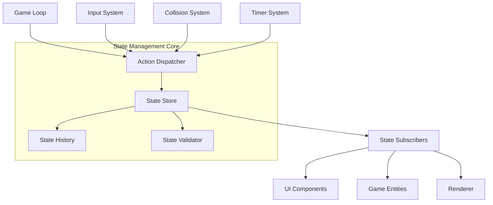

# State Management Design: 장애물 피하기 게임

## Meta
- 작성일: 2025-11-07
- 작성자: 07번 State Management Frontend 에이전트
- 버전: 1.0
- 아키텍처: Flux-like + Observer Pattern + Vanilla JavaScript

---

## 🎯 상태 관리 설계 목표

### 포트폴리오 어필 핵심
- **Frontend 상태 관리 전문성**: 복잡한 실시간 상태를 체계적으로 관리
- **성능 최적화 역량**: 60FPS 안정적 유지를 위한 상태 동기화
- **확장 가능한 아키텍처**: 향후 기능 추가를 고려한 설계
- **Vanilla JavaScript 고급 활용**: 프레임워크 없이 현대적 패턴 구현

### 기술적 목표
1. **Single Source of Truth**: 중앙집중식 상태 관리
2. **Predictable State Changes**: 일방향 데이터 플로우
3. **Time Travel Debugging**: 상태 변경 히스토리 추적
4. **Performance Optimization**: 불필요한 렌더링 방지

---

## 🏗️ 상태 관리 아키텍처

### 전체 구조도



### 핵심 컴포넌트

#### 1. State Store (상태 저장소)
```typescript
interface GameState {
  // 메타 상태
  gameStatus: 'ready' | 'playing' | 'paused' | 'gameover'
  sessionId: string
  timestamp: number

  // 게임 진행 상태
  score: number
  level: number
  playTime: number          // 밀리초
  lives: number

  // 엔티티 상태
  player: PlayerState
  obstacles: ObstacleState[]
  powerups: PowerupState[]

  // 시스템 상태
  input: InputState
  physics: PhysicsState
  rendering: RenderingState

  // 설정 상태
  settings: GameSettings

  // 성능 메트릭
  performance: PerformanceMetrics
}

interface PlayerState {
  id: string
  position: Vector2D
  targetPosition: Vector2D
  velocity: Vector2D
  size: number
  hitbox: Rectangle
  isInvincible: boolean
  invincibilityTimer: number
}

interface ObstacleState {
  id: string
  position: Vector2D
  velocity: Vector2D
  size: number
  type: 'normal' | 'fast' | 'large' | 'bouncing'
  hitbox: Rectangle
  spawnTime: number
  isActive: boolean
}
```

---

## 🔄 Flux-like 데이터 플로우

### Action-Reducer 패턴

#### Action Types
```typescript
enum ActionType {
  // 게임 제어
  GAME_START = 'GAME_START',
  GAME_PAUSE = 'GAME_PAUSE',
  GAME_RESUME = 'GAME_RESUME',
  GAME_OVER = 'GAME_OVER',
  GAME_RESTART = 'GAME_RESTART',

  // 플레이어 액션
  PLAYER_MOVE = 'PLAYER_MOVE',
  PLAYER_SET_TARGET = 'PLAYER_SET_TARGET',
  PLAYER_COLLISION = 'PLAYER_COLLISION',

  // 장애물 관리
  OBSTACLE_SPAWN = 'OBSTACLE_SPAWN',
  OBSTACLE_UPDATE = 'OBSTACLE_UPDATE',
  OBSTACLE_REMOVE = 'OBSTACLE_REMOVE',
  OBSTACLES_CLEANUP = 'OBSTACLES_CLEANUP',

  // 점수/레벨
  SCORE_UPDATE = 'SCORE_UPDATE',
  LEVEL_UP = 'LEVEL_UP',

  // 시스템
  FRAME_UPDATE = 'FRAME_UPDATE',
  PERFORMANCE_UPDATE = 'PERFORMANCE_UPDATE',
  SETTINGS_CHANGE = 'SETTINGS_CHANGE'
}

interface Action {
  type: ActionType
  payload?: any
  timestamp: number
  id: string
}
```

#### Action Creators
```typescript
class GameActions {
  static startGame(): Action {
    return {
      type: ActionType.GAME_START,
      payload: {
        sessionId: this.generateSessionId(),
        startTime: performance.now()
      },
      timestamp: performance.now(),
      id: this.generateId()
    }
  }

  static movePlayer(x: number, y: number): Action {
    return {
      type: ActionType.PLAYER_MOVE,
      payload: { x, y },
      timestamp: performance.now(),
      id: this.generateId()
    }
  }

  static spawnObstacle(obstacleData: Partial<ObstacleState>): Action {
    return {
      type: ActionType.OBSTACLE_SPAWN,
      payload: {
        ...obstacleData,
        id: this.generateId(),
        spawnTime: performance.now()
      },
      timestamp: performance.now(),
      id: this.generateId()
    }
  }

  static updateScore(points: number): Action {
    return {
      type: ActionType.SCORE_UPDATE,
      payload: { points },
      timestamp: performance.now(),
      id: this.generateId()
    }
  }

  private static generateId(): string {
    return `${Date.now()}-${Math.random().toString(36).substr(2, 9)}`
  }

  private static generateSessionId(): string {
    return `session-${Date.now()}-${Math.random().toString(36).substr(2, 6)}`
  }
}
```

### Reducer 함수들

#### 게임 상태 Reducer
```typescript
class GameStateReducer {
  static reduce(state: GameState, action: Action): GameState {
    switch (action.type) {
      case ActionType.GAME_START:
        return this.handleGameStart(state, action)

      case ActionType.GAME_PAUSE:
        return this.handleGamePause(state, action)

      case ActionType.GAME_RESUME:
        return this.handleGameResume(state, action)

      case ActionType.GAME_OVER:
        return this.handleGameOver(state, action)

      case ActionType.FRAME_UPDATE:
        return this.handleFrameUpdate(state, action)

      default:
        return state
    }
  }

  private static handleGameStart(state: GameState, action: Action): GameState {
    return {
      ...state,
      gameStatus: 'playing',
      sessionId: action.payload.sessionId,
      score: 0,
      level: 1,
      playTime: 0,
      player: this.createInitialPlayer(),
      obstacles: [],
      timestamp: action.timestamp
    }
  }

  private static handleGamePause(state: GameState, action: Action): GameState {
    if (state.gameStatus !== 'playing') return state

    return {
      ...state,
      gameStatus: 'paused',
      timestamp: action.timestamp
    }
  }

  private static handleFrameUpdate(state: GameState, action: Action): GameState {
    if (state.gameStatus !== 'playing') return state

    const deltaTime = action.timestamp - state.timestamp

    return {
      ...state,
      playTime: state.playTime + deltaTime,
      score: this.calculateScore(state, deltaTime),
      level: this.calculateLevel(state.playTime),
      timestamp: action.timestamp
    }
  }

  private static calculateScore(state: GameState, deltaTime: number): number {
    const SCORE_PER_MS = 0.01 // 1초당 10점
    const timeBonus = deltaTime * SCORE_PER_MS
    const levelMultiplier = 1 + (state.level - 1) * 0.1

    return Math.floor(state.score + timeBonus * levelMultiplier)
  }

  private static calculateLevel(playTime: number): number {
    const LEVEL_UP_INTERVAL = 30000 // 30초마다 레벨업
    return Math.min(Math.floor(playTime / LEVEL_UP_INTERVAL) + 1, 99)
  }
}
```

#### 플레이어 상태 Reducer
```typescript
class PlayerStateReducer {
  static reduce(state: PlayerState, action: Action, gameState: GameState): PlayerState {
    switch (action.type) {
      case ActionType.PLAYER_MOVE:
        return this.handlePlayerMove(state, action)

      case ActionType.PLAYER_SET_TARGET:
        return this.handleSetTarget(state, action)

      case ActionType.PLAYER_COLLISION:
        return this.handleCollision(state, action)

      case ActionType.FRAME_UPDATE:
        return this.handleFrameUpdate(state, action)

      default:
        return state
    }
  }

  private static handlePlayerMove(state: PlayerState, action: Action): PlayerState {
    const { x, y } = action.payload

    // 화면 경계 체크
    const clampedX = Math.max(0, Math.min(GAME_WIDTH - state.size, x))
    const clampedY = Math.max(0, Math.min(GAME_HEIGHT - state.size, y))

    return {
      ...state,
      position: { x: clampedX, y: clampedY }
    }
  }

  private static handleSetTarget(state: PlayerState, action: Action): PlayerState {
    const { x, y } = action.payload

    return {
      ...state,
      targetPosition: { x, y }
    }
  }

  private static handleFrameUpdate(state: PlayerState, action: Action): PlayerState {
    const deltaTime = action.payload?.deltaTime || 16.67

    // 부드러운 이동 (Linear Interpolation)
    const lerpFactor = Math.min(1, (PLAYER_SPEED * deltaTime) / 1000)

    const newX = this.lerp(state.position.x, state.targetPosition.x, lerpFactor)
    const newY = this.lerp(state.position.y, state.targetPosition.y, lerpFactor)

    // 속도 계산
    const velocityX = (newX - state.position.x) / deltaTime * 1000
    const velocityY = (newY - state.position.y) / deltaTime * 1000

    // 히트박스 업데이트
    const hitbox = {
      x: newX,
      y: newY,
      width: state.size,
      height: state.size
    }

    return {
      ...state,
      position: { x: newX, y: newY },
      velocity: { x: velocityX, y: velocityY },
      hitbox
    }
  }

  private static lerp(start: number, end: number, factor: number): number {
    return start + (end - start) * factor
  }
}
```

#### 장애물 상태 Reducer
```typescript
class ObstacleStateReducer {
  static reduce(state: ObstacleState[], action: Action, gameState: GameState): ObstacleState[] {
    switch (action.type) {
      case ActionType.OBSTACLE_SPAWN:
        return this.handleObstacleSpawn(state, action, gameState)

      case ActionType.OBSTACLE_UPDATE:
        return this.handleObstacleUpdate(state, action)

      case ActionType.OBSTACLE_REMOVE:
        return this.handleObstacleRemove(state, action)

      case ActionType.OBSTACLES_CLEANUP:
        return this.handleObstaclesCleanup(state, action)

      case ActionType.FRAME_UPDATE:
        return this.handleFrameUpdate(state, action, gameState)

      default:
        return state
    }
  }

  private static handleObstacleSpawn(
    state: ObstacleState[],
    action: Action,
    gameState: GameState
  ): ObstacleState[] {
    // 최대 장애물 수 체크
    if (state.length >= MAX_OBSTACLES) {
      return state
    }

    const newObstacle: ObstacleState = {
      id: action.payload.id,
      position: action.payload.position || this.getRandomSpawnPosition(),
      velocity: this.calculateObstacleVelocity(gameState.level),
      size: action.payload.size || this.getObstacleSize(gameState.level),
      type: action.payload.type || this.getRandomObstacleType(),
      hitbox: this.calculateHitbox(action.payload),
      spawnTime: action.timestamp,
      isActive: true
    }

    return [...state, newObstacle]
  }

  private static handleFrameUpdate(
    state: ObstacleState[],
    action: Action,
    gameState: GameState
  ): ObstacleState[] {
    const deltaTime = action.payload?.deltaTime || 16.67

    return state.map(obstacle => {
      if (!obstacle.isActive) return obstacle

      // 위치 업데이트
      const newY = obstacle.position.y + obstacle.velocity.y * deltaTime / 1000

      // 화면 밖으로 나간 장애물 비활성화
      if (newY > GAME_HEIGHT + 50) {
        return { ...obstacle, isActive: false }
      }

      // 히트박스 업데이트
      const hitbox = {
        x: obstacle.position.x,
        y: newY,
        width: obstacle.size,
        height: obstacle.size
      }

      return {
        ...obstacle,
        position: { ...obstacle.position, y: newY },
        hitbox
      }
    }).filter(obstacle => obstacle.isActive) // 비활성 장애물 제거
  }

  private static getRandomSpawnPosition(): Vector2D {
    return {
      x: Math.random() * (GAME_WIDTH - 40), // 40은 기본 장애물 크기
      y: -40 // 화면 위에서 시작
    }
  }

  private static calculateObstacleVelocity(level: number): Vector2D {
    const baseSpeed = 100 // 픽셀/초
    const speedIncrease = level * 10

    return {
      x: 0,
      y: baseSpeed + speedIncrease
    }
  }
}
```

---

## 🏪 State Store 구현

### 중앙 상태 저장소
```typescript
class GameStateStore {
  private state: GameState
  private subscribers: Map<string, Set<StateSubscriber>>
  private history: StateHistoryEntry[]
  private maxHistorySize: number = 100

  constructor(initialState: GameState) {
    this.state = this.deepClone(initialState)
    this.subscribers = new Map()
    this.history = []
  }

  // 상태 조회
  getState(): GameState {
    return this.deepClone(this.state)
  }

  // 상태 업데이트 (불변성 보장)
  dispatch(action: Action): void {
    const prevState = this.deepClone(this.state)

    // Reducer 실행
    const newState = this.executeReducers(this.state, action)

    // 상태 검증
    if (!this.validateState(newState)) {
      console.error('Invalid state transition detected:', { action, prevState, newState })
      return
    }

    // 히스토리 저장
    this.addToHistory(prevState, action, newState)

    // 상태 업데이트
    this.state = newState

    // 구독자 알림
    this.notifySubscribers(prevState, newState, action)
  }

  // 구독 관리
  subscribe(key: string, subscriber: StateSubscriber): () => void {
    if (!this.subscribers.has(key)) {
      this.subscribers.set(key, new Set())
    }

    this.subscribers.get(key)!.add(subscriber)

    // 구독 해제 함수 반환
    return () => {
      this.subscribers.get(key)?.delete(subscriber)
    }
  }

  // Reducer 실행
  private executeReducers(state: GameState, action: Action): GameState {
    let newState = { ...state }

    // 각 도메인별 Reducer 실행
    newState = GameStateReducer.reduce(newState, action)

    if (newState.player) {
      newState.player = PlayerStateReducer.reduce(newState.player, action, newState)
    }

    newState.obstacles = ObstacleStateReducer.reduce(newState.obstacles, action, newState)

    return newState
  }

  // 상태 검증
  private validateState(state: GameState): boolean {
    // 기본 타입 체크
    if (typeof state.score !== 'number' || state.score < 0) return false
    if (typeof state.level !== 'number' || state.level < 1 || state.level > 99) return false

    // 플레이어 위치 체크
    if (state.player) {
      const p = state.player.position
      if (p.x < -100 || p.x > GAME_WIDTH + 100 || p.y < -100 || p.y > GAME_HEIGHT + 100) {
        return false
      }
    }

    // 장애물 개수 체크
    if (state.obstacles.length > MAX_OBSTACLES) return false

    return true
  }

  // 구독자 알림
  private notifySubscribers(
    prevState: GameState,
    newState: GameState,
    action: Action
  ): void {
    this.subscribers.forEach((subscribers, key) => {
      // 해당 키의 상태가 변경된 경우만 알림
      if (this.hasStateChanged(prevState, newState, key)) {
        subscribers.forEach(subscriber => {
          try {
            subscriber.onStateChange(newState, prevState, action, key)
          } catch (error) {
            console.error(`Subscriber error for key ${key}:`, error)
          }
        })
      }
    })
  }

  // 상태 변경 감지
  private hasStateChanged(prevState: GameState, newState: GameState, key: string): boolean {
    switch (key) {
      case 'score':
        return prevState.score !== newState.score
      case 'level':
        return prevState.level !== newState.level
      case 'player':
        return !this.deepEqual(prevState.player, newState.player)
      case 'obstacles':
        return !this.deepEqual(prevState.obstacles, newState.obstacles)
      case 'gameStatus':
        return prevState.gameStatus !== newState.gameStatus
      default:
        return true // 알 수 없는 키는 항상 변경된 것으로 처리
    }
  }

  // 히스토리 관리
  private addToHistory(
    prevState: GameState,
    action: Action,
    newState: GameState
  ): void {
    const entry: StateHistoryEntry = {
      timestamp: action.timestamp,
      action: action,
      prevState: this.deepClone(prevState),
      newState: this.deepClone(newState)
    }

    this.history.push(entry)

    // 히스토리 크기 제한
    if (this.history.length > this.maxHistorySize) {
      this.history.shift()
    }
  }

  // Time Travel Debugging
  getHistory(): StateHistoryEntry[] {
    return [...this.history]
  }

  replayAction(actionId: string): void {
    const entry = this.history.find(h => h.action.id === actionId)
    if (entry) {
      this.dispatch(entry.action)
    }
  }

  // 유틸리티 메서드
  private deepClone<T>(obj: T): T {
    return JSON.parse(JSON.stringify(obj))
  }

  private deepEqual(a: any, b: any): boolean {
    return JSON.stringify(a) === JSON.stringify(b)
  }
}
```

---

## 🔔 Observer Pattern 구현

### 상태 구독자 인터페이스
```typescript
interface StateSubscriber {
  onStateChange(
    newState: GameState,
    prevState: GameState,
    action: Action,
    key: string
  ): void
}

interface StateHistoryEntry {
  timestamp: number
  action: Action
  prevState: GameState
  newState: GameState
}
```

### 도메인별 구독자 구현

#### UI 구독자
```typescript
class UISubscriber implements StateSubscriber {
  constructor(private uiElements: UIElements) {}

  onStateChange(newState: GameState, prevState: GameState, action: Action, key: string): void {
    switch (key) {
      case 'score':
        this.updateScoreDisplay(newState.score, prevState.score)
        break

      case 'level':
        this.updateLevelDisplay(newState.level, prevState.level)
        break

      case 'gameStatus':
        this.updateGameStatusUI(newState.gameStatus, prevState.gameStatus)
        break

      case 'playTime':
        this.updateTimeDisplay(newState.playTime)
        break
    }
  }

  private updateScoreDisplay(newScore: number, prevScore: number): void {
    const scoreElement = this.uiElements.score

    // 점수 애니메이션 효과
    if (newScore > prevScore) {
      scoreElement.textContent = newScore.toLocaleString()
      scoreElement.classList.add('score-increase')

      setTimeout(() => {
        scoreElement.classList.remove('score-increase')
      }, 300)
    }
  }

  private updateLevelDisplay(newLevel: number, prevLevel: number): void {
    const levelElement = this.uiElements.level

    // 레벨업 애니메이션
    if (newLevel > prevLevel) {
      levelElement.textContent = `Level ${newLevel}`
      levelElement.classList.add('level-up')

      // 레벨업 알림 표시
      this.showLevelUpNotification(newLevel)

      setTimeout(() => {
        levelElement.classList.remove('level-up')
      }, 1000)
    }
  }

  private updateGameStatusUI(newStatus: GameStatus, prevStatus: GameStatus): void {
    const gameContainer = this.uiElements.gameContainer

    // 상태별 UI 업데이트
    gameContainer.className = `game-container game-${newStatus}`

    switch (newStatus) {
      case 'paused':
        this.showPauseOverlay()
        break
      case 'gameover':
        this.showGameOverScreen()
        break
      case 'playing':
        this.hidePauseOverlay()
        this.hideGameOverScreen()
        break
    }
  }
}
```

#### 렌더링 구독자
```typescript
class RenderingSubscriber implements StateSubscriber {
  constructor(private renderer: GameRenderer) {}

  onStateChange(newState: GameState, prevState: GameState, action: Action, key: string): void {
    switch (key) {
      case 'player':
        this.renderer.invalidatePlayer()
        break

      case 'obstacles':
        this.renderer.invalidateObstacles()
        break

      case 'gameStatus':
        if (newState.gameStatus === 'paused') {
          this.renderer.pauseAnimations()
        } else if (newState.gameStatus === 'playing' && prevState.gameStatus === 'paused') {
          this.renderer.resumeAnimations()
        }
        break
    }
  }
}
```

#### 성능 모니터링 구독자
```typescript
class PerformanceSubscriber implements StateSubscriber {
  private frameCount: number = 0
  private lastFPSCheck: number = performance.now()
  private fpsHistory: number[] = []

  onStateChange(newState: GameState, prevState: GameState, action: Action, key: string): void {
    if (action.type === ActionType.FRAME_UPDATE) {
      this.updatePerformanceMetrics(action.timestamp)
    }
  }

  private updatePerformanceMetrics(timestamp: number): void {
    this.frameCount++

    // 1초마다 FPS 계산
    if (timestamp - this.lastFPSCheck >= 1000) {
      const fps = this.frameCount
      this.fpsHistory.push(fps)

      // 성능 경고
      if (fps < 55) {
        console.warn(`Low FPS detected: ${fps}`)
        this.triggerPerformanceOptimization()
      }

      // 히스토리 크기 제한
      if (this.fpsHistory.length > 60) {
        this.fpsHistory.shift()
      }

      this.frameCount = 0
      this.lastFPSCheck = timestamp
    }
  }

  private triggerPerformanceOptimization(): void {
    // 성능 최적화 액션 디스패치
    store.dispatch({
      type: ActionType.PERFORMANCE_UPDATE,
      payload: { enableOptimization: true },
      timestamp: performance.now(),
      id: generateId()
    })
  }
}
```

---

## ⚡ 성능 최적화 패턴

### 1. 불필요한 상태 업데이트 방지

#### 상태 비교 최적화
```typescript
class StateComparator {
  private static cache = new Map<string, any>()

  static hasChanged(key: string, newValue: any): boolean {
    const cachedValue = this.cache.get(key)

    if (this.deepEqual(cachedValue, newValue)) {
      return false
    }

    this.cache.set(key, this.deepClone(newValue))
    return true
  }

  // 얕은 비교 (성능 최적화)
  static hasChangedShallow(key: string, newValue: any): boolean {
    const cachedValue = this.cache.get(key)

    if (cachedValue === newValue) {
      return false
    }

    this.cache.set(key, newValue)
    return true
  }
}
```

#### 배치 업데이트
```typescript
class BatchedDispatcher {
  private pendingActions: Action[] = []
  private isDispatching = false

  dispatch(action: Action): void {
    this.pendingActions.push(action)

    if (!this.isDispatching) {
      this.scheduleDispatch()
    }
  }

  private scheduleDispatch(): void {
    this.isDispatching = true

    requestAnimationFrame(() => {
      const actions = [...this.pendingActions]
      this.pendingActions = []

      // 액션 타입별 그룹화
      const groupedActions = this.groupActionsByType(actions)

      // 그룹별 일괄 처리
      groupedActions.forEach(group => {
        if (group.length > 1) {
          this.dispatchBatchAction(group)
        } else {
          store.dispatch(group[0])
        }
      })

      this.isDispatching = false
    })
  }

  private groupActionsByType(actions: Action[]): Action[][] {
    const groups = new Map<ActionType, Action[]>()

    actions.forEach(action => {
      if (!groups.has(action.type)) {
        groups.set(action.type, [])
      }
      groups.get(action.type)!.push(action)
    })

    return Array.from(groups.values())
  }
}
```

### 2. 메모리 최적화

#### 참조 관리
```typescript
class ReferenceManager {
  private static refs = new WeakMap<object, string>()

  static trackObject(obj: object, id: string): void {
    this.refs.set(obj, id)
  }

  static cleanup(): void {
    // WeakMap은 자동 가비지 컬렉션되므로 명시적 정리 불필요
    // 하지만 순환 참조 방지를 위한 추가 정리 작업 수행
  }
}
```

#### 객체 풀링과 상태 관리 통합
```typescript
class StateAwareObjectPool<T extends { reset(): void }> {
  private pool: T[] = []
  private active: Set<T> = new Set()

  constructor(
    private createFn: () => T,
    private store: GameStateStore
  ) {
    // 상태 변화에 따른 자동 정리
    this.store.subscribe('obstacles', () => {
      this.autoCleanup()
    })
  }

  acquire(): T {
    let obj = this.pool.pop()

    if (!obj) {
      obj = this.createFn()
    }

    this.active.add(obj)
    return obj
  }

  release(obj: T): void {
    if (this.active.has(obj)) {
      obj.reset()
      this.active.delete(obj)
      this.pool.push(obj)
    }
  }

  private autoCleanup(): void {
    const currentState = this.store.getState()

    // 화면 밖 객체 자동 해제
    this.active.forEach(obj => {
      if (this.shouldRelease(obj, currentState)) {
        this.release(obj)
      }
    })
  }

  private shouldRelease(obj: T, state: GameState): boolean {
    // 구현에 따라 해제 조건 결정
    return false
  }
}
```

---

## 🧪 테스트 전략

### 단위 테스트

#### Reducer 테스트
```typescript
describe('GameStateReducer', () => {
  test('GAME_START 액션 처리', () => {
    const initialState = createInitialGameState()
    const action = GameActions.startGame()

    const newState = GameStateReducer.reduce(initialState, action)

    expect(newState.gameStatus).toBe('playing')
    expect(newState.score).toBe(0)
    expect(newState.level).toBe(1)
  })

  test('점수 계산 정확성', () => {
    const state = {
      ...createInitialGameState(),
      gameStatus: 'playing' as const,
      score: 100,
      level: 3,
      timestamp: 1000
    }

    const action = {
      type: ActionType.FRAME_UPDATE,
      payload: {},
      timestamp: 2000, // 1초 경과
      id: 'test-id'
    }

    const newState = GameStateReducer.reduce(state, action)

    // 1초 * 10점/초 * 레벨보너스(1.2) = 12점 증가
    expect(newState.score).toBe(112)
  })
})
```

#### Store 통합 테스트
```typescript
describe('GameStateStore Integration', () => {
  let store: GameStateStore
  let subscriber: jest.Mock

  beforeEach(() => {
    store = new GameStateStore(createInitialGameState())
    subscriber = jest.fn()
    store.subscribe('score', { onStateChange: subscriber })
  })

  test('액션 디스패치 및 구독자 알림', () => {
    const action = GameActions.updateScore(50)

    store.dispatch(action)

    expect(subscriber).toHaveBeenCalledWith(
      expect.objectContaining({ score: 50 }),
      expect.objectContaining({ score: 0 }),
      action,
      'score'
    )
  })

  test('상태 히스토리 추적', () => {
    store.dispatch(GameActions.startGame())
    store.dispatch(GameActions.updateScore(100))

    const history = store.getHistory()

    expect(history).toHaveLength(2)
    expect(history[0].action.type).toBe(ActionType.GAME_START)
    expect(history[1].action.type).toBe(ActionType.SCORE_UPDATE)
  })
})
```

### 성능 테스트

#### 프레임레이트 테스트
```typescript
describe('Performance Tests', () => {
  test('60FPS 상태 업데이트 성능', async () => {
    const store = new GameStateStore(createInitialGameState())
    const frameCount = 300 // 5초간
    const startTime = performance.now()

    for (let i = 0; i < frameCount; i++) {
      store.dispatch({
        type: ActionType.FRAME_UPDATE,
        payload: { deltaTime: 16.67 },
        timestamp: startTime + i * 16.67,
        id: `frame-${i}`
      })
    }

    const endTime = performance.now()
    const avgFrameTime = (endTime - startTime) / frameCount

    expect(avgFrameTime).toBeLessThan(1) // 1ms 이내로 처리
  })

  test('메모리 사용량 안정성', () => {
    const store = new GameStateStore(createInitialGameState())
    const initialMemory = (performance as any).memory?.usedJSHeapSize

    // 1000번의 장애물 생성/제거
    for (let i = 0; i < 1000; i++) {
      store.dispatch(GameActions.spawnObstacle({}))
      if (i % 10 === 0) {
        store.dispatch({
          type: ActionType.OBSTACLES_CLEANUP,
          payload: {},
          timestamp: performance.now(),
          id: `cleanup-${i}`
        })
      }
    }

    const finalMemory = (performance as any).memory?.usedJSHeapSize
    const memoryIncrease = finalMemory - initialMemory

    expect(memoryIncrease).toBeLessThan(5 * 1024 * 1024) // 5MB 미만
  })
})
```

---

## 📊 모니터링 및 디버깅

### 상태 변경 로깅
```typescript
class StateLogger {
  private isEnabled: boolean = process.env.NODE_ENV === 'development'

  logStateChange(
    action: Action,
    prevState: GameState,
    newState: GameState
  ): void {
    if (!this.isEnabled) return

    const changes = this.detectChanges(prevState, newState)

    console.group(`🎮 Action: ${action.type}`)
    console.log('📥 Action:', action)
    console.log('📊 State Changes:', changes)
    console.log('⏱️ Performance:', {
      timestamp: action.timestamp,
      frameTime: this.calculateFrameTime(action)
    })
    console.groupEnd()
  }

  private detectChanges(prev: GameState, next: GameState): object {
    const changes: any = {}

    Object.keys(next).forEach(key => {
      if (JSON.stringify((prev as any)[key]) !== JSON.stringify((next as any)[key])) {
        changes[key] = {
          from: (prev as any)[key],
          to: (next as any)[key]
        }
      }
    })

    return changes
  }
}
```

### Redux DevTools 호환 인터페이스
```typescript
class DevToolsIntegration {
  private devTools: any

  constructor(store: GameStateStore) {
    if (typeof window !== 'undefined' && (window as any).__REDUX_DEVTOOLS_EXTENSION__) {
      this.devTools = (window as any).__REDUX_DEVTOOLS_EXTENSION__.connect({
        name: 'Obstacle Avoidance Game'
      })

      this.setupDevTools(store)
    }
  }

  private setupDevTools(store: GameStateStore): void {
    // 상태 변경을 DevTools에 전송
    store.subscribe('*', {
      onStateChange: (newState, prevState, action) => {
        if (this.devTools) {
          this.devTools.send(action, newState)
        }
      }
    })

    // DevTools에서 액션 수신
    this.devTools.subscribe((message: any) => {
      if (message.type === 'DISPATCH' && message.payload) {
        switch (message.payload.type) {
          case 'JUMP_TO_ACTION':
          case 'JUMP_TO_STATE':
            // Time Travel 기능 구현
            this.handleTimeTravel(message.payload)
            break
        }
      }
    })
  }

  private handleTimeTravel(payload: any): void {
    // Time Travel 디버깅 구현
    const targetState = payload.state
    // 상태 복원 로직
  }
}
```

---

## 🎯 최종 구현 체크리스트

### 핵심 기능
- [ ] **Single Source of Truth**: 중앙 집중식 상태 관리
- [ ] **Immutable Updates**: 불변성 보장된 상태 변경
- [ ] **Predictable Flow**: 액션 → 리듀서 → 상태 → UI 순서
- [ ] **Time Travel**: 상태 히스토리 추적 및 재생

### 성능 최적화
- [ ] **Batched Updates**: 프레임별 배치 업데이트
- [ ] **Selective Updates**: 변경된 부분만 업데이트
- [ ] **Memory Management**: 객체 풀링 + 참조 관리
- [ ] **60FPS Stability**: 안정적 프레임레이트 유지

### 확장성
- [ ] **Modular Architecture**: 도메인별 모듈 분리
- [ ] **Plugin System**: 새로운 기능 쉽게 추가
- [ ] **Type Safety**: TypeScript 타입 시스템 활용
- [ ] **Testing Coverage**: 80% 이상 테스트 커버리지

### 개발 경험
- [ ] **DevTools Integration**: Redux DevTools 호환
- [ ] **State Logging**: 개발 모드 상태 로깅
- [ ] **Error Boundary**: 상태 오류 복구 메커니즘
- [ ] **Performance Monitoring**: 실시간 성능 모니터링

---

**🎯 최종 목표**: "복잡한 실시간 애플리케이션의 상태를 체계적이고 효율적으로 관리할 수 있는 Frontend 개발자"라는 인상을 주는 포트폴리오 완성