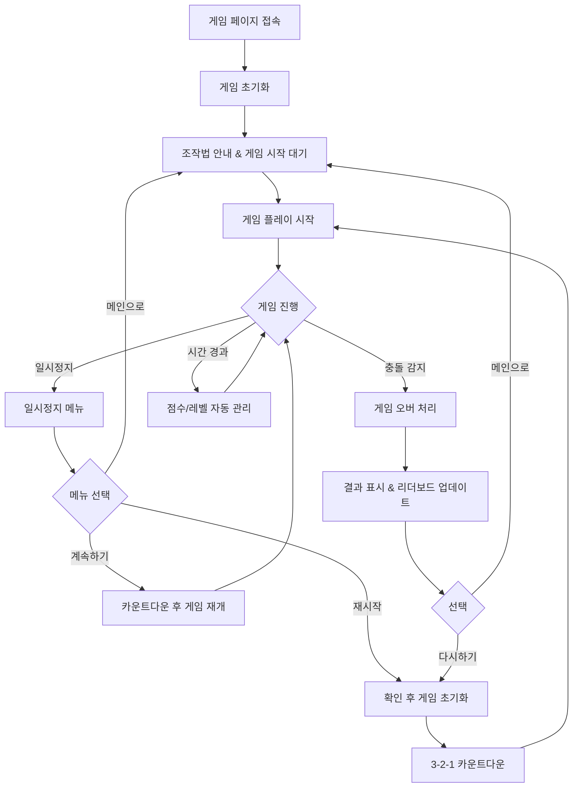

# User Flow: 장애물 피하기 게임

## Meta
- 작성일: 2025-11-07
- 작성자: Portfolio Project
- 버전: 1.0

---

## 목차
1. [게임 초기화](#기능-게임-초기화)
2. [게임 플레이](#기능-게임-플레이)
3. [일시정지 기능](#기능-일시정지-기능)
4. [점수/레벨 관리](#기능-점수레벨-관리)
5. [게임 오버 처리](#기능-게임-오버-처리)
6. [최고점수 리더보드](#기능-최고점수-리더보드)
7. [게임 재시작](#기능-게임-재시작)

---

## 기능: 게임 초기화

### 1. 입력 (User Actions)
- **트리거**: 게임 페이지 접속 또는 브라우저 새로고침
- **입력 데이터**: 없음 (자동 실행)

### 2. 처리 (System Logic)
**정상 플로우**:
1. 게임 리소스 로딩 (이미지, 스크립트)
2. 캔버스 초기화 및 화면 크기 감지
3. LocalStorage에서 최고점수 불러오기
4. 조작법 안내 화면 표시
5. "게임 시작" 버튼 활성화

**예외 처리**:
- 리소스 로딩 실패 → "게임을 불러올 수 없습니다. 새로고침해주세요" 메시지
- LocalStorage 접근 실패 → 최고점수 0으로 초기화, 경고 없이 진행
- 화면 크기 너무 작음 → "화면을 확대하거나 세로 모드로 전환해주세요" 안내

### 3. 출력 (User Feedback)
**성공 시**:
- **UI**: 조작법 안내 오버레이 표시 (키보드/마우스/터치 모든 방법 포함), "게임 시작" 버튼, 최고점수 상단 헤더에 표시
- **사이드이펙트**: 게임 상태를 "ready"로 설정

**실패 시**:
- **UI**: 에러 메시지와 "새로고침" 버튼
- **복구 경로**: 새로고침 버튼 클릭 또는 수동 새로고침

### 엣지케이스 체크리스트
- [x] **중복 데이터**: N/A
- [x] **네트워크 오류**: CDN 리소스 로딩 실패 처리
- [x] **입력 검증 실패**: N/A (사용자 입력 없음)
- [x] **권한 부족**: LocalStorage 접근 권한 없음
- [x] **동시성 이슈**: 여러 탭에서 동시 실행 (각각 독립적으로 처리)

---

## 기능: 게임 플레이

### 1. 입력 (User Actions)
- **트리거**: "게임 시작" 버튼 클릭 또는 재시작
- **입력 데이터**:
  - 키보드: 방향키 (←, →, ↑, ↓)
  - 마우스: 마우스 이동 (캐릭터가 마우스 위치 따라감)
  - 터치: 터치 위치 (캐릭터가 터치 위치로 이동)

### 2. 처리 (System Logic)
**정상 플로우**:
1. 게임 루프 시작 (60FPS)
2. 캐릭터 위치 업데이트 (입력에 따른 이동, 고정 속도)
3. 장애물 생성 및 이동 (랜덤 위치에서 하강, 레벨에 따라 생성 빈도 증가)
4. 충돌 감지 (캐릭터 vs 장애물)
5. 점수 증가 (시간 기반)
6. 레벨 체크 및 난이도 조정
7. 화면 렌더링 (캐릭터, 장애물, UI)

**예외 처리**:
- 캐릭터 화면 밖 이동 → 화면 경계로 위치 제한
- 프레임 드롭 발생 → 게임 속도 자동 조정
- 메모리 부족 → 불필요한 장애물 객체 제거

### 3. 출력 (User Feedback)
**성공 시**:
- **UI**: 실시간 점수/시간 표시, 레벨 표시, 부드러운 애니메이션
- **사이드이펙트**: 게임 상태 "playing"으로 설정, 배경음 재생(선택)

**실패 시 (충돌 감지)**:
- **UI**: 게임 일시정지, 게임오버 화면으로 전환
- **복구 경로**: 게임오버 처리 기능으로 이동

### 엣지케이스 체크리스트
- [x] **중복 데이터**: 동일한 위치에 장애물 중복 생성 방지
- [x] **네트워크 오류**: N/A (오프라인 게임)
- [x] **입력 검증 실패**: 잘못된 키 입력 무시
- [x] **권한 부족**: N/A
- [x] **동시성 이슈**: 동시 다중 입력 처리 (마우스+키보드)

---

## 기능: 일시정지 기능

### 1. 입력 (User Actions)
- **트리거**: 스페이스바 또는 ESC 키 또는 "일시정지" 버튼 클릭
- **입력 데이터**: 없음 (토글 방식)

### 2. 처리 (System Logic)
**정상 플로우**:
1. 현재 게임 상태 확인 (playing/paused)
2. 게임 루프 일시정지/재개
3. 장애물 이동 및 생성 중단/재시작
4. 점수 증가 중단/재시작
5. 일시정지 오버레이 표시/숨김

**예외 처리**:
- 게임오버 상태에서 일시정지 시도 → 무시
- 게임 초기화 중 일시정지 시도 → 무시
- 연속적인 키 입력 → 디바운싱 처리 (0.2초 간격)

### 3. 출력 (User Feedback)
**성공 시 (일시정지)**:
- **UI**: 반투명 오버레이, "일시정지" 텍스트, "계속하기" 버튼, "재시작" 및 "메인으로" 메뉴 버튼, 현재 점수/레벨 표시
- **사이드이펙트**: 배경음 음소거, 게임 상태 "paused"로 설정

**성공 시 (재개)**:
- **UI**: 오버레이 제거, 3-2-1 카운트다운 표시 후 게임 재개
- **사이드이펙트**: 배경음 재시작, 게임 상태 "playing"으로 설정

**실패 시**:
- **UI**: 변화 없음 (무시된 입력)
- **복구 경로**: N/A

### 엣지케이스 체크리스트
- [x] **중복 데이터**: N/A
- [x] **네트워크 오류**: N/A
- [x] **입력 검증 실패**: 잘못된 상태에서 일시정지 시도
- [x] **권한 부족**: N/A
- [x] **동시성 이슈**: 빠른 연속 일시정지/재개 입력

---

## 기능: 점수/레벨 관리

### 1. 입력 (User Actions)
- **트리거**: 게임 플레이 중 자동 실행 (시간 경과)
- **입력 데이터**:
  - 게임 경과 시간 (자동)
  - 현재 생존 상태 (자동)

### 2. 처리 (System Logic)
**정상 플로우**:
1. 매 프레임마다 경과 시간 계산
2. 시간 기반 점수 증가 (1초당 10점)
3. 레벨 진행도 계산 (30초마다 레벨업)
4. 레벨에 따른 난이도 조정:
   - 장애물 생성 빈도 증가
   - 장애물 낙하 속도 증가
5. 레벨업 시 보너스 점수 추가 (레벨 × 100점)

**예외 처리**:
- 정수 오버플로우 → 점수 상한선 999,999로 제한
- 레벨 상한선 → 최대 레벨 99로 제한
- 시간 계산 오류 → 이전 값 유지 및 경고 로그

### 3. 출력 (User Feedback)
**성공 시**:
- **UI**: 실시간 점수 표시 (우상단), 현재 레벨 표시, 다음 레벨까지 진행바
- **사이드이펙트**: 레벨업 시 화면 효과, 알림음, 난이도 자동 조정

**레벨업 시**:
- **UI**: "LEVEL UP!" 애니메이션, 보너스 점수 표시, 다음 레벨 안내 메시지
- **복구 경로**: N/A (실시간 자동 처리)

### 엣지케이스 체크리스트
- [x] **중복 데이터**: 동일 프레임에서 중복 점수 증가 방지
- [x] **네트워크 오류**: N/A (로컬 계산)
- [x] **입력 검증 실패**: 음수 시간 값 처리
- [x] **권한 부족**: N/A
- [x] **동시성 이슈**: 일시정지 중 점수 증가 중단

---

## 기능: 게임 오버 처리

### 1. 입력 (User Actions)
- **트리거**: 캐릭터와 장애물 충돌 감지 (자동)
- **입력 데이터**:
  - 충돌 발생 시점의 점수
  - 충돌 발생 시점의 레벨
  - 게임 플레이 시간

### 2. 처리 (System Logic)
**정상 플로우**:
1. 충돌 감지 시 즉시 게임 루프 중단
2. 충돌한 장애물 강조 표시
3. 최종 점수 및 게임 시간 기록
4. 최고점수와 비교 (신기록 여부 확인)
5. LocalStorage에 최고점수 및 플레이 통계 저장 (총 게임 횟수, 총 플레이 시간 포함)
6. 게임 결과 데이터 준비
7. 게임오버 화면 표시

**예외 처리**:
- LocalStorage 저장 실패 → 세션 메모리에만 저장, 경고 없이 진행
- 점수 데이터 손상 → 0점으로 처리
- 화면 렌더링 실패 → 텍스트 기반 결과 표시

### 3. 출력 (User Feedback)
**성공 시**:
- **UI**:
  - "GAME OVER" 메시지
  - 충돌한 장애물 강조 표시
  - 최종 점수, 도달 레벨, 플레이 시간 표시
  - 신기록 시 "NEW RECORD!" 애니메이션
  - "다시하기" 및 "메인으로" 버튼
- **사이드이펙트**: 게임 상태 "gameover"로 설정, 충돌 효과음

**신기록 달성 시**:
- **UI**: 축하 애니메이션, 기존 기록 vs 신기록 비교 표시
- **복구 경로**: "다시하기"로 즉시 재도전 또는 "메인으로" 복귀

### 엣지케이스 체크리스트
- [x] **중복 데이터**: 동시 다중 충돌 감지 → 첫 번째만 처리
- [x] **네트워크 오류**: N/A (로컬 저장)
- [x] **입력 검증 실패**: 음수 점수/시간 처리
- [x] **권한 부족**: LocalStorage 접근 실패
- [x] **동시성 이슈**: 게임오버 중 추가 입력 무시

---

## 기능: 최고점수 리더보드

### 1. 입력 (User Actions)
- **트리거**:
  - 게임 초기화 시 자동 로딩
  - 게임오버 후 신기록 저장
  - "기록 보기" 버튼 클릭 (선택)
- **입력 데이터**:
  - 신기록 달성 시: 점수, 레벨, 플레이 시간, 달성 날짜

### 2. 처리 (System Logic)
**정상 플로우**:
1. LocalStorage에서 기존 기록 불러오기
2. 신기록 시 기록 목록에 추가
3. 점수 기준 내림차순 정렬
4. 상위 5개 기록만 유지 (저장 용량 최적화)
5. 플레이 통계 업데이트:
   - 총 게임 횟수
   - 총 플레이 시간
   - 평균 점수
6. 화면에 리더보드 표시

**예외 처리**:
- LocalStorage 접근 실패 → 임시 메모리 저장소 사용
- 손상된 기록 데이터 → 기본값으로 초기화
- 저장 용량 부족 → 오래된 기록부터 삭제

### 3. 출력 (User Feedback)
**성공 시**:
- **UI**:
  - 상위 5개 기록 테이블 (순위, 점수, 레벨, 날짜)
  - 현재 기록 강조 표시 (신기록 시)
  - 플레이 통계 요약 (총 횟수, 평균 점수)
  - "기록 삭제" 버튼 (전체 초기화, 확인 대화상자 포함)
- **사이드이펙트**: 기록 데이터 영구 저장

**기록 없음 시**:
- **UI**: "아직 기록이 없습니다" 메시지, 게임 시작 유도
- **복구 경로**: "첫 게임 시작하기" 버튼

### 엣지케이스 체크리스트
- [x] **중복 데이터**: 동일한 점수의 기록 → 최신 기록으로 교체
- [x] **네트워크 오류**: N/A (로컬 저장)
- [x] **입력 검증 실패**: 잘못된 날짜/점수 형식
- [x] **권한 부족**: LocalStorage 쓰기 권한 없음
- [x] **동시성 이슈**: 여러 탭에서 동시 기록 업데이트

---

## 기능: 게임 재시작

### 1. 입력 (User Actions)
- **트리거**:
  - "다시하기" 버튼 클릭 (게임오버 화면)
  - "재시작" 버튼 클릭 (일시정지 메뉴)
  - "새 게임" 버튼 클릭 (메인 화면)
- **입력 데이터**: 없음 (상태 리셋)

### 2. 처리 (System Logic)
**정상 플로우**:
1. 현재 게임 상태 확인 및 정리
2. 진행 중인 게임의 경우 확인 대화상자 표시
3. 게임 변수 초기화:
   - 점수 → 0
   - 레벨 → 1
   - 플레이 시간 → 0
   - 캐릭터 위치 → 중앙 하단
4. 장애물 배열 비우기
5. 게임 루프 재시작 준비
6. UI 요소 초기화
7. 게임 상태를 "playing"으로 설정

**예외 처리**:
- 메모리 정리 실패 → 강제 페이지 새로고침
- 초기화 중 오류 → 기본값으로 복구 시도
- 리소스 재로딩 실패 → 오류 메시지 표시

### 3. 출력 (User Feedback)
**성공 시**:
- **UI**:
  - 게임 화면으로 즉시 전환
  - 초기화된 점수/레벨 표시
  - 캐릭터가 시작 위치에 배치
  - 3-2-1 카운트다운 후 게임 시작 (옵션: 즉시 시작 버튼 제공)
- **사이드이펙트**:
  - 이전 게임 데이터 완전 삭제
  - 배경음 재시작
  - 총 게임 횟수 +1

**실패 시**:
- **UI**: "게임을 다시 시작할 수 없습니다. 페이지를 새로고침해주세요" 메시지
- **복구 경로**: "새로고침" 버튼 또는 수동 새로고침

### 엣지케이스 체크리스트
- [x] **중복 데이터**: 연속 재시작 클릭 → 디바운싱 처리
- [x] **네트워크 오류**: N/A
- [x] **입력 검증 실패**: 잘못된 게임 상태에서 재시작
- [x] **권한 부족**: N/A
- [x] **동시성 이슈**: 재시작 중 다른 버튼 클릭 무시

---

## 전체 흐름 다이어그램

---

## 의존성 & 연계

- **게임 초기화** → **게임 플레이**: 리소스 로딩 완료 후 진행 가능
- **게임 플레이** → **점수/레벨 관리**: 실시간 연동, 지속적 업데이트
- **게임 플레이** → **일시정지 기능**: 언제든 토글 가능
- **게임 플레이** → **게임 오버 처리**: 충돌 시 즉시 전환
- **게임 오버 처리** → **최고점수 리더보드**: 자동 기록 저장 및 표시
- **모든 기능** → **게임 재시작**: 어느 단계에서든 초기화 가능

---

## 오픈 이슈

- [ ] [2025-11-07] 결정 필요: 닉네임 입력 기능 추가 여부
- [ ] [2025-11-07] 결정 필요: 사운드/음향 효과 포함 범위
- [ ] [2025-11-07] 결정 필요: 모바일에서 햅틱 피드백 추가 여부