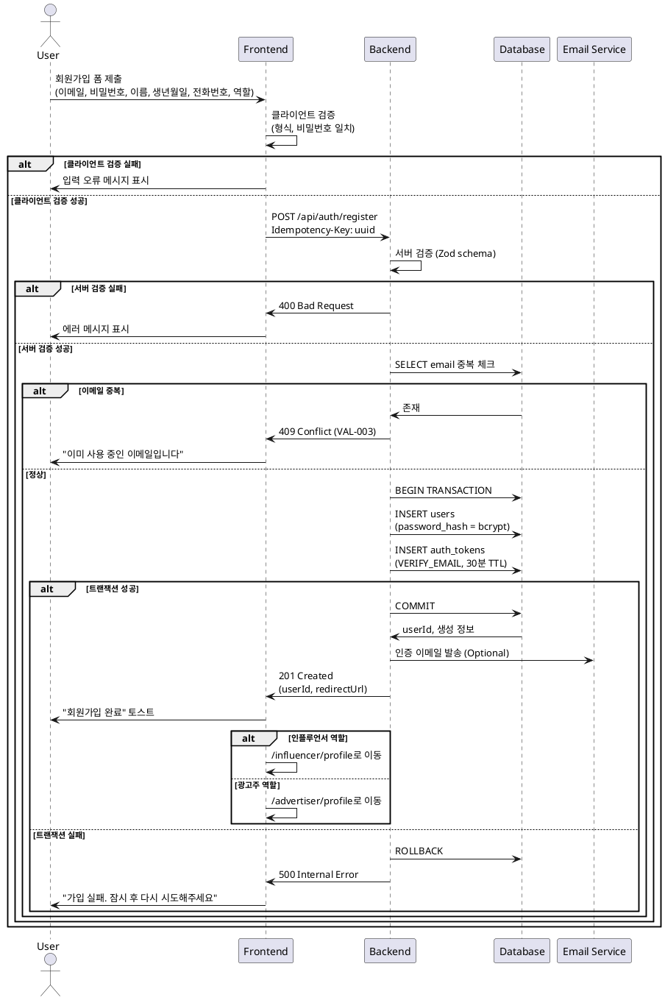

# UC-001: 회원가입 및 역할 선택

## Meta
- **UC ID**: UC-001
- **Flow ID**: UF-001-SIGNUP (from userflow.md)
- **Created**: 2025-11-07
- **Version**: 1.0
- **Related**: [PRD](../prd/체험단_매칭_플랫폼_prd_v1.md), [Userflow](../userflow.md), [Database](../dataflow-schema.md)

---

## Primary Actor
로그인하지 않은 사용자 (미가입자)

---

## Precondition (사용자 관점)
사용자가 로그인되어 있지 않다

---

## Trigger
사용자가 "회원가입" 버튼 클릭

---

## Data Contract

### Request
| Field | Type | Constraints | Example |
|-------|------|-------------|---------|
| email | string | RFC5322, max 255 | "user@example.com" |
| password | string | ≥8, alphanumeric+symbols | "P@ssw0rd!" |
| passwordConfirm | string | equals password | "P@ssw0rd!" |
| name | string | 2-20자, 한글/영문 | "김체험" |
| birthDate | string | YYYY-MM-DD, 만 14세 이상 | "1990-05-15" |
| phoneNumber | string | 010-XXXX-XXXX | "010-1234-5678" |
| role | enum | ADVERTISER or INFLUENCER | "INFLUENCER" |

### Response (Success)
```json
{
  "userId": "cm3h4k...",
  "email": "user@example.com",
  "name": "김체험",
  "role": "INFLUENCER",
  "createdAt": "2025-11-07T12:00:00Z",
  "redirectUrl": "/influencer/profile"
}
```

### Error Shape
```json
{
  "code": "VAL-003",
  "message": "이미 사용 중인 이메일입니다",
  "field": "email"
}
```

---

## Main Scenario

1. **사용자 입력** (Actor: User)
   - 기본 정보 입력 (이메일, 비밀번호, 이름, 생년월일, 휴대폰번호)
   - 역할 선택 (광고주/인플루언서) 후 제출
   - 클라이언트 검증: 형식, 길이, 비밀번호 일치

2. **경계 검증** (Actor: System/Presentation)
   - BR-001: 이메일 형식 (RFC5322)
   - BR-002: 비밀번호 정책 (≥8, 조합)
   - BR-003: 나이 제한 (만 14세 이상)

3. **비즈니스 규칙 검증** (Actor: Application)
   - BR-004: 이메일 중복 검사 (DB query)
   - BR-005: 전화번호 중복 검사

4. **데이터 저장** (Actor: Infrastructure)
   - users INSERT (트랜잭션 시작)
   - 비밀번호 해싱 (bcrypt, salt rounds ≥ 10)
   - auth_tokens INSERT (이메일 인증용)
   - 트랜잭션 커밋

5. **응답 반환** (Actor: System)
   - 201 Created + 사용자 정보
   - 역할별 리다이렉트 URL
   - traceId 로깅 (@SPEC:UC001-LOG-001)

---

## Edge Cases

### EC-001: 이메일 중복
- **조건**: users.email UNIQUE 위반
- **처리**: 409 Conflict, VAL-003
- **결과**: "이미 사용 중인 이메일입니다"
- **보장**: DB 변경 없음

### EC-002: 전화번호 중복
- **조건**: users.phone_number 중복 (선택적 검증)
- **처리**: 409 Conflict, VAL-004
- **결과**: "이미 사용 중인 전화번호입니다"
- **보장**: DB 변경 없음

### EC-003: 네트워크 타임아웃
- **조건**: API 요청 timeout > 10s
- **처리**: 재시도 3회 (지수백오프)
- **결과**: "네트워크 오류" 토스트
- **보장**: Idempotency-Key로 중복 방지

### EC-004: 동시성 이슈
- **조건**: 동일 이메일 동시 가입 시도
- **처리**: DB UNIQUE 제약 조건 활용
- **결과**: 먼저 처리된 요청만 성공
- **보장**: 하나의 계정만 생성

---

## Business Rules (EARS 기반)

### Ubiquitous (항상)
- **BR-001**: 시스템은 이메일 형식(RFC5322)을 검증해야 한다
  - @SPEC:UC001-UBI-001
  - Validation: Zod schema (Presentation)

- **BR-002**: 시스템은 비밀번호 정책(≥8자, 영문+숫자+특수문자)을 검증해야 한다
  - @SPEC:UC001-UBI-002
  - Validation: Zod schema (Presentation)

### Event-driven (이벤트 발생 시)
- **BR-003**: WHEN 유효한 회원가입 정보가 제공되면 사용자 계정을 생성해야 한다
  - @SPEC:UC001-EVT-001
  - Validation: Application Use Case

- **BR-004**: WHEN 사용자 계정이 생성되면 이메일 인증 토큰을 발급해야 한다
  - @SPEC:UC001-EVT-002
  - Validation: Application Use Case

### State-driven (상태 기반)
- **BR-005**: WHILE 로그인 상태일 때 회원가입을 차단해야 한다
  - @SPEC:UC001-STA-001
  - Validation: Auth Middleware (Presentation)

### Optional (선택)
- **BR-006**: WHERE 이메일 인증이 필요한 환경에서는 인증 이메일을 발송할 수 있다
  - @SPEC:UC001-OPT-001
  - Validation: Feature flag + Email Service

### Constraints (제약)
- **BR-007**: 비밀번호 해싱은 bcrypt salt rounds ≥ 10이어야 한다
  - @SPEC:UC001-CON-001
  - Validation: Domain Value Object

- **BR-008**: 사용자는 만 14세 이상이어야 한다
  - @SPEC:UC001-CON-002
  - Validation: Domain Value Object

---

## Rule ↔ Validation Mapping

| Rule ID | @SPEC:ID | Layer | Method |
|---------|----------|-------|--------|
| BR-001 | UC001-UBI-001 | Presentation | Zod email() |
| BR-002 | UC001-UBI-002 | Presentation | Zod regex pattern |
| BR-003 | UC001-EVT-001 | Application | Register Use Case |
| BR-004 | UC001-EVT-002 | Application | EmailToken Service |
| BR-005 | UC001-STA-001 | Presentation | Auth Middleware |
| BR-006 | UC001-OPT-001 | Application | Feature flag |
| BR-007 | UC001-CON-001 | Domain | Password VO |
| BR-008 | UC001-CON-002 | Domain | Age VO |

---

## Guarantees

### Success
- ✅ users 테이블 레코드 생성
- ✅ 선택한 역할로 리다이렉트 준비
- ✅ 이메일 인증 토큰 생성
- ✅ traceId 로깅 완료

### Failure
- ✅ DB 변경 없음 (트랜잭션 롤백)
- ✅ 재시도 안전 (Idempotency)
- ✅ 에러 로깅 100%

---

## Error Catalogue

| Code | HTTP | Message | Recovery |
|------|------|---------|----------|
| VAL-001 | 400 | 이메일 형식 오류 | 형식 수정 |
| VAL-002 | 400 | 비밀번호 정책 위반 | 규칙 준수 |
| VAL-003 | 409 | 이미 사용 중인 이메일입니다 | 다른 이메일 |
| VAL-004 | 409 | 이미 사용 중인 전화번호입니다 | 다른 번호 |
| VAL-005 | 400 | 만 14세 이상만 가입 가능합니다 | 생년월일 확인 |
| SYS-001 | 500 | 내부 오류 | 재시도 |

---

## Acceptance Criteria (Gherkin)

### Scenario 1: 신규 회원가입 성공 (인플루언서)
```gherkin
Given 사용자가 로그인하지 않았다
  And 이메일 "new@example.com"이 존재하지 않는다
When 유효한 정보로 폼을 제출한다
  And 역할로 "인플루언서"를 선택한다
Then 201 Created 응답을 받는다
  And userId가 반환된다
  And "회원가입 완료" 메시지가 보인다
  And "/influencer/profile" 페이지로 리다이렉트된다
```

### Scenario 2: 신규 회원가입 성공 (광고주)
```gherkin
Given 사용자가 로그인하지 않았다
  And 이메일 "advertiser@example.com"이 존재하지 않는다
When 유효한 정보로 폼을 제출한다
  And 역할로 "광고주"를 선택한다
Then 201 Created 응답을 받는다
  And "/advertiser/profile" 페이지로 리다이렉트된다
```

### Scenario 3: 이메일 중복 실패
```gherkin
Given 이메일 "existing@example.com"이 이미 존재한다
When 동일 이메일로 폼을 제출한다
Then 409 Conflict 응답을 받는다
  And 에러 코드는 "VAL-003"이다
  And 폼 입력값은 유지된다
  And 다른 이메일 입력이 가능하다
```

### Scenario 4: 비밀번호 정책 위반
```gherkin
Given 사용자가 회원가입 폼에 있다
When 비밀번호를 "123456"으로 입력한다
Then 클라이언트 검증이 실패한다
  And "비밀번호는 8자 이상, 영문+숫자+특수문자 조합이어야 합니다" 메시지가 보인다
  And 폼 제출이 차단된다
```

---

## Sequence Diagram (PlantUML 표준)



---

## Traceability

### 코드 파일
- `/presentation/features/auth/RegisterForm.tsx` — UC-001-UI-001
- `/application/auth/RegisterUserUseCase.ts` — UC-001-APP-001
- `/domain/user/User.entity.ts` — UC-001-DOM-001
- `/domain/user/Password.vo.ts` — UC-001-DOM-002
- `/infrastructure/repo/UserRepository.ts` — UC-001-INF-001

### 테스트
- `RegisterForm.test.tsx` — QA-PRES-001, QA-PRES-002
- `RegisterUserUseCase.spec.ts` — UT-APP-001, UT-APP-002
- `User.entity.spec.ts` — UT-DOM-001
- `Password.vo.spec.ts` — UT-DOM-002

### @SPEC:ID 매핑
- UC001-UBI-001 → BR-001 (이메일 형식)
- UC001-UBI-002 → BR-002 (비밀번호 정책)
- UC001-EVT-001 → BR-003 (사용자 생성)
- UC001-CON-001 → BR-007 (비밀번호 해싱)
- UC001-CON-002 → BR-008 (나이 제한)

---

## Postcondition

### Success
- ✅ users 레코드 존재
- ✅ password_hash bcrypt 완료
- ✅ role 필드 설정됨
- ✅ auth_tokens 생성 (이메일 인증용)
- ✅ traceId 로깅 완료

### Failure
- ✅ DB 변경 없음
- ✅ 에러 로깅 완료
- ✅ Rate Limit 카운터 증가 (브루트포스 방지)

---

## Related Use Cases

| UC ID | Name | Relationship |
|-------|------|--------------|
| UC-002 | 광고주 정보 입력 | 회원가입 후 광고주 선택 시 |
| UC-003 | 인플루언서 정보 입력 | 회원가입 후 인플루언서 선택 시 |
| UC-004 | 로그인 | 회원가입 후 로그인 |
| UC-005 | 이메일 인증 | 회원가입 후 인증 (선택) |

---

## Notes

### Implementation Phases
- **Phase 0**: 기본 회원가입, 역할 선택, Idempotency
- **Phase 1**: 이메일 인증, 전화번호 인증 (SMS)
- **Phase 2**: 소셜 로그인 (Google, 카카오, 네이버)

### Technical Debt
- 전화번호 중복 검사 정책 명확화 필요
- 이메일 인증 필수/선택 정책 결정 필요
- Idempotency-Key TTL 관리 (Redis)

---