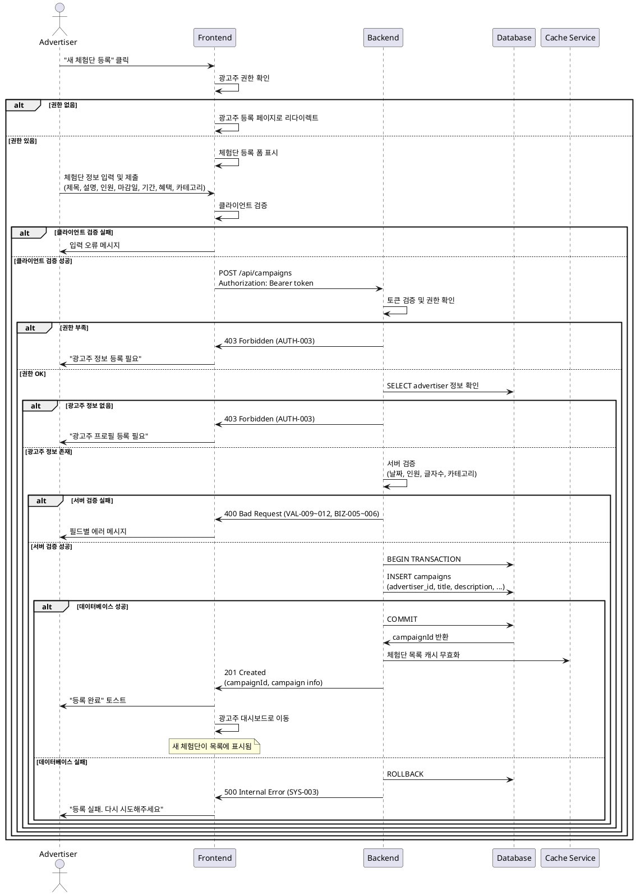

# UC-005: 체험단 등록 (광고주)

## Meta
- **UC ID**: UC-005
- **Flow ID**: UF-005-CAMPAIGN-CREATE (from userflow.md)
- **Created**: 2025-11-07
- **Version**: 1.0
- **Related**: [PRD](../prd/체험단_매칭_플랫폼_prd_v1.md), [Userflow](../userflow.md), [Database](../dataflow-schema.md)

---

## Primary Actor
로그인된 광고주 (advertisers 테이블 등록 완료)

---

## Precondition (사용자 관점)
- 사용자가 광고주로 로그인되어 있다
- 광고주 정보가 등록되어 있다 (업체명, 사업자등록번호 등)

---

## Trigger
광고주가 대시보드에서 "새 체험단 등록" 버튼 클릭

---

## Data Contract

### Request
| Field | Type | Constraints | Example |
|-------|------|-------------|---------|
| title | string | 10-100자, 필수 | "신제품 립스틱 체험단 모집" |
| description | string | 50-1000자, 필수 | "새로 출시되는 매트 립스틱의..." |
| recruitCount | number | 1-50명, 필수 | 10 |
| deadline | string | YYYY-MM-DD, 오늘 이후 | "2025-11-20" |
| experiencePeriod | number | 1-30일, 필수 | 14 |
| benefits | string | 10-500자, 필수 | "제품 무료 제공 + 리뷰 수수료" |
| category | string | 선택지 중 하나, 필수 | "뷰티" |

### Response (Success)
```json
{
  "campaignId": "cm3h6m...",
  "title": "신제품 립스틱 체험단 모집",
  "status": "RECRUITING",
  "deadline": "2025-11-20",
  "createdAt": "2025-11-07T13:00:00Z",
  "message": "체험단이 등록되었습니다"
}
```

### Error Shape
```json
{
  "code": "BIZ-005",
  "message": "모집 마감일은 오늘 이후로 설정해주세요",
  "field": "deadline"
}
```

---

## Main Scenario

1. **권한 확인** (Actor: System/Presentation)
   - BR-001: 광고주 로그인 상태 확인
   - BR-002: advertisers 테이블 등록 여부 확인

2. **입력값 검증** (Actor: System/Presentation)
   - BR-003: 제목 길이 (10-100자)
   - BR-004: 설명 길이 (50-1000자)
   - BR-005: 모집 인원 범위 (1-50명)
   - BR-006: 체험 기간 범위 (1-30일)

3. **비즈니스 규칙 검증** (Actor: Application)
   - BR-007: 마감일 유효성 (오늘 이후)
   - BR-008: 카테고리 유효성 (정의된 목록)
   - BR-009: 혜택 내용 길이 (10-500자)

4. **데이터 저장** (Actor: Infrastructure)
   - campaigns INSERT (트랜잭션)
   - 상태를 'RECRUITING'으로 설정
   - 생성일시 자동 기록

5. **후속 처리** (Actor: System)
   - 체험단 목록 캐시 무효화
   - 광고주 대시보드 업데이트
   - traceId 로깅 (@SPEC:UC005-LOG-001)

6. **응답 반환** (Actor: System)
   - 201 Created + 체험단 정보
   - 광고주 대시보드로 리다이렉트

---

## Edge Cases

### EC-001: 권한 부족 (광고주 정보 미등록)
- **조건**: users.role != 'ADVERTISER' 또는 advertisers 레코드 없음
- **처리**: 403 Forbidden, AUTH-003
- **결과**: "광고주 정보 등록 후 이용 가능합니다"
- **보장**: 광고주 프로필 등록 페이지로 리다이렉트

### EC-002: 마감일 과거 날짜
- **조건**: deadline < 오늘 날짜
- **처리**: 400 Bad Request, BIZ-005
- **결과**: "모집 마감일은 오늘 이후로 설정해주세요"
- **보장**: DB 변경 없음, 입력값 유지

### EC-003: 글자 수 제한 위반
- **조건**: title.length < 10 또는 > 100
- **처리**: 400 Bad Request, VAL-009
- **결과**: "제목은 10-100자로 입력해주세요"
- **보장**: 클라이언트 검증으로 사전 차단

### EC-004: 잘못된 카테고리
- **조건**: category가 정의된 목록에 없음
- **처리**: 400 Bad Request, VAL-010
- **결과**: "올바른 카테고리를 선택해주세요"
- **보장**: Enum 검증으로 차단

### EC-005: 네트워크 타임아웃
- **조건**: API 요청 timeout > 10s
- **처리**: 재시도 2회 (지수백오프)
- **결과**: "등록 실패. 잠시 후 다시 시도하세요"
- **보장**: Idempotency-Key로 중복 등록 방지

---

## Business Rules (EARS 기반)

### Ubiquitous (항상)
- **BR-001**: 시스템은 광고주 권한을 확인해야 한다
  - @SPEC:UC005-UBI-001
  - Validation: Auth Middleware (Presentation)

- **BR-002**: 시스템은 제목 길이(10-100자)를 검증해야 한다
  - @SPEC:UC005-UBI-002
  - Validation: Zod schema (Presentation)

- **BR-003**: 시스템은 설명 길이(50-1000자)를 검증해야 한다
  - @SPEC:UC005-UBI-003
  - Validation: Zod schema (Presentation)

### Event-driven (이벤트 발생 시)
- **BR-004**: WHEN 유효한 체험단 정보가 제공되면 캠페인을 생성해야 한다
  - @SPEC:UC005-EVT-001
  - Validation: Application Use Case

- **BR-005**: WHEN 체험단이 등록되면 상태를 'RECRUITING'으로 설정해야 한다
  - @SPEC:UC005-EVT-002
  - Validation: Domain Entity

### State-driven (상태 기반)
- **BR-006**: WHILE 광고주 정보가 등록된 상태에서만 체험단 등록을 허용해야 한다
  - @SPEC:UC005-STA-001
  - Validation: Advertiser Repository Check

### Optional (선택)
- **BR-007**: WHERE 체험단 이미지가 제공되면 업로드를 처리할 수 있다
  - @SPEC:UC005-OPT-001
  - Validation: File Upload Service

### Constraints (제약)
- **BR-008**: 모집 마감일은 오늘 이후여야 한다
  - @SPEC:UC005-CON-001
  - Validation: Date Validation Logic

- **BR-009**: 모집 인원은 1-50명이어야 한다
  - @SPEC:UC005-CON-002
  - Validation: Number Range Validation

- **BR-010**: 체험 기간은 1-30일이어야 한다
  - @SPEC:UC005-CON-003
  - Validation: Number Range Validation

---

## Rule ↔ Validation Mapping

| Rule ID | @SPEC:ID | Layer | Method |
|---------|----------|-------|--------|
| BR-001 | UC005-UBI-001 | Presentation | Auth Middleware |
| BR-002 | UC005-UBI-002 | Presentation | Zod string length |
| BR-003 | UC005-UBI-003 | Presentation | Zod string length |
| BR-004 | UC005-EVT-001 | Application | Create Campaign Use Case |
| BR-005 | UC005-EVT-002 | Domain | Campaign Entity |
| BR-006 | UC005-STA-001 | Application | Advertiser Check |
| BR-007 | UC005-OPT-001 | Application | File Upload Service |
| BR-008 | UC005-CON-001 | Domain | Date VO |
| BR-009 | UC005-CON-002 | Domain | RecruitCount VO |
| BR-010 | UC005-CON-003 | Domain | Period VO |

---

## Guarantees

### Success
- ✅ campaigns 레코드 생성 (RECRUITING 상태)
- ✅ advertiser_id 올바른 연결
- ✅ 체험단 목록에 즉시 노출
- ✅ 광고주 대시보드 업데이트
- ✅ traceId 로깅 완료

### Failure
- ✅ DB 변경 없음 (트랜잭션 롤백)
- ✅ 입력값 유지 (사용자 편의)
- ✅ 에러 로깅 100%
- ✅ 재시도 안전 (Idempotency)

---

## Error Catalogue

| Code | HTTP | Message | Recovery |
|------|------|---------|----------|
| AUTH-003 | 403 | 광고주 정보 등록 후 이용 가능합니다 | 프로필 등록 |
| VAL-009 | 400 | 제목은 10-100자로 입력해주세요 | 글자 수 조정 |
| VAL-010 | 400 | 올바른 카테고리를 선택해주세요 | 카테고리 재선택 |
| VAL-011 | 400 | 설명은 50-1000자로 입력해주세요 | 내용 수정 |
| VAL-012 | 400 | 모집 인원은 1-50명으로 설정해주세요 | 인원 조정 |
| BIZ-005 | 400 | 모집 마감일은 오늘 이후로 설정해주세요 | 날짜 수정 |
| BIZ-006 | 400 | 체험 기간은 1-30일로 설정해주세요 | 기간 조정 |
| SYS-003 | 500 | 등록 처리 실패 | 재시도 |

---

## Acceptance Criteria (Gherkin)

### Scenario 1: 정상 체험단 등록 성공
```gherkin
Given 광고주가 로그인되어 있다
  And 광고주 정보가 등록되어 있다
When 유효한 체험단 정보로 폼을 제출한다
Then 201 Created 응답을 받는다
  And campaignId가 반환된다
  And "체험단이 등록되었습니다" 메시지가 보인다
  And 광고주 대시보드로 리다이렉트된다
  And 체험단 목록에 새 항목이 표시된다
```

### Scenario 2: 권한 부족 실패
```gherkin
Given 인플루언서로 로그인되어 있다
When 체험단 등록 페이지에 접근한다
Then 403 Forbidden 응답을 받는다
  And "광고주 정보 등록 후 이용 가능합니다" 메시지가 보인다
  And 광고주 프로필 등록 페이지로 리다이렉트된다
```

### Scenario 3: 마감일 과거 날짜 실패
```gherkin
Given 광고주가 체험단 등록 폼에 있다
When 마감일을 어제 날짜로 설정한다
  And 폼을 제출한다
Then 400 Bad Request 응답을 받는다
  And "모집 마감일은 오늘 이후로 설정해주세요" 메시지가 보인다
  And 입력값이 유지된다
```

### Scenario 4: 제목 길이 부족
```gherkin
Given 광고주가 체험단 등록 폼에 있다
When 제목을 5자로 입력한다
Then 클라이언트 검증이 실패한다
  And "제목은 10자 이상 입력해주세요" 메시지가 보인다
  And 폼 제출이 차단된다
```

### Scenario 5: 모집 인원 초과
```gherkin
Given 광고주가 체험단 등록 폼에 있다
When 모집 인원을 100명으로 설정한다
Then 클라이언트 검증이 실패한다
  And "모집 인원은 최대 50명까지 가능합니다" 메시지가 보인다
  And 폼 제출이 차단된다
```

---

## Sequence Diagram (PlantUML 표준)



---

## Traceability

### 코드 파일
- `/presentation/features/campaigns/CreateCampaignForm.tsx` — UC-005-UI-001
- `/presentation/features/advertiser/AdvertiserDashboard.tsx` — UC-005-UI-002
- `/application/campaigns/CreateCampaignUseCase.ts` — UC-005-APP-001
- `/domain/campaign/Campaign.entity.ts` — UC-005-DOM-001
- `/domain/campaign/RecruitCount.vo.ts` — UC-005-DOM-002
- `/domain/campaign/Period.vo.ts` — UC-005-DOM-003
- `/infrastructure/repo/CampaignRepository.ts` — UC-005-INF-001

### 테스트
- `CreateCampaignForm.test.tsx` — QA-PRES-005, QA-PRES-006
- `CreateCampaignUseCase.spec.ts` — UT-APP-005, UT-APP-006
- `Campaign.entity.spec.ts` — UT-DOM-004
- `RecruitCount.vo.spec.ts` — UT-DOM-005
- `CampaignRepository.spec.ts` — UT-INF-002

### @SPEC:ID 매핑
- UC005-UBI-001 → BR-001 (권한 확인)
- UC005-UBI-002 → BR-002 (제목 길이)
- UC005-EVT-001 → BR-004 (캠페인 생성)
- UC005-CON-001 → BR-008 (마감일 검증)
- UC005-CON-002 → BR-009 (모집 인원)

---

## Postcondition

### Success
- ✅ campaigns 레코드 존재 (RECRUITING 상태)
- ✅ 정확한 advertiser_id 연결
- ✅ 체험단 목록 캐시 무효화 완료
- ✅ 광고주 대시보드 업데이트
- ✅ traceId 로깅 완료

### Failure
- ✅ DB 변경 없음 (트랜잭션 보장)
- ✅ 사용자 입력값 유지
- ✅ 실패 사유 로깅 완료

---

## Related Use Cases

| UC ID | Name | Relationship |
|-------|------|--------------|
| UC-002 | 광고주 정보 입력 | 체험단 등록 전 필수 완료 |
| UC-007 | 체험단 관리 | 등록 후 관리 기능 |
| UC-006 | 체험단 지원 | 등록 후 인플루언서 지원 |
| UC-008 | 체험단 탐색 | 등록된 체험단 노출 |

---

## Notes

### Implementation Phases
- **Phase 0**: 기본 등록, 필수 검증, 상태 관리
- **Phase 1**: 이미지 업로드, 임시저장, 미리보기
- **Phase 2**: AI 제목/설명 추천, 자동 카테고리 분류

### Technical Debt
- 체험단 이미지 업로드 기능 구현 고려
- 임시저장 기능으로 UX 개선 필요
- 체험단 템플릿 기능 검토

### Performance Considerations
- 체험단 목록 캐시 전략 (Redis)
- 대시보드 실시간 업데이트 (WebSocket 고려)
- 파일 업로드 시 CDN 활용

### Business Logic
- 카테고리 목록: 뷰티, 패션, 푸드, 테크, 라이프, 헬스, 여행, 기타
- 모집 인원 제한: 1-50명 (스팸 방지)
- 체험 기간 제한: 1-30일 (관리 효율성)

---