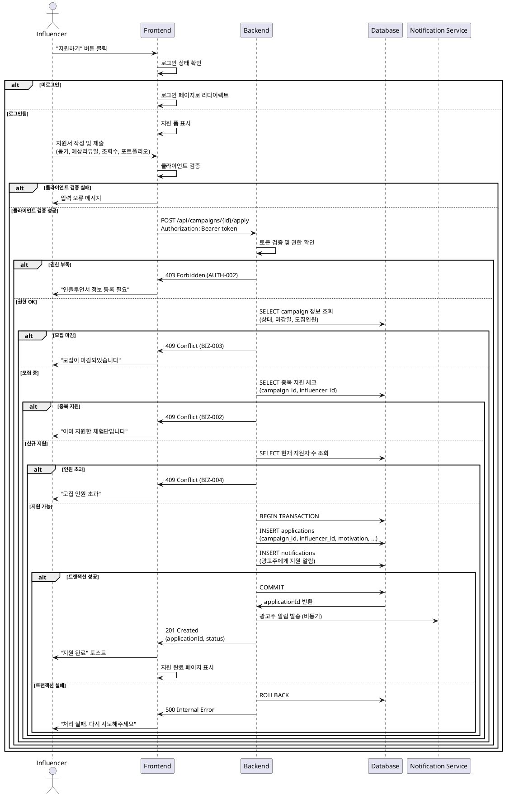

# UC-006: 체험단 지원 (인플루언서)

## Meta
- **UC ID**: UC-006
- **Flow ID**: UF-006-APPLICATION (from userflow.md)
- **Created**: 2025-11-07
- **Version**: 1.0
- **Related**: [PRD](../prd/체험단_매칭_플랫폼_prd_v1.md), [Userflow](../userflow.md), [Database](../dataflow-schema.md)

---

## Primary Actor
로그인된 인플루언서 (influencers 테이블 등록 완료)

---

## Precondition (사용자 관점)
- 사용자가 인플루언서로 로그인되어 있다
- 인플루언서 정보가 등록되어 있다
- 체험단이 "모집중" 상태이다

---

## Trigger
인플루언서가 체험단 상세 페이지에서 "지원하기" 버튼 클릭

---

## Data Contract

### Request
| Field | Type | Constraints | Example |
|-------|------|-------------|---------|
| campaignId | string | CUID, 존재하는 캠페인 | "cm3h4k..." |
| motivation | string | 50-500자, 필수 | "평소 뷰티 리뷰를 자주 하고..." |
| expectedReviewDate | string | YYYY-MM-DD, 체험기간 내 | "2025-11-30" |
| expectedViews | number | 양수, 선택 | 5000 |
| portfolioLink | string | URL 형식, 선택 | "https://instagram.com/highlights" |

### Response (Success)
```json
{
  "applicationId": "cm3h5l...",
  "status": "PENDING",
  "campaignTitle": "신제품 립스틱 체험단",
  "message": "지원이 완료되었습니다",
  "createdAt": "2025-11-07T12:30:00Z"
}
```

### Error Shape
```json
{
  "code": "BIZ-002",
  "message": "이미 지원한 체험단입니다",
  "field": "campaignId"
}
```

---

## Main Scenario

1. **권한 확인** (Actor: System/Presentation)
   - BR-001: 인플루언서 로그인 상태 확인
   - BR-002: influencers 테이블 등록 여부 확인

2. **체험단 상태 검증** (Actor: Application)
   - BR-003: 캠페인 존재 여부 확인
   - BR-004: 모집 상태 확인 ('RECRUITING')
   - BR-005: 모집 마감일 확인 (>= 오늘)

3. **지원 자격 검증** (Actor: Application)
   - BR-006: 중복 지원 여부 체크
   - BR-007: 모집 인원 초과 여부 확인 (동시성 처리)

4. **입력값 검증** (Actor: System/Presentation)
   - BR-008: 지원 동기 글자 수 (50-500자)
   - BR-009: 예상 리뷰 발행일 (체험 기간 내)
   - BR-010: 포트폴리오 링크 형식 (URL)

5. **지원서 저장 및 알림** (Actor: Infrastructure)
   - applications INSERT (트랜잭션 시작)
   - notifications INSERT (광고주에게 알림)
   - 트랜잭션 커밋

6. **응답 반환** (Actor: System)
   - 201 Created + 지원 정보
   - traceId 로깅 (@SPEC:UC006-LOG-001)

---

## Edge Cases

### EC-001: 이미 지원한 체험단
- **조건**: applications 테이블에 (campaign_id, influencer_id) 존재
- **처리**: 409 Conflict, BIZ-002
- **결과**: "이미 지원한 체험단입니다"
- **보장**: DB 변경 없음, 중복 지원 방지

### EC-002: 모집 마감된 체험단
- **조건**: campaign.status != 'RECRUITING' 또는 deadline < 오늘
- **처리**: 409 Conflict, BIZ-003
- **결과**: "모집이 마감된 체험단입니다"
- **보장**: 지원 불가, 상태 정보 제공

### EC-003: 인원 초과 (동시성)
- **조건**: 모집 인원 == 현재 지원자 수 (동시 지원 시)
- **처리**: 409 Conflict, BIZ-004
- **결과**: "모집 인원이 초과되어 지원할 수 없습니다"
- **보장**: UNIQUE 제약으로 동시성 해결

### EC-004: 권한 부족
- **조건**: users.role != 'INFLUENCER' 또는 influencers 레코드 없음
- **처리**: 403 Forbidden, AUTH-002
- **결과**: "인플루언서 정보 등록 후 지원 가능합니다"
- **보장**: 권한 없는 지원 차단

### EC-005: 네트워크 타임아웃
- **조건**: API 요청 timeout > 15s
- **처리**: 재시도 2회 (지수백오프)
- **결과**: "지원 처리 중 오류가 발생했습니다" 토스트
- **보장**: Idempotency-Key로 중복 방지

---

## Business Rules (EARS 기반)

### Ubiquitous (항상)
- **BR-001**: 시스템은 인플루언서 권한을 확인해야 한다
  - @SPEC:UC006-UBI-001
  - Validation: Auth Middleware (Presentation)

- **BR-002**: 시스템은 지원 동기 길이(50-500자)를 검증해야 한다
  - @SPEC:UC006-UBI-002
  - Validation: Zod schema (Presentation)

### Event-driven (이벤트 발생 시)
- **BR-003**: WHEN 유효한 지원서가 제출되면 지원 내역을 생성해야 한다
  - @SPEC:UC006-EVT-001
  - Validation: Application Use Case

- **BR-004**: WHEN 지원이 완료되면 광고주에게 알림을 발송해야 한다
  - @SPEC:UC006-EVT-002
  - Validation: Notification Service

### State-driven (상태 기반)
- **BR-005**: WHILE 체험단이 모집중일 때만 지원을 허용해야 한다
  - @SPEC:UC006-STA-001
  - Validation: Campaign Status Check

- **BR-006**: WHILE 모집 마감일 이전에만 지원을 허용해야 한다
  - @SPEC:UC006-STA-002
  - Validation: Date Validation

### Optional (선택)
- **BR-007**: WHERE 포트폴리오 링크가 제공되면 URL 유효성을 검증할 수 있다
  - @SPEC:UC006-OPT-001
  - Validation: URL Validation Service

### Constraints (제약)
- **BR-008**: 인플루언서는 동일 체험단에 중복 지원할 수 없다
  - @SPEC:UC006-CON-001
  - Validation: Database UNIQUE constraint

- **BR-009**: 예상 리뷰 발행일은 체험 기간 내에 있어야 한다
  - @SPEC:UC006-CON-002
  - Validation: Domain Business Logic

---

## Rule ↔ Validation Mapping

| Rule ID | @SPEC:ID | Layer | Method |
|---------|----------|-------|--------|
| BR-001 | UC006-UBI-001 | Presentation | Auth Middleware |
| BR-002 | UC006-UBI-002 | Presentation | Zod string length |
| BR-003 | UC006-EVT-001 | Application | Apply Use Case |
| BR-004 | UC006-EVT-002 | Application | Notification Service |
| BR-005 | UC006-STA-001 | Application | Campaign State Check |
| BR-006 | UC006-STA-002 | Application | Date Validation |
| BR-007 | UC006-OPT-001 | Application | URL Validator |
| BR-008 | UC006-CON-001 | Infrastructure | DB Constraint |
| BR-009 | UC006-CON-002 | Domain | Date Range VO |

---

## Guarantees

### Success
- ✅ applications 레코드 생성 (PENDING 상태)
- ✅ 광고주에게 알림 발송
- ✅ 지원 현황 실시간 업데이트
- ✅ traceId 로깅 완료

### Failure
- ✅ DB 변경 없음 (트랜잭션 롤백)
- ✅ 중복 지원 방지 (UNIQUE 제약)
- ✅ 에러 로깅 100%
- ✅ 사용자에게 명확한 실패 사유 제공

---

## Error Catalogue

| Code | HTTP | Message | Recovery |
|------|------|---------|----------|
| AUTH-002 | 403 | 인플루언서 정보 등록 후 지원 가능합니다 | 프로필 등록 |
| VAL-006 | 400 | 지원 동기는 50-500자로 입력해주세요 | 글자 수 조정 |
| VAL-007 | 400 | 올바른 URL 형식을 입력해주세요 | 링크 수정 |
| VAL-008 | 400 | 예상 리뷰 발행일을 확인해주세요 | 날짜 수정 |
| BIZ-002 | 409 | 이미 지원한 체험단입니다 | 다른 체험단 탐색 |
| BIZ-003 | 409 | 모집이 마감된 체험단입니다 | 다른 체험단 탐색 |
| BIZ-004 | 409 | 모집 인원이 초과되었습니다 | 다른 체험단 탐색 |
| SYS-002 | 500 | 지원 처리 실패 | 재시도 |

---

## Acceptance Criteria (Gherkin)

### Scenario 1: 정상 지원 성공
```gherkin
Given 인플루언서가 로그인되어 있다
  And 인플루언서 정보가 등록되어 있다
  And 체험단이 "모집중" 상태이다
  And 아직 지원하지 않은 체험단이다
When 유효한 지원서를 제출한다
Then 201 Created 응답을 받는다
  And applicationId가 반환된다
  And "지원이 완료되었습니다" 메시지가 보인다
  And 광고주에게 알림이 발송된다
```

### Scenario 2: 중복 지원 실패
```gherkin
Given 인플루언서가 이미 지원한 체험단이 있다
When 동일한 체험단에 다시 지원한다
Then 409 Conflict 응답을 받는다
  And 에러 코드는 "BIZ-002"이다
  And "이미 지원한 체험단입니다" 메시지가 보인다
  And 다른 체험단 탐색 링크가 제공된다
```

### Scenario 3: 모집 마감 실패
```gherkin
Given 체험단 상태가 "모집마감"이다
When 지원하기 버튼을 클릭한다
Then 버튼이 비활성화되어 있다
  And "모집이 마감되었습니다" 텍스트가 보인다
  And API 호출이 발생하지 않는다
```

### Scenario 4: 권한 부족 실패
```gherkin
Given 광고주로 로그인되어 있다
When 체험단 지원 페이지에 접근한다
Then 403 Forbidden 응답을 받는다
  And "인플루언서만 지원 가능합니다" 메시지가 보인다
  And 인플루언서 등록 페이지로 이동할 수 있다
```

### Scenario 5: 지원 동기 부족
```gherkin
Given 인플루언서가 지원 폼에 있다
When 지원 동기를 30자만 입력한다
Then 클라이언트 검증이 실패한다
  And "지원 동기는 50자 이상 입력해주세요" 메시지가 보인다
  And 폼 제출이 차단된다
```

---

## Sequence Diagram (PlantUML 표준)



---

## Traceability

### 코드 파일
- `/presentation/features/campaigns/ApplyForm.tsx` — UC-006-UI-001
- `/presentation/features/campaigns/CampaignDetail.tsx` — UC-006-UI-002
- `/application/campaigns/ApplyCampaignUseCase.ts` — UC-006-APP-001
- `/domain/application/Application.entity.ts` — UC-006-DOM-001
- `/domain/application/Motivation.vo.ts` — UC-006-DOM-002
- `/infrastructure/repo/ApplicationRepository.ts` — UC-006-INF-001

### 테스트
- `ApplyForm.test.tsx` — QA-PRES-003, QA-PRES-004
- `ApplyCampaignUseCase.spec.ts` — UT-APP-003, UT-APP-004
- `Application.entity.spec.ts` — UT-DOM-003
- `ApplicationRepository.spec.ts` — UT-INF-001

### @SPEC:ID 매핑
- UC006-UBI-001 → BR-001 (권한 확인)
- UC006-UBI-002 → BR-002 (동기 길이)
- UC006-EVT-001 → BR-003 (지원서 생성)
- UC006-STA-001 → BR-005 (모집 상태)
- UC006-CON-001 → BR-008 (중복 방지)

---

## Postcondition

### Success
- ✅ applications 레코드 존재 (PENDING 상태)
- ✅ campaign 지원자 수 증가
- ✅ 광고주 notifications 레코드 생성
- ✅ traceId 로깅 완료

### Failure
- ✅ DB 변경 없음 (트랜잭션 보장)
- ✅ 실패 사유 로깅 완료
- ✅ 사용자에게 명확한 안내 제공

---

## Related Use Cases

| UC ID | Name | Relationship |
|-------|------|--------------|
| UC-003 | 인플루언서 정보 입력 | 지원 전 필수 완료 |
| UC-007 | 체험단 관리 (광고주) | 지원 후 선정 과정 |
| UC-008 | 체험단 탐색 | 지원할 체험단 탐색 |
| UC-004 | 로그인 | 지원 전 인증 필요 |

---

## Notes

### Implementation Phases
- **Phase 0**: 기본 지원, 중복 방지, 상태 검증
- **Phase 1**: 첨부파일 업로드, 임시저장 기능
- **Phase 2**: AI 매칭 점수, 추천 시스템

### Technical Debt
- 지원서 임시저장 기능 고려 필요
- 파일 업로드 용량/형식 제한 정책 수립
- 지원 취소 기능 구현 여부 결정

### Performance Considerations
- 동시성 처리: DB UNIQUE 제약 + Optimistic Locking
- 알림 발송: 비동기 처리 (Queue 시스템)
- 지원자 수 조회: 캐싱 고려 (Redis)

---