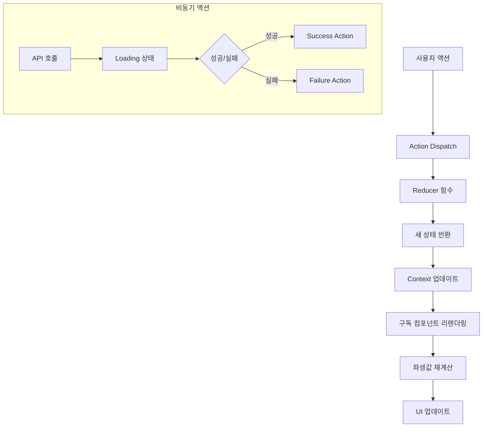

# 상태관리 명세: 체험단 매칭 플랫폼

## Meta
- **작성일**: 2025-11-07
- **버전**: 1.0
- **기반 Agent**: 07-State Management Frontend
- **적용 패턴**: Context + useReducer, Flux Architecture

---

## 🏗️ 상태관리 아키텍처

### Context + useReducer 선택 근거
- **중간 복잡도**: Redux까지는 과도하지만 useState로는 부족한 규모
- **TypeScript 친화적**: Action 타입 안전성 보장
- **성능 최적화**: Provider 분리를 통한 리렌더링 제어
- **테스트 용이성**: 순수함수 리듀서로 단위 테스트 가능

### 전체 아키텍처 구조
```
src/
├── store/
│   ├── contexts/
│   │   ├── AuthContext.tsx        # 인증 상태
│   │   ├── CampaignContext.tsx    # 체험단 관리
│   │   ├── ApplicationContext.tsx # 지원 관리
│   │   ├── DashboardContext.tsx   # 대시보드
│   │   └── UserContext.tsx        # 사용자 정보
│   ├── reducers/
│   │   ├── authReducer.ts
│   │   ├── campaignReducer.ts
│   │   ├── applicationReducer.ts
│   │   ├── dashboardReducer.ts
│   │   └── userReducer.ts
│   ├── types/
│   │   ├── auth.types.ts
│   │   ├── campaign.types.ts
│   │   └── common.types.ts
│   └── index.ts                   # Store 통합 Provider
```

---

## 🔄 Flux 패턴 설계

### Action 네이밍 규칙
```typescript
// 패턴: [도메인]_[동작]_[상태]
interface ActionTypes {
  // 요청 시작
  AUTH_LOGIN_REQUEST: 'AUTH_LOGIN_REQUEST';
  CAMPAIGN_FETCH_REQUEST: 'CAMPAIGN_FETCH_REQUEST';
  APPLICATION_SUBMIT_REQUEST: 'APPLICATION_SUBMIT_REQUEST';

  // 성공
  AUTH_LOGIN_SUCCESS: 'AUTH_LOGIN_SUCCESS';
  CAMPAIGN_FETCH_SUCCESS: 'CAMPAIGN_FETCH_SUCCESS';
  APPLICATION_SUBMIT_SUCCESS: 'APPLICATION_SUBMIT_SUCCESS';

  // 실패
  AUTH_LOGIN_FAILURE: 'AUTH_LOGIN_FAILURE';
  CAMPAIGN_FETCH_FAILURE: 'CAMPAIGN_FETCH_FAILURE';
  APPLICATION_SUBMIT_FAILURE: 'APPLICATION_SUBMIT_FAILURE';

  // 리셋/클리어
  AUTH_LOGOUT: 'AUTH_LOGOUT';
  CAMPAIGN_CLEAR_FILTERS: 'CAMPAIGN_CLEAR_FILTERS';
  APPLICATION_RESET_FORM: 'APPLICATION_RESET_FORM';
}
```

### 비동기 Action 패턴
```typescript
// 표준 비동기 액션 구조
type AsyncAction<T> = {
  type: string;
  payload?: T;
  error?: string;
  meta?: {
    loading: boolean;
    timestamp: number;
  };
};
```

---

## 🏪 도메인별 Store 설계

### 1. AuthContext - 인증 상태
```typescript
interface AuthState {
  // 기본 상태
  user: User | null;
  isAuthenticated: boolean;
  isLoading: boolean;
  error: string | null;

  // 파생 상태 (computed)
  userRole: 'advertiser' | 'influencer' | null;
  canAccessDashboard: boolean;
  canApplyCampaign: boolean;
}

type AuthAction =
  | { type: 'AUTH_LOGIN_REQUEST' }
  | { type: 'AUTH_LOGIN_SUCCESS'; payload: User }
  | { type: 'AUTH_LOGIN_FAILURE'; payload: string }
  | { type: 'AUTH_LOGOUT' }
  | { type: 'AUTH_UPDATE_PROFILE'; payload: Partial<User> };

// 상태 변경 조건
const authConditions = {
  login: '이메일/비밀번호 검증 + 서버 응답',
  logout: '사용자 요청 또는 토큰 만료',
  profileUpdate: '프로필 저장 성공 시',
};
```

### 2. CampaignContext - 체험단 관리
```typescript
interface CampaignState {
  // 목록 상태
  campaigns: Campaign[];
  selectedCampaign: Campaign | null;

  // 필터링
  filters: {
    category: string | null;
    search: string;
    status: CampaignStatus;
  };

  // UI 상태
  isLoading: boolean;
  error: string | null;

  // 페이지네이션
  pagination: {
    page: number;
    total: number;
    hasMore: boolean;
  };

  // 파생 상태
  filteredCampaigns: Campaign[];
  canCreateCampaign: boolean;
}

type CampaignAction =
  | { type: 'CAMPAIGN_FETCH_REQUEST' }
  | { type: 'CAMPAIGN_FETCH_SUCCESS'; payload: { campaigns: Campaign[], total: number } }
  | { type: 'CAMPAIGN_FETCH_FAILURE'; payload: string }
  | { type: 'CAMPAIGN_SELECT'; payload: Campaign }
  | { type: 'CAMPAIGN_SET_FILTERS'; payload: Partial<CampaignFilters> }
  | { type: 'CAMPAIGN_CLEAR_FILTERS' }
  | { type: 'CAMPAIGN_CREATE_SUCCESS'; payload: Campaign }
  | { type: 'CAMPAIGN_UPDATE_STATUS'; payload: { id: string, status: CampaignStatus } };
```

### 3. ApplicationContext - 지원 관리
```typescript
interface ApplicationState {
  // 지원 현황
  applications: Application[];
  selectedApplication: Application | null;

  // 폼 상태
  applicationForm: {
    motivation: string;
    expectedDate: string;
    expectedViews: number;
    portfolioLink: string;
  };

  // UI 상태
  isSubmitting: boolean;
  showSuccessModal: boolean;
  error: string | null;

  // 파생 상태
  hasAppliedToCampaign: (campaignId: string) => boolean;
  canApply: boolean;
}

type ApplicationAction =
  | { type: 'APPLICATION_SUBMIT_REQUEST' }
  | { type: 'APPLICATION_SUBMIT_SUCCESS'; payload: Application }
  | { type: 'APPLICATION_SUBMIT_FAILURE'; payload: string }
  | { type: 'APPLICATION_UPDATE_FORM'; payload: Partial<ApplicationFormData> }
  | { type: 'APPLICATION_RESET_FORM' }
  | { type: 'APPLICATION_SHOW_SUCCESS' }
  | { type: 'APPLICATION_HIDE_SUCCESS' };
```

### 4. DashboardContext - 광고주 대시보드
```typescript
interface DashboardState {
  // 광고주 체험단 목록
  myCampaigns: Campaign[];
  selectedCampaignApplications: Application[];

  // 통계 데이터
  stats: {
    totalCampaigns: number;
    activeCampaigns: number;
    totalApplications: number;
    selectedInfluencers: number;
  };

  // UI 상태
  isLoading: boolean;
  isSelecting: boolean;
  showSelectionComplete: boolean;
  error: string | null;

  // 파생 상태
  campaignsByStatus: Record<CampaignStatus, Campaign[]>;
  pendingApplications: Application[];
  selectedApplications: Application[];
}

type DashboardAction =
  | { type: 'DASHBOARD_FETCH_REQUEST' }
  | { type: 'DASHBOARD_FETCH_SUCCESS'; payload: DashboardData }
  | { type: 'DASHBOARD_SELECT_INFLUENCERS_REQUEST' }
  | { type: 'DASHBOARD_SELECT_INFLUENCERS_SUCCESS'; payload: string[] }
  | { type: 'DASHBOARD_SHOW_SELECTION_COMPLETE' }
  | { type: 'DASHBOARD_HIDE_SELECTION_COMPLETE' };
```

### 5. UserContext - 사용자 정보 관리
```typescript
interface UserState {
  // 기본 정보
  profile: UserProfile | null;
  advertiserInfo: AdvertiserInfo | null;
  influencerInfo: InfluencerInfo | null;

  // 등록 상태
  hasAdvertiserInfo: boolean;
  hasInfluencerInfo: boolean;

  // UI 상태
  isUpdatingProfile: boolean;
  profileError: string | null;

  // 파생 상태
  displayName: string;
  userRole: UserRole | null;
}

type UserAction =
  | { type: 'USER_UPDATE_PROFILE_REQUEST' }
  | { type: 'USER_UPDATE_PROFILE_SUCCESS'; payload: UserProfile }
  | { type: 'USER_SET_ADVERTISER_INFO'; payload: AdvertiserInfo }
  | { type: 'USER_SET_INFLUENCER_INFO'; payload: InfluencerInfo }
  | { type: 'USER_CLEAR_PROFILE' };
```

---

## 📊 상태 vs 파생값 분리

### Store에 저장할 상태
✅ **서버에서 받은 원시 데이터**
- `campaigns: Campaign[]`
- `user: User | null`
- `applications: Application[]`

✅ **사용자 입력값**
- `filters: { category, search, status }`
- `applicationForm: { motivation, expectedDate }`

✅ **UI 제어 상태**
- `isLoading: boolean`
- `showModal: boolean`
- `selectedId: string | null`

### 파생값으로 계산할 값
❌ **계산 가능한 데이터는 저장하지 않음**
- `filteredCampaigns` → `campaigns + filters`로 계산
- `canApply` → `user.role + hasInfluencerInfo`로 계산
- `pendingApplications` → `applications.filter(status === 'pending')`

### 파생값 계산 Hook 패턴
```typescript
// useMemo를 활용한 파생값 계산
const useCampaignDerived = (state: CampaignState) => {
  const filteredCampaigns = useMemo(() => {
    return state.campaigns.filter(campaign => {
      const matchCategory = !state.filters.category || campaign.category === state.filters.category;
      const matchSearch = !state.filters.search || campaign.title.includes(state.filters.search);
      const matchStatus = campaign.status === state.filters.status;

      return matchCategory && matchSearch && matchStatus;
    });
  }, [state.campaigns, state.filters]);

  const canCreateCampaign = useMemo(() => {
    return state.user?.role === 'advertiser' && state.user?.hasAdvertiserInfo;
  }, [state.user]);

  return { filteredCampaigns, canCreateCampaign };
};
```

---

## 🔄 상태 변경 흐름도



### 상태 변경 조건표

| 컨텍스트 | 변경 트리거 | 조건 | 결과 상태 |
|----------|------------|------|-----------|
| **Auth** | 로그인 성공 | 이메일/비밀번호 유효 | `isAuthenticated: true, user: userData` |
| **Auth** | 로그아웃 | 사용자 요청/토큰 만료 | `isAuthenticated: false, user: null` |
| **Campaign** | 목록 조회 | 페이지 로드/필터 변경 | `campaigns: [...], isLoading: false` |
| **Campaign** | 체험단 생성 | 광고주 권한 + 유효한 데이터 | `campaigns: [new, ...existing]` |
| **Application** | 지원 제출 | 인플루언서 권한 + 모집중 | `applications: [..., new]` |
| **Dashboard** | 인플루언서 선정 | 광고주 소유 + 모집종료 | `selectedInfluencers: [...]` |

---

## 🧪 테스트 전략

### Reducer 테스트
```typescript
describe('campaignReducer', () => {
  it('should handle CAMPAIGN_FETCH_SUCCESS', () => {
    const initialState: CampaignState = {
      campaigns: [],
      isLoading: true,
      error: null
    };

    const action = {
      type: 'CAMPAIGN_FETCH_SUCCESS',
      payload: { campaigns: mockCampaigns, total: 10 }
    };

    const newState = campaignReducer(initialState, action);

    expect(newState).toEqual({
      campaigns: mockCampaigns,
      isLoading: false,
      error: null,
      pagination: { total: 10 }
    });
  });
});
```

### Context Hook 테스트
```typescript
describe('useCampaigns', () => {
  it('should filter campaigns by category', () => {
    const wrapper = ({ children }) => (
      <CampaignProvider>{children}</CampaignProvider>
    );

    const { result } = renderHook(() => useCampaigns(), { wrapper });

    act(() => {
      result.current.setFilters({ category: 'beauty' });
    });

    expect(result.current.filteredCampaigns).toHaveLength(3);
  });
});
```

---

## 📈 성능 최적화

### Context 분리 전략
```typescript
// 인증은 자주 변경되지 않으므로 별도 Provider
<AuthProvider>
  {/* 체험단 데이터는 자주 변경되므로 분리 */}
  <CampaignProvider>
    {/* 지원 데이터도 독립적으로 관리 */}
    <ApplicationProvider>
      <App />
    </ApplicationProvider>
  </CampaignProvider>
</AuthProvider>
```

### 메모이제이션 최적화
```typescript
// 1. 컴포넌트 메모이제이션
const CampaignCard = memo(({ campaign }) => {
  // ...
});

// 2. 콜백 메모이제이션
const handleFilter = useCallback((filters) => {
  dispatch({ type: 'CAMPAIGN_SET_FILTERS', payload: filters });
}, [dispatch]);

// 3. 값 메모이제이션
const expensiveValue = useMemo(() => {
  return campaigns.reduce((acc, campaign) => {
    // 복잡한 계산
  }, {});
}, [campaigns]);
```

### 지연 로딩 전략
```typescript
// Context Provider는 필요할 때만 로드
const DashboardProvider = lazy(() => import('./DashboardContext'));

// 컴포넌트에서 조건부 Provider 적용
{userRole === 'advertiser' && (
  <Suspense fallback={<Loading />}>
    <DashboardProvider>
      <AdvertiserDashboard />
    </DashboardProvider>
  </Suspense>
)}
```

---

## 🔌 API 연동 패턴

### 비동기 액션 Creator
```typescript
// services/api.ts 활용
const useCampaignActions = () => {
  const { dispatch } = useCampaigns();

  const fetchCampaigns = async (filters: CampaignFilters) => {
    dispatch({ type: 'CAMPAIGN_FETCH_REQUEST' });

    try {
      const response = await api.campaigns.list(filters);
      dispatch({
        type: 'CAMPAIGN_FETCH_SUCCESS',
        payload: response.data
      });
    } catch (error) {
      dispatch({
        type: 'CAMPAIGN_FETCH_FAILURE',
        payload: error.message
      });
    }
  };

  return { fetchCampaigns };
};
```

### Error Boundary 연동
```typescript
<ErrorBoundary fallback={<ErrorPage />}>
  <CampaignProvider>
    <CampaignList />
  </CampaignProvider>
</ErrorBoundary>
```

---

## 📝 구현 체크리스트

### Phase 1: 기본 Context 구현
- [ ] AuthContext + useAuth 훅
- [ ] CampaignContext + useCampaigns 훅
- [ ] ApplicationContext + useApplications 훅
- [ ] 기본 Reducer 함수들

### Phase 2: 파생값 시스템
- [ ] useMemo 기반 계산 훅들
- [ ] 조건부 렌더링 로직
- [ ] 권한 체크 유틸리티

### Phase 3: 성능 최적화
- [ ] memo() 적용
- [ ] useCallback 최적화
- [ ] Context Provider 분리

### Phase 4: 테스트 커버리지
- [ ] Reducer 유닛 테스트
- [ ] Hook 테스트
- [ ] 통합 테스트

---

## 🎯 마무리

이 상태관리 설계는 체험단 매칭 플랫폼의 **5개 핵심 기능**을 효율적으로 지원하며, **확장 가능한 아키텍처**와 **타입 안전성**을 보장합니다. Context + useReducer 패턴을 통해 중간 규모의 복잡성을 적절히 관리하고, 파생값 분리를 통해 성능을 최적화했습니다.

### 핵심 설계 원칙
1. **단방향 데이터 흐름** - Flux 패턴 준수
2. **타입 안전성** - TypeScript 완전 지원
3. **성능 최적화** - 메모이제이션 & Provider 분리
4. **테스트 용이성** - 순수함수 리듀서
5. **확장성** - 모듈화된 Context 구조