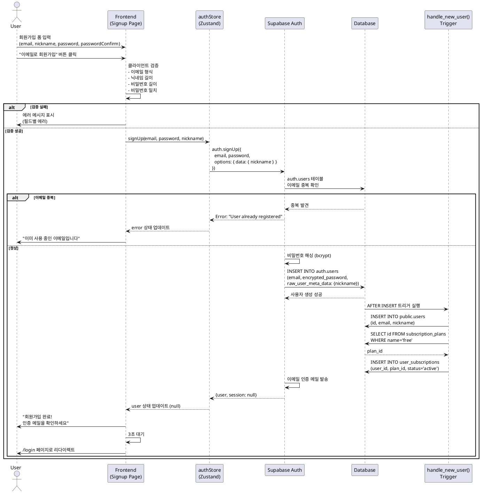

# UC-001: 회원가입 (이메일)

## 개요
- **Use Case ID**: UC-001
- **Use Case Name**: 회원가입 (이메일 + 비밀번호)
- **Created**: 2025-10-21
- **Version**: 1.0
- **Related**:
  - Userflow: [회원가입 플로우](../userflow.md#1-회원가입-sign-up)
  - Database: `users`, `user_subscriptions`, `subscription_plans`

---

## Primary Actor
신규 사용자 (미가입 학습자)

---

## Precondition
- 사용자가 Arikonia Hub 랜딩 페이지에 접근할 수 있다
- 사용자가 유효한 이메일 주소를 가지고 있다

---

## Trigger
사용자가 회원가입 페이지에서 이메일, 닉네임, 비밀번호를 입력하고 "이메일로 회원가입" 버튼 클릭

---

## Main Scenario

### Happy Path

1. 사용자가 회원가입 페이지 접근
   - **Actor**: User
   - **Action**: 랜딩 페이지 "회원가입" 버튼 클릭 또는 로그인 페이지에서 "계정이 없으신가요?" 링크 클릭
   - **Output**: `/signup` 페이지 표시

2. 사용자가 회원가입 폼 입력
   - **Actor**: User
   - **Action**: 이메일, 닉네임, 비밀번호, 비밀번호 확인 입력
   - **Input**:
     - `email`: 이메일 주소 (example@domain.com)
     - `nickname`: 닉네임 (2자 이상)
     - `password`: 비밀번호 (6자 이상)
     - `passwordConfirm`: 비밀번호 확인

3. 사용자가 "이메일로 회원가입" 버튼 클릭
   - **Actor**: User
   - **Action**: 폼 제출

4. 시스템이 클라이언트 측 검증 수행
   - **Actor**: System (Frontend)
   - **Validation**:
     - 이메일 형식 검증 (정규식: `example@domain.com`)
     - 닉네임 최소 2자 이상
     - 비밀번호 최소 6자 이상
     - 비밀번호 확인 일치 여부
   - **Output**: 검증 실패 시 해당 필드 하단에 에러 메시지 표시

5. 시스템이 Supabase Auth 회원가입 API 호출
   - **Actor**: System (Frontend)
   - **Action**: `authStore.signUp(email, password, nickname)` 호출
   - **API**: Supabase `auth.signUp()`
   - **Request**: `{ email, password, options: { data: { nickname } } }`

6. Supabase가 사용자 생성 처리
   - **Actor**: System (Supabase Auth)
   - **Action**:
     - `auth.users` 테이블에 사용자 생성
     - 이메일 중복 확인
     - 비밀번호 해싱 (자동)
   - **Data**: `auth.users` INSERT

7. 트리거가 프로필 및 구독 자동 생성
   - **Actor**: System (Database Trigger)
   - **Action**: `handle_new_user()` 함수 실행
   - **Process**:
     - `public.users` INSERT (id, email, nickname)
     - 무료 플랜 조회 (`subscription_plans WHERE name='free'`)
     - `user_subscriptions` INSERT (user_id, plan_id='free', status='active')
   - **Data**:
     - `users`: {id, email, nickname, created_at, updated_at}
     - `user_subscriptions`: {user_id, plan_id, status='active', expires_at=null}

8. Supabase가 이메일 인증 메일 발송
   - **Actor**: System (Supabase Auth)
   - **Action**: 인증 링크 포함 이메일 발송
   - **Note**: 사용자 상태는 `email_confirmed_at = NULL` (미인증)

9. 시스템이 성공 응답 반환
   - **Actor**: System (Supabase → Frontend)
   - **Response**: `{ user, session: null }` (이메일 미인증으로 세션 없음)
   - **Output**: "회원가입 완료! 인증 메일을 확인하세요" 메시지 표시

10. 시스템이 로그인 페이지로 리다이렉트
    - **Actor**: System (Frontend)
    - **Action**: 3초 후 `/login` 페이지로 자동 이동

---

## Edge Cases

### 이메일 중복
- **조건**: 입력한 이메일이 이미 `auth.users`에 존재
- **처리**: Supabase Auth가 중복 확인 후 에러 반환
- **결과**: "이미 사용 중인 이메일입니다" 에러 메시지 표시, 폼 유지

### 비밀번호 불일치
- **조건**: `password`와 `passwordConfirm`이 일치하지 않음
- **처리**: 클라이언트 검증 단계에서 차단
- **결과**: "비밀번호가 일치하지 않습니다" 에러 메시지 표시 (passwordConfirm 필드 하단)

### 이메일 형식 오류
- **조건**: 이메일이 표준 형식(RFC 5322)을 따르지 않음
- **처리**: 클라이언트 검증 실패
- **결과**: "올바른 이메일 주소를 입력하세요" 에러 메시지 표시

### 닉네임 길이 부족
- **조건**: 닉네임이 2자 미만
- **처리**: 클라이언트 검증 실패
- **결과**: "닉네임은 최소 2자 이상이어야 합니다" 에러 메시지 표시

### 비밀번호 길이 부족
- **조건**: 비밀번호가 6자 미만
- **처리**: 클라이언트 및 Supabase 검증 실패
- **결과**: "비밀번호는 최소 6자 이상이어야 합니다" 에러 메시지 표시

### 중복 제출 (Double Submit)
- **조건**: 사용자가 "회원가입" 버튼을 연속으로 클릭
- **처리**: `isLoading` 플래그로 중복 방지 (버튼 비활성화)
- **결과**: 첫 번째 요청만 처리됨

### 네트워크 오류
- **조건**: API 요청 중 네트워크 연결 끊김 또는 타임아웃
- **처리**: Supabase SDK에서 에러 catch
- **결과**: "네트워크 오류가 발생했습니다. 다시 시도해주세요" 에러 배너 표시

### 서버 오류 (500)
- **조건**: Supabase 내부 오류 발생
- **처리**: 예외 처리 및 에러 로깅
- **결과**: "서버 오류가 발생했습니다. 잠시 후 다시 시도해주세요" 에러 배너 표시

---

## Business Rules

### 데이터 검증
- 이메일은 RFC 5322 표준 형식 (정규식: `^[A-Za-z0-9._%+-]+@[A-Za-z0-9.-]+\.[A-Za-z]{2,}$`)
- 닉네임은 최소 2자 이상, 최대 20자
- 비밀번호는 최소 6자 이상 (Supabase 기본 정책)
- 모든 필드는 필수 입력

### 보안
- 비밀번호는 Supabase가 자동으로 해싱 처리 (bcrypt)
- 이메일 중복 불가 (UNIQUE 제약조건)
- 이메일 인증 필수 (미인증 시 로그인 불가 - Phase 2)

### 비즈니스 로직
- 가입 즉시 무료 플랜 자동 할당 (`subscription_plans.name='free'`)
- 관리자 이메일(`tkandpf18@naver.com`)은 엔터프라이즈 플랜 자동 할당
- 프로필 생성 시 `created_at`, `updated_at` 자동 기록
- 구독 상태는 `active`로 시작, 만료일은 `null` (무제한)

---

## Sequence Diagram

---

## Postcondition
- 새로운 사용자 레코드가 `auth.users`, `public.users`에 생성됨
- 사용자에게 무료 플랜 구독이 자동 할당됨 (`user_subscriptions`)
- 사용자에게 이메일 인증 메일이 발송됨
- 사용자는 로그인 페이지에서 인증 후 로그인 가능

---

## Non-Functional Requirements

### Performance
- 회원가입 API 응답 시간 < 2초
- 클라이언트 검증 응답 < 100ms (즉시)
- 이메일 인증 메일 발송 < 5초

### Security
- HTTPS 통신 (Vercel 자동 적용)
- 비밀번호 해싱 (Supabase bcrypt)
- CSRF 방지 (Supabase 자동)
- SQL Injection 방지 (Supabase parameterized queries)

### Usability
- 에러 메시지는 명확하고 한글로 표시
- 입력 필드별 실시간 검증 피드백
- 로딩 중 버튼 비활성화 및 "가입 중..." 표시
- 성공 메시지 3초 표시 후 자동 리다이렉트

### Accessibility
- 모든 입력 필드에 `<label>` 태그 제공
- 에러 메시지는 `role="alert"` 또는 `aria-live="polite"`
- 키보드 네비게이션 지원 (Tab, Enter)
- 색상 대비 WCAG AA 기준 (4.5:1)

---

## Related Use Cases
- **UC-002**: 회원가입 (구글 OAuth)
- **UC-003**: 로그인 (이메일)
- **UC-004**: 로그인 (구글 OAuth)
- **UC-010**: 이메일 인증 (Phase 2)
- **UC-011**: 비밀번호 재설정 (Phase 2)

---

## Notes

### Phase 1 구현 범위
- 이메일 회원가입 기본 기능
- 무료 플랜 자동 할당
- 이메일 인증 메일 발송 (단, 인증 없이도 로그인 가능)

### Phase 2 개선사항
- 이메일 인증 강제 (미인증 시 로그인 차단)
- 닉네임 중복 확인 및 제안 (예: "홍길동123")
- 비밀번호 강도 표시 (약함/보통/강함)
- reCAPTCHA 추가 (봇 방지)
- 소셜 프로필 이미지 자동 연동

### 기술적 고려사항
- Supabase Auth는 이메일 인증 전까지 `email_confirmed_at = NULL`
- `handle_new_user()` 트리거는 SECURITY DEFINER로 실행 (권한 우회)
- 닉네임은 `raw_user_meta_data`에 저장 후 트리거에서 추출
- 관리자 이메일 체크는 트리거 내부에서 수행
