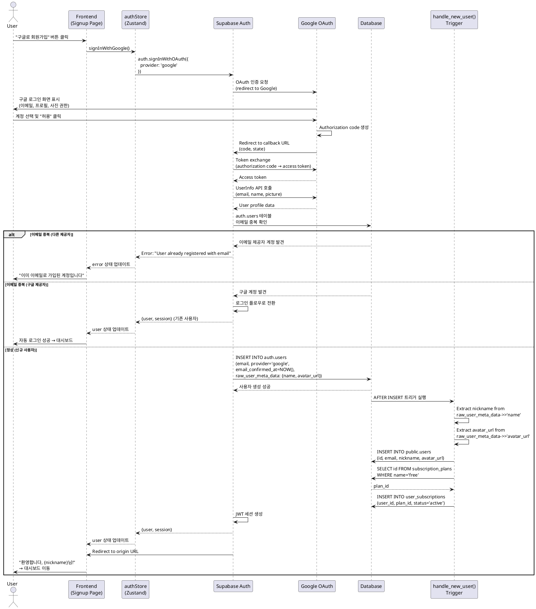

# UC-002: 회원가입 (구글 OAuth)

## 개요
- **Use Case ID**: UC-002
- **Use Case Name**: 회원가입 (구글 OAuth 2.0)
- **Created**: 2025-10-21
- **Version**: 1.0
- **Related**:
  - Userflow: [회원가입 플로우](../userflow.md#1-회원가입-sign-up)
  - Database: `users`, `user_subscriptions`, `subscription_plans`

---

## Primary Actor
신규 사용자 (미가입 학습자)

---

## Precondition
- 사용자가 Arikonia Hub 랜딩 페이지에 접근할 수 있다
- 사용자가 유효한 구글 계정을 가지고 있다
- 사용자 브라우저에서 팝업이 차단되지 않았다

---

## Trigger
사용자가 회원가입 페이지에서 "구글로 회원가입" 버튼 클릭

---

## Main Scenario

### Happy Path

1. 사용자가 회원가입 페이지 접근
   - **Actor**: User
   - **Action**: 랜딩 페이지 "회원가입" 버튼 클릭 또는 로그인 페이지에서 "계정이 없으신가요?" 링크 클릭
   - **Output**: `/signup` 페이지 표시

2. 사용자가 "구글로 회원가입" 버튼 클릭
   - **Actor**: User
   - **Action**: OAuth 회원가입 버튼 클릭
   - **Output**: 구글 OAuth 동의 화면 팝업 표시

3. 시스템이 Supabase OAuth 플로우 시작
   - **Actor**: System (Frontend)
   - **Action**: `authStore.signInWithGoogle()` 호출
   - **API**: Supabase `auth.signInWithOAuth({ provider: 'google' })`
   - **Request**: `{ provider: 'google', options: { redirectTo: window.location.origin } }`

4. 구글 OAuth 동의 화면 표시
   - **Actor**: System (Google OAuth)
   - **Action**: 구글 로그인 및 권한 동의 화면 표시
   - **Required Permissions**:
     - 이메일 주소 (email)
     - 프로필 정보 (profile)
     - 프로필 사진 (avatar)

5. 사용자가 구글 계정으로 로그인 및 권한 승인
   - **Actor**: User
   - **Action**: 구글 계정 선택 및 "허용" 버튼 클릭
   - **Output**: 구글이 authorization code 발급

6. 구글이 Supabase로 리다이렉트
   - **Actor**: System (Google OAuth)
   - **Action**: `{SUPABASE_URL}/auth/v1/callback` 엔드포인트로 리다이렉트
   - **Parameters**: `code={authorization_code}&state={state_token}`

7. Supabase가 구글 토큰 교환 및 사용자 정보 조회
   - **Actor**: System (Supabase Auth)
   - **Action**:
     - Authorization code를 access token으로 교환
     - 구글 UserInfo API 호출로 프로필 정보 조회
   - **Retrieved Data**:
     - `email`: 구글 계정 이메일
     - `name`: 구글 계정 이름
     - `picture`: 구글 프로필 사진 URL

8. Supabase가 사용자 생성 처리
   - **Actor**: System (Supabase Auth)
   - **Action**:
     - `auth.users` 테이블에 사용자 생성
     - 이메일 중복 확인 (기존 이메일 계정과 병합 불가)
     - `email_confirmed_at` 자동 설정 (구글이 이미 인증함)
   - **Data**: `auth.users` INSERT
     - `id`: UUID (자동 생성)
     - `email`: 구글 이메일
     - `provider`: 'google'
     - `email_confirmed_at`: NOW() (즉시 인증됨)
     - `raw_user_meta_data`: `{ name, avatar_url: picture, provider: 'google' }`

9. 트리거가 프로필 및 구독 자동 생성
   - **Actor**: System (Database Trigger)
   - **Action**: `handle_new_user()` 함수 실행
   - **Process**:
     - 닉네임 추출: `raw_user_meta_data->>'name'` → `nickname`
     - Avatar URL 추출: `raw_user_meta_data->>'avatar_url'` → `avatar_url`
     - `public.users` INSERT (id, email, nickname, avatar_url)
     - 무료 플랜 조회 (`subscription_plans WHERE name='free'`)
     - `user_subscriptions` INSERT (user_id, plan_id='free', status='active')
   - **Data**:
     - `users`: {id, email, nickname, avatar_url, created_at, updated_at}
     - `user_subscriptions`: {user_id, plan_id, status='active', expires_at=null}

10. Supabase가 세션 생성 및 응답
    - **Actor**: System (Supabase Auth)
    - **Response**: `{ user, session }` (JWT 토큰 포함)
    - **Session Data**:
      - `access_token`: JWT 토큰
      - `refresh_token`: 갱신용 토큰
      - `expires_at`: 만료 시간

11. 시스템이 프론트엔드로 리다이렉트
    - **Actor**: System (Supabase → Frontend)
    - **Action**: `window.location.origin` URL로 리다이렉트 (state 포함)
    - **Output**: 메인 페이지 또는 대시보드로 자동 로그인됨

12. 시스템이 환영 메시지 표시
    - **Actor**: System (Frontend)
    - **Action**: 로그인 성공 토스트 메시지 표시
    - **Output**: "환영합니다, {nickname}님!" 메시지 표시 후 대시보드 이동

---

## Edge Cases

### 이메일 중복 (다른 제공자)
- **조건**: 입력한 구글 이메일이 이미 `auth.users`에 이메일 제공자로 존재
- **처리**: Supabase Auth가 중복 확인 후 에러 반환 (제공자 간 병합 불가)
- **결과**: "이미 이메일로 가입된 계정입니다. 이메일 로그인을 사용하세요" 에러 메시지 표시

### 이메일 중복 (동일 제공자)
- **조건**: 입력한 구글 이메일이 이미 `auth.users`에 구글 제공자로 존재
- **처리**: 회원가입이 아닌 로그인 플로우로 전환 (기존 사용자 인증)
- **결과**: 자동으로 로그인 처리되고 대시보드로 이동

### OAuth 권한 거부
- **조건**: 사용자가 구글 동의 화면에서 "취소" 또는 "거부" 클릭
- **처리**: 구글이 에러 파라미터와 함께 리다이렉트 (`error=access_denied`)
- **결과**: "구글 로그인이 취소되었습니다" 메시지 표시, 회원가입 페이지 유지

### 팝업 차단
- **조건**: 사용자 브라우저에서 OAuth 팝업이 차단됨
- **처리**: Supabase SDK가 팝업 실패 감지
- **결과**: "팝업이 차단되었습니다. 브라우저 설정을 확인하세요" 에러 배너 표시

### 구글 API 오류
- **조건**: 구글 OAuth API가 일시적으로 사용 불가 (500, 503 등)
- **처리**: Supabase가 구글 API 에러 catch
- **결과**: "구글 로그인 서비스에 문제가 발생했습니다. 잠시 후 다시 시도해주세요" 에러 배너 표시

### 닉네임 누락 (드문 경우)
- **조건**: 구글 계정에 `name` 필드가 없음 (극히 드묾)
- **처리**: `handle_new_user()` 함수에서 이메일 앞부분을 닉네임으로 사용
- **결과**: 프로필 생성 성공, 닉네임은 `email.split('@')[0]` 값 사용

### 네트워크 오류 (토큰 교환 중)
- **조건**: Supabase ↔ 구글 API 통신 중 네트워크 연결 끊김
- **처리**: Supabase Auth 타임아웃 에러 발생
- **결과**: "네트워크 오류가 발생했습니다. 다시 시도해주세요" 에러 배너 표시

### 중복 제출 (Double Click)
- **조건**: 사용자가 "구글로 회원가입" 버튼을 연속으로 클릭
- **처리**: `isLoading` 플래그로 중복 방지 (버튼 비활성화)
- **Result**: 첫 번째 요청만 처리됨, 두 번째 클릭은 무시됨

---

## Business Rules

### 데이터 검증
- 이메일은 구글이 검증한 이메일 사용 (추가 검증 불필요)
- 닉네임은 구글 계정 이름(`name`) 자동 사용
- Avatar URL은 구글 프로필 사진(`picture`) 자동 사용
- 비밀번호 불필요 (OAuth 제공자가 인증 처리)

### 보안
- OAuth 2.0 표준 프로토콜 사용
- PKCE (Proof Key for Code Exchange) 자동 적용 (Supabase 기본)
- State 파라미터로 CSRF 공격 방지
- 이메일 자동 인증됨 (`email_confirmed_at` 즉시 설정)
- 제공자 간 이메일 중복 불가 (보안 정책)

### 비즈니스 로직
- 가입 즉시 무료 플랜 자동 할당 (`subscription_plans.name='free'`)
- 관리자 이메일(`tkandpf18@naver.com`)은 엔터프라이즈 플랜 자동 할당
- 구글 프로필 사진 자동 저장 (`users.avatar_url`)
- 구글 계정 이름을 닉네임으로 자동 설정 (사용자가 나중에 변경 가능)
- 이메일 인증 단계 생략 (구글이 이미 인증함)

---

## Sequence Diagram

---

## Postcondition
- 새로운 사용자 레코드가 `auth.users`, `public.users`에 생성됨
- 사용자에게 무료 플랜 구독이 자동 할당됨 (`user_subscriptions`)
- 사용자는 즉시 로그인 상태로 대시보드 접근 가능 (이메일 인증 불필요)
- 구글 프로필 사진과 이름이 자동으로 프로필에 저장됨

---

## Non-Functional Requirements

### Performance
- OAuth 전체 플로우 완료 시간 < 5초
- 토큰 교환 응답 시간 < 1초
- 구글 UserInfo API 조회 < 500ms

### Security
- HTTPS 통신 (Vercel + Supabase 자동 적용)
- OAuth 2.0 + PKCE 표준 준수
- State 파라미터 CSRF 방지
- 토큰은 httpOnly 쿠키에 저장 (XSS 방지)
- Refresh token rotation 자동 적용

### Usability
- 팝업 차단 시 명확한 안내 메시지
- 구글 로그인 화면은 구글 표준 UI 사용
- 에러 메시지는 명확하고 한글로 표시
- 로딩 중 "구글 계정 연동 중..." 표시
- 성공 시 환영 메시지와 함께 자동 리다이렉트

### Accessibility
- "구글로 회원가입" 버튼은 명확한 레이블 제공
- 키보드 네비게이션 지원 (Tab, Enter)
- OAuth 팝업 화면은 구글의 접근성 기준 준수
- 색상 대비 WCAG AA 기준 (4.5:1)

---

## Related Use Cases
- **UC-001**: 회원가입 (이메일)
- **UC-003**: 로그인 (이메일 + 구글 OAuth)
- **UC-004**: 프로젝트 접근 제어
- **UC-011**: 비밀번호 재설정 (Phase 2 - 구글 계정은 해당 없음)

---

## Notes

### Phase 1 구현 범위
- 구글 OAuth 2.0 회원가입 기본 기능
- 무료 플랜 자동 할당
- 구글 프로필 사진 및 이름 자동 연동
- 이메일 인증 생략 (구글이 이미 인증함)

### Phase 2 개선사항
- 닉네임 변경 기능 (마이페이지)
- 프로필 사진 커스텀 업로드 (구글 사진 대신)
- 계정 연결 (이메일 계정 ↔ 구글 계정 병합)
- 추가 OAuth 제공자 (Naver, Kakao)

### 기술적 고려사항
- Supabase Auth는 제공자 간 이메일 중복을 허용하지 않음 (보안 정책)
- 구글 OAuth는 `email_confirmed_at`을 자동으로 설정함 (추가 인증 불필요)
- `handle_new_user()` 트리거는 `raw_user_meta_data`에서 `name`, `avatar_url` 추출
- 관리자 이메일 체크는 트리거 내부에서 수행
- OAuth redirect URL은 Supabase 콘솔에서 화이트리스트 등록 필요
- 구글 OAuth Client ID/Secret은 Supabase 대시보드에서 설정

### 구글 OAuth 설정 요구사항
- Google Cloud Console에서 OAuth 2.0 Client ID 생성 필요
- Authorized redirect URIs: `https://{PROJECT_REF}.supabase.co/auth/v1/callback`
- Scopes: `openid`, `email`, `profile`
- Supabase Dashboard → Authentication → Providers → Google 활성화
