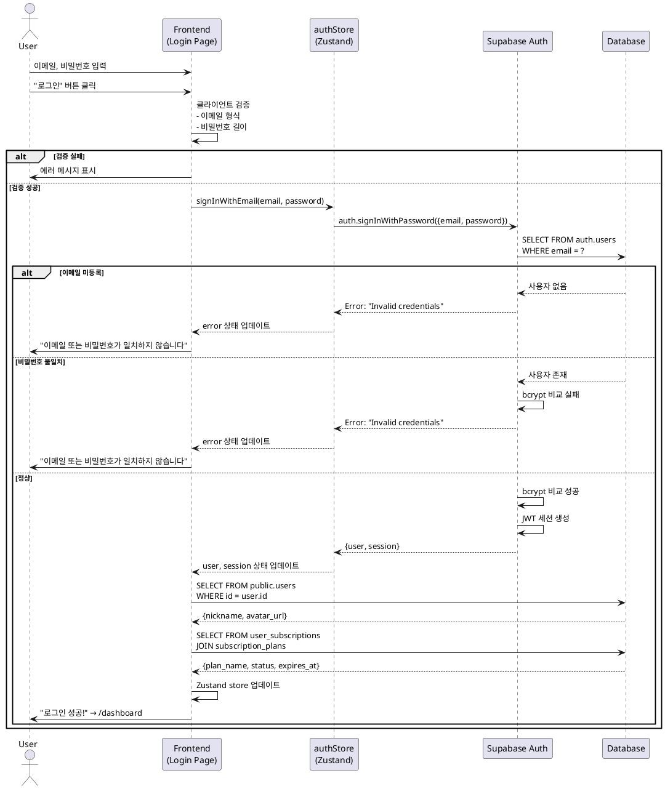
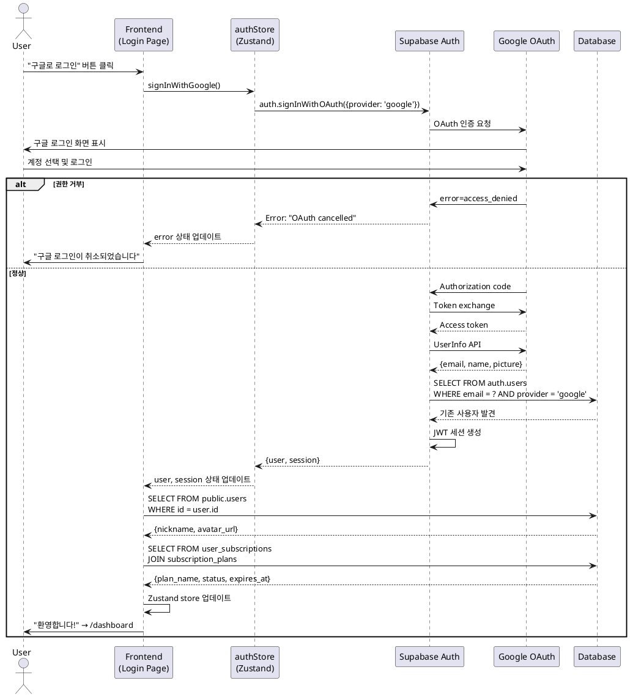

# UC-003: 로그인

## 개요
- **Use Case ID**: UC-003
- **Use Case Name**: 로그인 (이메일 + 구글 OAuth)
- **Created**: 2025-10-21
- **Version**: 1.0
- **Related**:
  - Userflow: [로그인 플로우](../userflow.md#2-로그인-login)
  - Database: `users`, `user_subscriptions`

---

## Primary Actor
기존 사용자 (가입 완료 학습자)

---

## Precondition
- 사용자가 UC-001 또는 UC-002를 통해 회원가입을 완료했다
- 이메일 사용자는 이메일 인증을 완료했다 (Phase 2에서 강제)
- 사용자가 Arikonia Hub 로그인 페이지에 접근할 수 있다

---

## Trigger
사용자가 로그인 페이지에서 이메일/비밀번호 입력 후 "로그인" 버튼 클릭 또는 "구글로 로그인" 버튼 클릭

---

## Main Scenario

### Scenario A: 이메일 로그인 (Happy Path)

1. 사용자가 로그인 페이지 접근
   - **Actor**: User
   - **Action**: 랜딩 페이지 "로그인" 버튼 클릭 또는 `/login` URL 직접 접근
   - **Output**: `/login` 페이지 표시

2. 사용자가 로그인 폼 입력
   - **Actor**: User
   - **Action**: 이메일, 비밀번호 입력
   - **Input**:
     - `email`: 이메일 주소
     - `password`: 비밀번호

3. 사용자가 "로그인" 버튼 클릭
   - **Actor**: User
   - **Action**: 폼 제출

4. 시스템이 클라이언트 측 검증 수행
   - **Actor**: System (Frontend)
   - **Validation**:
     - 이메일 형식 검증
     - 비밀번호 길이 검증 (6자 이상)
   - **Output**: 검증 실패 시 해당 필드 하단에 에러 메시지 표시

5. 시스템이 Supabase Auth 로그인 API 호출
   - **Actor**: System (Frontend)
   - **Action**: `authStore.signInWithEmail(email, password)` 호출
   - **API**: Supabase `auth.signInWithPassword({ email, password })`

6. Supabase가 인증 처리
   - **Actor**: System (Supabase Auth)
   - **Action**:
     - `auth.users` 테이블에서 이메일 조회
     - 비밀번호 해시 비교 (bcrypt)
     - 이메일 인증 여부 확인 (Phase 2)
   - **Data**: `auth.users` SELECT

7. Supabase가 세션 생성
   - **Actor**: System (Supabase Auth)
   - **Action**: JWT 토큰 생성 및 세션 생성
   - **Response**: `{ user, session }`
   - **Session Data**:
     - `access_token`: JWT 토큰
     - `refresh_token`: 갱신용 토큰
     - `expires_at`: 만료 시간 (1시간 후)

8. 시스템이 사용자 정보 조회
   - **Actor**: System (Frontend)
   - **Action**: `public.users` 테이블에서 프로필 조회
   - **API**: Supabase `from('users').select('*').eq('id', user.id).single()`
   - **Data**: `{ id, email, nickname, avatar_url, created_at, updated_at }`

9. 시스템이 구독 정보 조회
   - **Actor**: System (Frontend)
   - **Action**: `user_subscriptions` 조인 조회
   - **API**:
     ```typescript
     from('user_subscriptions')
       .select('*, subscription_plans(*)')
       .eq('user_id', user.id)
       .single()
     ```
   - **Data**: `{ plan_name, status, expires_at, max_projects }`

10. 시스템이 상태 업데이트 및 리다이렉트
    - **Actor**: System (Frontend)
    - **Action**: Zustand store에 user, session, subscription 저장
    - **Output**: "로그인 성공!" 토스트 메시지 표시
    - **Redirect**: `/dashboard` 페이지로 자동 이동

---

### Scenario B: 구글 로그인 (Happy Path)

1. 사용자가 로그인 페이지 접근
   - **Actor**: User
   - **Action**: 랜딩 페이지 "로그인" 버튼 클릭 또는 `/login` URL 직접 접근
   - **Output**: `/login` 페이지 표시

2. 사용자가 "구글로 로그인" 버튼 클릭
   - **Actor**: User
   - **Action**: OAuth 로그인 버튼 클릭
   - **Output**: 구글 로그인 화면 팝업 표시

3-7. **OAuth 플로우 실행** (UC-002와 동일)
   - Supabase OAuth 시작 → 구글 로그인 → 토큰 교환 → 사용자 정보 조회

8. Supabase가 기존 사용자 확인
   - **Actor**: System (Supabase Auth)
   - **Action**: `auth.users` 테이블에서 이메일 조회
   - **Result**: 기존 구글 계정 발견 → 로그인 플로우 (신규 가입 아님)

9. Supabase가 세션 생성
   - **Actor**: System (Supabase Auth)
   - **Action**: JWT 토큰 생성 및 세션 생성
   - **Response**: `{ user, session }`

10. 시스템이 사용자 및 구독 정보 조회
    - **Actor**: System (Frontend)
    - **Action**: 이메일 로그인과 동일 (Scenario A의 8-9단계)

11. 시스템이 상태 업데이트 및 리다이렉트
    - **Actor**: System (Frontend)
    - **Output**: "환영합니다, {nickname}님!" 토스트 메시지 표시
    - **Redirect**: `/dashboard` 페이지로 자동 이동

---

## Edge Cases

### 이메일 미등록
- **조건**: 입력한 이메일이 `auth.users`에 존재하지 않음
- **처리**: Supabase Auth가 사용자 조회 실패
- **결과**: "이메일 또는 비밀번호가 일치하지 않습니다" 에러 메시지 표시
- **보안**: 계정 존재 여부 노출 방지 (일반적인 에러 메시지 사용)

### 비밀번호 불일치
- **조건**: 비밀번호 해시가 일치하지 않음
- **처리**: Supabase Auth가 bcrypt 비교 실패
- **결과**: "이메일 또는 비밀번호가 일치하지 않습니다" 에러 메시지 표시
- **보안**: 이메일 존재 여부 노출 방지

### 이메일 미인증 (Phase 2)
- **조건**: `email_confirmed_at = NULL` (이메일 인증 미완료)
- **처리**: Supabase Auth가 인증 상태 확인 후 차단
- **결과**: "이메일 인증이 필요합니다. 인증 메일을 확인하세요" 에러 메시지 표시
- **Action**: "인증 메일 재발송" 버튼 표시

### 계정 비활성화 (Phase 2)
- **조건**: `users.is_active = false` (관리자가 계정 비활성화)
- **처리**: 로그인 성공 후 프로필 조회 시 `is_active` 체크
- **결과**: "계정이 비활성화되었습니다. 관리자에게 문의하세요" 에러 메시지 표시
- **Action**: 즉시 로그아웃 처리

### 구독 만료 (경고)
- **조건**: `user_subscriptions.expires_at < NOW()` (유료 플랜 만료)
- **처리**: 로그인 성공하지만 구독 상태 확인 후 경고 표시
- **결과**: 로그인 성공, 배너 메시지 "구독이 만료되었습니다. 무료 플랜으로 전환됩니다"
- **Action**: 자동으로 `status='expired'` 업데이트, 무료 플랜 기능만 사용 가능

### 중복 제출 (Double Submit)
- **조건**: 사용자가 "로그인" 버튼을 연속으로 클릭
- **처리**: `isLoading` 플래그로 중복 방지 (버튼 비활성화)
- **결과**: 첫 번째 요청만 처리됨

### 네트워크 오류
- **조건**: API 요청 중 네트워크 연결 끊김 또는 타임아웃
- **처리**: Supabase SDK에서 에러 catch
- **결과**: "네트워크 오류가 발생했습니다. 다시 시도해주세요" 에러 배너 표시

### 서버 오류 (500)
- **조건**: Supabase 내부 오류 발생
- **처리**: 예외 처리 및 에러 로깅
- **결과**: "서버 오류가 발생했습니다. 잠시 후 다시 시도해주세요" 에러 배너 표시

### 세션 만료 (자동 갱신)
- **조건**: 로그인 후 1시간 경과로 `access_token` 만료
- **처리**: Supabase SDK가 자동으로 `refresh_token` 사용하여 갱신
- **결과**: 사용자는 알아채지 못하고 계속 사용 가능 (백그라운드 갱신)

### OAuth 권한 거부
- **조건**: 사용자가 구글 로그인 화면에서 "취소" 클릭
- **처리**: 구글이 에러 파라미터와 함께 리다이렉트
- **결과**: "구글 로그인이 취소되었습니다" 메시지 표시, 로그인 페이지 유지

---

## Business Rules

### 데이터 검증
- 이메일은 RFC 5322 표준 형식
- 비밀번호는 최소 6자 이상 (Supabase 기본 정책)
- 모든 필드는 필수 입력

### 보안
- 비밀번호는 bcrypt 해싱으로 저장 및 비교
- JWT 토큰은 httpOnly 쿠키에 저장 (XSS 방지)
- Refresh token은 자동 rotation 적용
- 로그인 실패 시 이메일 존재 여부 노출 방지
- Rate limiting 적용 (5분 내 10회 실패 시 일시 차단 - Phase 2)

### 세션 관리
- Access token 만료: 1시간
- Refresh token 만료: 7일
- Refresh token 자동 갱신 (SDK 자동 처리)
- 로그아웃 시 모든 토큰 무효화

### 비즈니스 로직
- 로그인 성공 시 사용자 정보 및 구독 정보 자동 조회
- 구독 만료 시 경고 표시하지만 로그인은 허용
- 계정 비활성화 시 로그인 즉시 차단
- 이메일 미인증 시 로그인 차단 (Phase 2)

---

## Sequence Diagram

### Scenario A: 이메일 로그인



### Scenario B: 구글 로그인



---

## Postcondition
- 사용자가 인증되어 세션이 생성됨
- JWT 토큰이 httpOnly 쿠키에 저장됨
- Zustand store에 사용자 정보, 세션, 구독 정보가 저장됨
- 사용자가 대시보드 또는 요청한 페이지로 리다이렉트됨
- 이후 모든 API 요청에 JWT 토큰이 자동으로 포함됨

---

## Non-Functional Requirements

### Performance
- 이메일 로그인 API 응답 시간 < 1초
- 구글 로그인 전체 플로우 < 5초
- 클라이언트 검증 응답 < 100ms
- 사용자 정보 조회 < 500ms

### Security
- HTTPS 통신 (Vercel + Supabase 자동 적용)
- bcrypt 비밀번호 해싱 (cost factor 10)
- JWT 토큰은 httpOnly 쿠키 (XSS 방지)
- CSRF 방지 (Supabase 자동)
- Rate limiting (5분 내 10회 실패 시 차단 - Phase 2)
- 로그인 실패 시 계정 존재 여부 노출 방지

### Usability
- 에러 메시지는 명확하고 한글로 표시
- 입력 필드별 실시간 검증 피드백
- 로딩 중 버튼 비활성화 및 "로그인 중..." 표시
- 성공 메시지 표시 후 자동 리다이렉트
- "비밀번호 찾기" 링크 제공 (Phase 2)
- "회원가입" 링크 제공

### Accessibility
- 모든 입력 필드에 `<label>` 태그 제공
- 에러 메시지는 `role="alert"` 또는 `aria-live="polite"`
- 키보드 네비게이션 지원 (Tab, Enter)
- 색상 대비 WCAG AA 기준 (4.5:1)
- 스크린 리더 지원

---

## Related Use Cases
- **UC-001**: 회원가입 (이메일)
- **UC-002**: 회원가입 (구글 OAuth)
- **UC-004**: 프로젝트 접근 제어
- **UC-010**: 이메일 인증 (Phase 2)
- **UC-011**: 비밀번호 재설정 (Phase 2)
- **UC-012**: 로그아웃 (Phase 2)

---

## Notes

### Phase 1 구현 범위
- 이메일 로그인 기본 기능
- 구글 OAuth 로그인
- 세션 관리 및 자동 갱신
- 사용자 정보 및 구독 정보 자동 조회
- 이메일 미인증도 로그인 허용 (경고만 표시)

### Phase 2 개선사항
- 이메일 인증 강제 (미인증 시 로그인 차단)
- Rate limiting (무차별 대입 공격 방지)
- 비밀번호 찾기 기능
- 로그인 이력 추적 (IP, 디바이스, 시간)
- 의심스러운 로그인 감지 및 이메일 알림
- 다중 디바이스 세션 관리

### 기술적 고려사항
- Supabase Auth는 JWT 토큰을 자동으로 httpOnly 쿠키에 저장
- Refresh token rotation은 Supabase SDK가 자동 처리
- 이메일 로그인과 OAuth 로그인은 동일한 세션 구조 사용
- 구독 정보는 매 로그인마다 조회하여 최신 상태 유지
- `email_confirmed_at` 체크는 Phase 2에서 강제 적용
- 로그인 실패 메시지는 보안상 일반적인 메시지 사용 (계정 존재 여부 노출 방지)

### 프론트엔드 구현 참고
```typescript
// authStore.ts
const signInWithEmail = async (email: string, password: string) => {
  const { data, error } = await supabase.auth.signInWithPassword({ email, password });
  if (error) throw error;

  // 사용자 정보 조회
  const { data: profile } = await supabase
    .from('users')
    .select('*')
    .eq('id', data.user.id)
    .single();

  // 구독 정보 조회
  const { data: subscription } = await supabase
    .from('user_subscriptions')
    .select('*, subscription_plans(*)')
    .eq('user_id', data.user.id)
    .single();

  set({ user: data.user, session: data.session, profile, subscription });
};

const signInWithGoogle = async () => {
  const { data, error } = await supabase.auth.signInWithOAuth({
    provider: 'google',
    options: { redirectTo: window.location.origin }
  });
  if (error) throw error;
};
```
