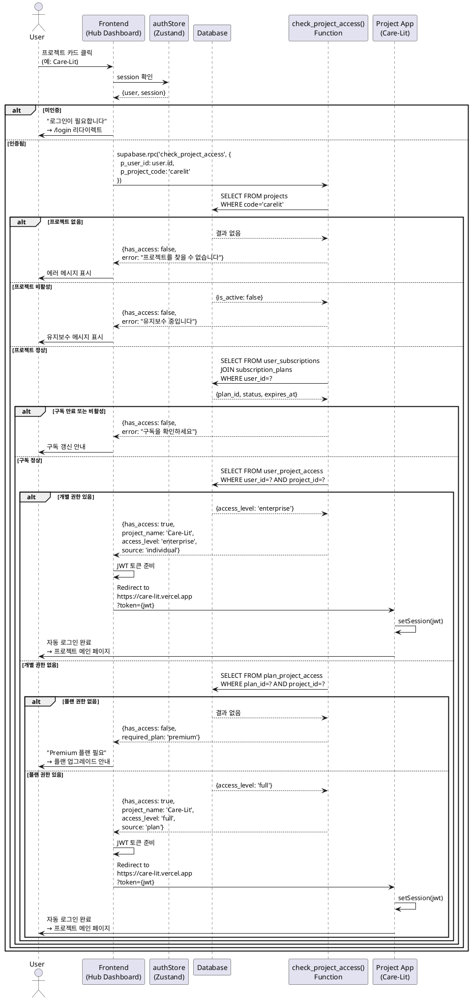

# UC-004: 프로젝트 접근 제어

## 개요
- **Use Case ID**: UC-004
- **Use Case Name**: 프로젝트 접근 제어 (Subscription-Based Access)
- **Created**: 2025-10-21
- **Version**: 1.0
- **Related**:
  - Userflow: [프로젝트 접근 플로우](../userflow.md#3-프로젝트-접근-project-access)
  - Database: `projects`, `user_subscriptions`, `subscription_plans`, `plan_project_access`, `user_project_access`
  - Function: `check_project_access(p_user_id, p_project_code)`

---

## Primary Actor
인증된 사용자 (로그인 완료 학습자)

---

## Precondition
- 사용자가 UC-003을 통해 로그인을 완료했다
- 사용자가 유효한 구독 플랜을 가지고 있다 (`user_subscriptions.status='active'`)
- 접근하려는 프로젝트가 활성화 상태다 (`projects.is_active=true`)

---

## Trigger
사용자가 프로젝트 URL 클릭 또는 프로젝트 페이지에 직접 접근

---

## Main Scenario

### Happy Path

1. 사용자가 프로젝트 접근 시도
   - **Actor**: User
   - **Action**: 대시보드에서 프로젝트 카드 클릭 또는 프로젝트 URL 직접 입력
   - **Input**: 프로젝트 코드 (예: `carelit`, `temflow`, `arisper`)

2. 시스템이 인증 상태 확인
   - **Actor**: System (Frontend)
   - **Action**: Zustand store에서 `session` 확인
   - **Validation**: `session?.access_token` 존재 여부 확인

3. 시스템이 접근 권한 확인 API 호출
   - **Actor**: System (Frontend)
   - **Action**: `check_project_access(user_id, project_code)` 함수 호출
   - **API**: Supabase RPC
     ```typescript
     supabase.rpc('check_project_access', {
       p_user_id: user.id,
       p_project_code: 'carelit'
     })
     ```

4. 데이터베이스 함수가 프로젝트 조회
   - **Actor**: System (Database Function)
   - **Action**: `projects` 테이블에서 프로젝트 조회
   - **Query**: `SELECT id, name, is_active FROM projects WHERE code = 'carelit'`
   - **Validation**: 프로젝트 존재 여부 및 활성화 상태 확인

5. 데이터베이스 함수가 사용자 구독 조회
   - **Actor**: System (Database Function)
   - **Action**: `user_subscriptions` 조인 조회
   - **Query**:
     ```sql
     SELECT us.plan_id, sp.name, us.status, us.expires_at
     FROM user_subscriptions us
     JOIN subscription_plans sp ON us.plan_id = sp.id
     WHERE us.user_id = p_user_id
     ```
   - **Validation**: 구독 상태 `status='active'` 및 만료일 확인

6. 데이터베이스 함수가 개별 접근 권한 확인
   - **Actor**: System (Database Function)
   - **Action**: `user_project_access` 테이블 조회 (우선순위 1)
   - **Query**:
     ```sql
     SELECT access_level, granted_at, granted_by
     FROM user_project_access
     WHERE user_id = p_user_id AND project_id = v_project_id
     ```
   - **Result**: 개별 권한이 있으면 즉시 반환 (플랜 권한보다 우선)

7. 데이터베이스 함수가 플랜 접근 권한 확인
   - **Actor**: System (Database Function)
   - **Action**: `plan_project_access` 테이블 조회 (우선순위 2)
   - **Query**:
     ```sql
     SELECT access_level
     FROM plan_project_access
     WHERE plan_id = v_plan_id AND project_id = v_project_id
     ```
   - **Result**: 플랜에 프로젝트 접근 권한 포함 여부 확인

8. 데이터베이스 함수가 결과 반환
   - **Actor**: System (Database Function)
   - **Response**: JSONB 형식
     ```json
     {
       "has_access": true,
       "project_name": "Care-Lit",
       "access_level": "premium",
       "source": "plan" // or "individual"
     }
     ```

9. 시스템이 프로젝트 리다이렉트
   - **Actor**: System (Frontend)
   - **Action**: 접근 권한 확인 후 프로젝트 URL로 리다이렉트
   - **URL**: `https://care-lit.vercel.app?token={jwt_token}`
   - **Parameter**: JWT 토큰을 쿼리 파라미터로 전달 (SSO)

10. 프로젝트가 SSO 인증 처리
    - **Actor**: System (Project App)
    - **Action**: 쿼리 파라미터에서 JWT 토큰 추출 후 Supabase Auth 세션 설정
    - **API**: `supabase.auth.setSession({ access_token, refresh_token })`
    - **Result**: 사용자 자동 로그인, 프로젝트 메인 페이지 표시

---

## Edge Cases

### 프로젝트 존재하지 않음
- **조건**: 입력한 `project_code`가 `projects` 테이블에 없음
- **처리**: `check_project_access()` 함수에서 예외 발생
- **결과**:
  ```json
  {
    "has_access": false,
    "project_name": null,
    "error": "프로젝트를 찾을 수 없습니다"
  }
  ```
- **UI**: "존재하지 않는 프로젝트입니다" 에러 메시지 표시, 대시보드로 리다이렉트

### 프로젝트 비활성화
- **조건**: `projects.is_active = false` (유지보수 중)
- **처리**: `check_project_access()` 함수에서 활성화 상태 확인
- **결과**:
  ```json
  {
    "has_access": false,
    "project_name": "Care-Lit",
    "error": "현재 이 프로젝트는 유지보수 중입니다"
  }
  ```
- **UI**: "Care-Lit은 현재 유지보수 중입니다. 잠시 후 다시 시도해주세요" 메시지 표시

### 접근 권한 없음 (플랜 부족)
- **조건**: 사용자 플랜에 프로젝트 접근 권한 없음
- **처리**: `plan_project_access` 테이블 조회 결과 없음
- **결과**:
  ```json
  {
    "has_access": false,
    "project_name": "Tem-Flow",
    "current_plan": "free",
    "required_plan": "premium",
    "error": "Tem-Flow는 Premium 플랜이 필요합니다"
  }
  ```
- **UI**:
  - "Tem-Flow는 Premium 플랜이 필요합니다" 에러 배너 표시
  - "플랜 업그레이드" 버튼 제공 → 결제 페이지로 이동

### 구독 만료
- **조건**: `user_subscriptions.expires_at < NOW()` (유료 플랜 기간 만료)
- **처리**: `check_project_access()` 함수에서 만료일 확인
- **결과**:
  ```json
  {
    "has_access": false,
    "project_name": "Tem-Flow",
    "error": "구독이 만료되었습니다. 플랜을 갱신하세요"
  }
  ```
- **UI**:
  - "구독이 만료되었습니다" 에러 배너 표시
  - "구독 갱신" 버튼 제공 → 결제 페이지로 이동
- **Note**: 무료 플랜은 `expires_at = null` (만료 없음)

### 구독 상태 비활성
- **조건**: `user_subscriptions.status != 'active'` (결제 실패, 취소 등)
- **처리**: `check_project_access()` 함수에서 상태 확인
- **Result**:
  ```json
  {
    "has_access": false,
    "project_name": "Arisper",
    "error": "구독 상태를 확인해주세요"
  }
  ```
- **UI**: "구독 상태를 확인해주세요. 마이페이지에서 결제 정보를 확인하세요" 메시지 표시

### 미인증 사용자
- **조건**: `session = null` (로그인하지 않음)
- **처리**: 프론트엔드에서 세션 확인 단계에서 차단 (API 호출 전)
- **결과**: "로그인이 필요합니다" 메시지 표시
- **Action**: 로그인 페이지로 리다이렉트, `redirect_to={current_url}` 파라미터 포함

### 개별 권한 부여 (관리자)
- **조건**: 관리자가 특정 사용자에게 개별 프로젝트 접근 권한 부여
- **처리**: `user_project_access` 테이블에 레코드 존재
- **Result**:
  ```json
  {
    "has_access": true,
    "project_name": "Tem-Flow",
    "access_level": "enterprise",
    "source": "individual",
    "granted_by": "admin_user_id"
  }
  ```
- **Priority**: 개별 권한이 플랜 권한보다 우선 (더 높은 접근 레벨 가능)

### JWT 토큰 만료 (SSO 실패)
- **조건**: 프로젝트 리다이렉트 중 JWT 토큰이 만료됨
- **처리**: 프로젝트 앱에서 `setSession()` 실패
- **Result**: 프로젝트 앱에서 "인증 실패" 에러 표시
- **Action**: Arikonia Hub로 다시 리다이렉트하여 재인증

---

## Business Rules

### 접근 제어 우선순위
1. **개별 권한** (`user_project_access`) - 최우선
2. **플랜 권한** (`plan_project_access`) - 일반적인 경우
3. **차단**: 위 두 가지 모두 없으면 접근 거부

### 플랜별 접근 권한 (Phase 1 초기 데이터)
- **Free 플랜**: Care-Lit (view)
- **Basic 플랜**: Care-Lit (full), Tem-Flow (view)
- **Premium 플랜**: Care-Lit (full), Tem-Flow (full), Arisper (view)
- **Enterprise 플랜**: Care-Lit (full), Tem-Flow (full), Arisper (full)

### 접근 레벨 정의
- **view**: 읽기 전용 (문제 조회, 통계 확인)
- **full**: 모든 기능 (문제 풀이, 오답노트, SRS 복습, 통계)
- **admin**: 관리자 기능 (문제 생성, 사용자 관리 - 미래 확장)

### 구독 상태 검증
- `status='active'` 필수
- `expires_at > NOW()` 또는 `expires_at IS NULL` (무료 플랜)
- 만료 시 자동으로 `status='expired'` 업데이트 (cron job - Phase 2)

### 프로젝트 활성화
- `projects.is_active=true` 필수
- 비활성화 시 모든 사용자 접근 차단 (유지보수 모드)

---

## Sequence Diagram



---

## Postcondition
- 접근 권한이 확인됨 (허용 또는 거부)
- 권한이 있으면 프로젝트 URL로 리다이렉트됨
- 프로젝트에서 SSO 인증이 완료되어 자동 로그인됨
- 권한이 없으면 에러 메시지 및 업그레이드 안내가 표시됨

---

## Non-Functional Requirements

### Performance
- `check_project_access()` 함수 실행 시간 < 200ms
- 프로젝트 리다이렉트 전체 플로우 < 1초
- SSO 인증 완료 < 500ms

### Security
- JWT 토큰은 URL 파라미터로 전달 (한 번만 사용)
- 프로젝트 앱에서 토큰 사용 후 즉시 세션으로 전환
- RLS 정책으로 데이터베이스 레벨 접근 제어
- `check_project_access()` 함수는 SECURITY DEFINER (권한 우회)

### Usability
- 접근 거부 시 명확한 이유 제공 (플랜 부족, 구독 만료 등)
- "플랜 업그레이드" 또는 "구독 갱신" CTA 버튼 제공
- 프로젝트 카드에 필요 플랜 배지 표시 (예: "Premium 필요")
- SSO 리다이렉트는 사용자가 알아채지 못할 정도로 빠름

### Reliability
- 프로젝트 비활성화 시에도 시스템 안정성 유지
- JWT 토큰 만료 시 자동으로 재인증 프로세스 시작
- 데이터베이스 함수 예외 처리 완비

---

## Related Use Cases
- **UC-001**: 회원가입 (이메일)
- **UC-002**: 회원가입 (구글 OAuth)
- **UC-003**: 로그인
- **UC-005**: 플랜 업그레이드 (Phase 2)
- **UC-006**: 구독 관리 (Phase 2)
- **UC-007**: 관리자 개별 권한 부여 (Phase 2)

---

## Notes

### Phase 1 구현 범위
- 기본 접근 제어 (플랜 기반)
- SSO 리다이렉트 (JWT 토큰)
- 접근 거부 시 플랜 업그레이드 안내
- 개별 권한 부여 (데이터베이스 구조만, UI는 Phase 2)

### Phase 2 개선사항
- 관리자 대시보드에서 개별 권한 부여 UI
- 접근 로그 기록 (`project_access_logs` 테이블)
- 접근 레벨별 기능 제한 (view vs full)
- 프로젝트별 사용량 추적 (analytics)
- 임시 접근 권한 (시간 제한)

### 기술적 고려사항
- `check_project_access()` 함수는 SECURITY DEFINER로 RLS 우회
- 개별 권한이 플랜 권한보다 우선순위 높음 (먼저 확인)
- JWT 토큰은 Supabase에서 자동 생성 (session.access_token 사용)
- 프로젝트 앱은 Supabase 클라이언트 초기화 후 `setSession()` 호출
- 만료된 구독은 cron job으로 자동 `status='expired'` 업데이트 (Phase 2)

### 프론트엔드 구현 참고
```typescript
// projectAccessService.ts
const checkAccess = async (projectCode: string) => {
  const { data, error } = await supabase.rpc('check_project_access', {
    p_user_id: user.id,
    p_project_code: projectCode
  });

  if (error) throw error;
  if (!data.has_access) {
    toast.error(data.error);
    if (data.required_plan) {
      // 플랜 업그레이드 안내
      showUpgradeModal(data.required_plan);
    }
    return false;
  }

  // SSO 리다이렉트
  const projectUrl = getProjectUrl(projectCode);
  const token = session.access_token;
  window.location.href = `${projectUrl}?token=${token}`;
  return true;
};

// Project App (Care-Lit, Tem-Flow, Arisper)
// app/layout.tsx or middleware.ts
const handleSSOAuth = async () => {
  const params = new URLSearchParams(window.location.search);
  const token = params.get('token');

  if (token) {
    const { error } = await supabase.auth.setSession({
      access_token: token,
      refresh_token: '' // Supabase will handle refresh
    });

    if (!error) {
      // Remove token from URL
      window.history.replaceState({}, '', window.location.pathname);
    }
  }
};
```

### 데이터베이스 함수 참고
```sql
CREATE OR REPLACE FUNCTION public.check_project_access(
  p_user_id UUID,
  p_project_code TEXT
)
RETURNS JSONB AS $$
DECLARE
  v_project_id UUID;
  v_project_name TEXT;
  v_is_active BOOLEAN;
  v_plan_id UUID;
  v_status TEXT;
  v_expires_at TIMESTAMPTZ;
  v_access_level TEXT;
  v_source TEXT;
BEGIN
  -- 1. 프로젝트 조회
  SELECT id, name, is_active INTO v_project_id, v_project_name, v_is_active
  FROM public.projects WHERE code = p_project_code;

  IF NOT FOUND THEN
    RETURN jsonb_build_object(
      'has_access', false,
      'project_name', null,
      'error', '프로젝트를 찾을 수 없습니다'
    );
  END IF;

  IF NOT v_is_active THEN
    RETURN jsonb_build_object(
      'has_access', false,
      'project_name', v_project_name,
      'error', '현재 이 프로젝트는 유지보수 중입니다'
    );
  END IF;

  -- 2. 구독 조회
  SELECT us.plan_id, us.status, us.expires_at
  INTO v_plan_id, v_status, v_expires_at
  FROM public.user_subscriptions us
  WHERE us.user_id = p_user_id;

  IF v_status != 'active' OR (v_expires_at IS NOT NULL AND v_expires_at < NOW()) THEN
    RETURN jsonb_build_object(
      'has_access', false,
      'project_name', v_project_name,
      'error', '구독을 확인해주세요'
    );
  END IF;

  -- 3. 개별 권한 확인 (우선순위 1)
  SELECT access_level INTO v_access_level
  FROM public.user_project_access
  WHERE user_id = p_user_id AND project_id = v_project_id;

  IF FOUND THEN
    RETURN jsonb_build_object(
      'has_access', true,
      'project_name', v_project_name,
      'access_level', v_access_level,
      'source', 'individual'
    );
  END IF;

  -- 4. 플랜 권한 확인 (우선순위 2)
  SELECT access_level INTO v_access_level
  FROM public.plan_project_access
  WHERE plan_id = v_plan_id AND project_id = v_project_id;

  IF FOUND THEN
    RETURN jsonb_build_object(
      'has_access', true,
      'project_name', v_project_name,
      'access_level', v_access_level,
      'source', 'plan'
    );
  END IF;

  -- 5. 접근 권한 없음
  RETURN jsonb_build_object(
    'has_access', false,
    'project_name', v_project_name,
    'error', v_project_name || '는 상위 플랜이 필요합니다'
  );
END;
$$ LANGUAGE plpgsql SECURITY DEFINER;
```
