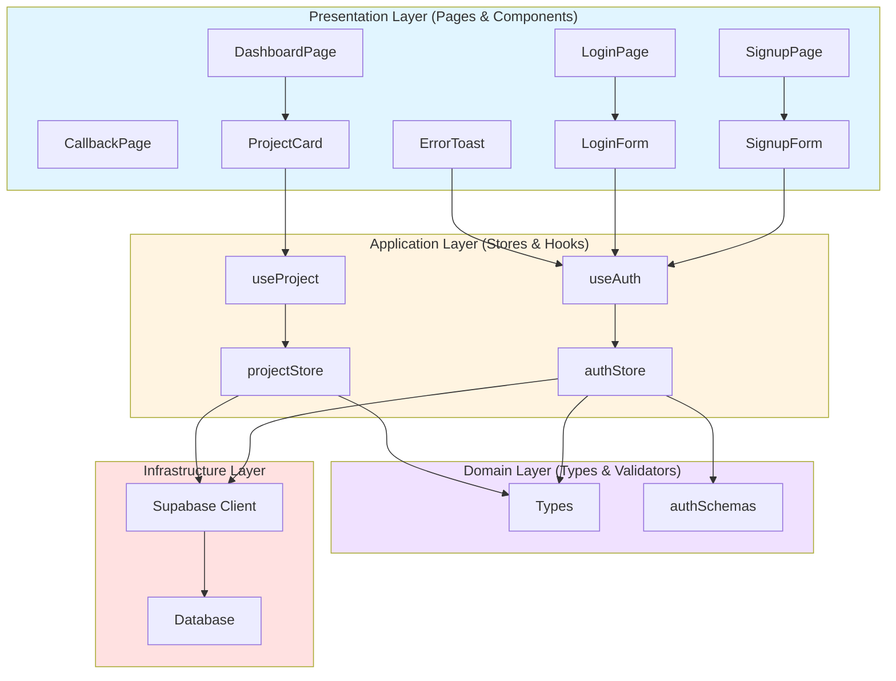
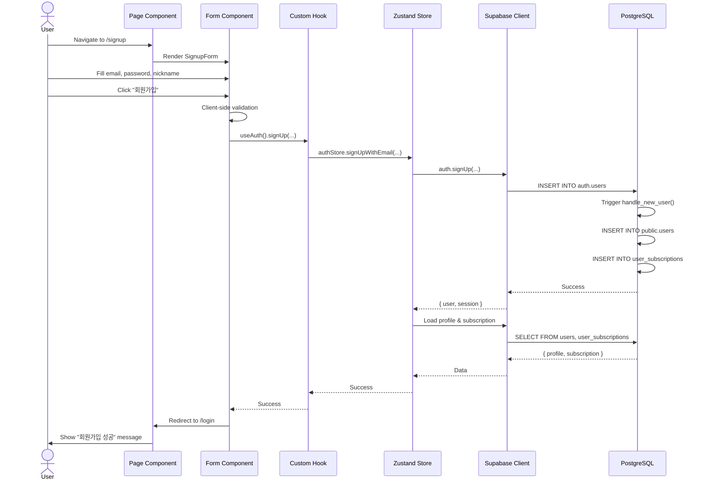

# Implementation Plan: Phase 1 MVP Authentication

## 문서 정보
- **Use Cases**: UC-001 ~ UC-004
- **관련 문서**:
  - [UC-001 회원가입 (이메일)](./001/spec.md)
  - [UC-002 회원가입 (구글 OAuth)](./002/spec.md)
  - [UC-003 로그인](./003/spec.md)
  - [UC-004 프로젝트 접근 제어](./004/spec.md)
  - [State Management](./state-management.md)
  - [Codebase Structure](./codebase-structure.md)
- **작성일**: 2025-10-21
- **버전**: 1.0

---

## 개요

Phase 1 MVP의 핵심 인증 및 접근 제어 기능을 구현하기 위한 모듈 목록 및 구현 계획입니다.

**전체 모듈 개요**:
| 모듈 | 위치 | 설명 | 상태 |
|------|------|------|------|
| **Presentation Layer** |
| SignupPage | `app/signup/page.tsx` | 회원가입 페이지 | 🆕 신규 |
| LoginPage | `app/login/page.tsx` | 로그인 페이지 | 🆕 신규 |
| CallbackPage | `app/auth/callback/page.tsx` | OAuth 콜백 핸들러 | 🆕 신규 |
| DashboardPage | `app/dashboard/page.tsx` | 대시보드 페이지 | 🆕 신규 |
| SignupForm | `components/features/auth/SignupForm.tsx` | 회원가입 폼 컴포넌트 | 🆕 신규 |
| LoginForm | `components/features/auth/LoginForm.tsx` | 로그인 폼 컴포넌트 | 🆕 신규 |
| ProjectCard | `components/features/dashboard/ProjectCard.tsx` | 프로젝트 카드 컴포넌트 | 🆕 신규 |
| ErrorToast | `components/ErrorToast.tsx` | 전역 에러 토스트 | 🆕 신규 |
| **Application Layer** |
| authStore | `stores/authStore.ts` | 인증 상태 관리 | 🆕 신규 |
| projectStore | `stores/projectStore.ts` | 프로젝트 접근 제어 | 🆕 신규 |
| useAuth | `hooks/useAuth.ts` | Auth selectors | 🆕 신규 |
| useProject | `hooks/useProject.ts` | Project selectors | 🆕 신규 |
| **Domain Layer** |
| Types | `types/index.ts` | 도메인 타입 정의 | 🆕 신규 |
| authSchemas | `validators/authSchemas.ts` | 인증 Zod 스키마 | 🆕 신규 |
| **Infrastructure Layer** |
| supabase | `lib/supabase.ts` | Supabase 클라이언트 | ♻️ 재사용 |
| **shadcn/ui Components** |
| Button, Input, Card, Form, Label | `components/ui/*` | 공통 UI 컴포넌트 | ♻️ 재사용 |

**범례**:
- 🆕 신규: 새로 생성
- 🔧 수정: 기존 파일 수정
- ♻️ 재사용: 기존 파일 그대로 사용

---

## Architecture Diagram

### Module Relationships



### Data Flow



---

## Implementation Plan

### 1. Presentation Layer

#### 1.1 SignupPage 🆕

**파일 경로**: `app/signup/page.tsx`

**책임**: 회원가입 페이지 렌더링

**Implementation**:
```tsx
'use client'

import { SignupForm } from '@/components/features/auth/SignupForm'
import { Card, CardContent, CardDescription, CardHeader, CardTitle } from '@/components/ui/card'

export default function SignupPage() {
  return (
    <div className="min-h-screen flex items-center justify-center bg-gray-50">
      <Card className="w-full max-w-md">
        <CardHeader>
          <CardTitle>회원가입</CardTitle>
          <CardDescription>
            Arikonia Hub에 오신 것을 환영합니다
          </CardDescription>
        </CardHeader>
        <CardContent>
          <SignupForm />
        </CardContent>
      </Card>
    </div>
  )
}
```

**의존성**:
- SignupForm (컴포넌트)
- Card (shadcn/ui)

---

#### 1.2 LoginPage 🆕

**파일 경로**: `app/login/page.tsx`

**책임**: 로그인 페이지 렌더링

**Implementation**:
```tsx
'use client'

import { LoginForm } from '@/components/features/auth/LoginForm'
import { Card, CardContent, CardDescription, CardHeader, CardTitle } from '@/components/ui/card'
import Link from 'next/link'

export default function LoginPage() {
  return (
    <div className="min-h-screen flex items-center justify-center bg-gray-50">
      <Card className="w-full max-w-md">
        <CardHeader>
          <CardTitle>로그인</CardTitle>
          <CardDescription>
            계정이 없으신가요?{' '}
            <Link href="/signup" className="text-blue-600 hover:underline">
              회원가입
            </Link>
          </CardDescription>
        </CardHeader>
        <CardContent>
          <LoginForm />
        </CardContent>
      </Card>
    </div>
  )
}
```

**의존성**:
- LoginForm (컴포넌트)
- Card (shadcn/ui)

---

#### 1.3 CallbackPage 🆕

**파일 경로**: `app/auth/callback/page.tsx`

**책임**: OAuth 콜백 처리 및 리다이렉트

**Implementation**:
```tsx
'use client'

import { useEffect } from 'react'
import { useRouter } from 'next/navigation'
import { useAuthStore } from '@/stores/authStore'

export default function CallbackPage() {
  const router = useRouter()
  const loadUserData = useAuthStore((state) => state.loadUserData)

  useEffect(() => {
    const handleCallback = async () => {
      try {
        // Supabase SDK가 자동으로 토큰 처리
        // 현재 session에서 user 가져오기
        const session = await supabase.auth.getSession()

        if (session.data.session?.user) {
          // 프로필 및 구독 정보 로드
          await loadUserData(session.data.session.user.id)

          // 대시보드로 리다이렉트
          router.push('/dashboard')
        } else {
          // 세션 없으면 로그인 페이지로
          router.push('/login')
        }
      } catch (error) {
        console.error('OAuth callback error:', error)
        router.push('/login')
      }
    }

    handleCallback()
  }, [loadUserData, router])

  return (
    <div className="min-h-screen flex items-center justify-center">
      <div className="text-center">
        <div className="animate-spin rounded-full h-12 w-12 border-b-2 border-gray-900 mx-auto"></div>
        <p className="mt-4 text-gray-600">로그인 처리 중...</p>
      </div>
    </div>
  )
}
```

**의존성**:
- authStore
- useRouter (Next.js)

---

#### 1.4 DashboardPage 🆕

**파일 경로**: `app/dashboard/page.tsx`

**책임**: 대시보드 페이지 (프로젝트 목록 표시)

**Implementation**:
```tsx
'use client'

import { useEffect } from 'react'
import { useRouter } from 'next/navigation'
import { useAuth } from '@/hooks/useAuth'
import { ProjectCard } from '@/components/features/dashboard/ProjectCard'

const PROJECTS = [
  { code: 'carelit', name: 'Care-Lit', description: '간호사 국가고시 학습 플랫폼' },
  { code: 'temflow', name: 'Tem-Flow', description: '템플릿 워크플로우 관리' },
  { code: 'arisper', name: 'Arisper', description: '아리스퍼 프로젝트' },
]

export default function DashboardPage() {
  const router = useRouter()
  const { user, profile, subscription, isLoading } = useAuth()

  useEffect(() => {
    if (!isLoading && !user) {
      router.push('/login')
    }
  }, [user, isLoading, router])

  if (isLoading) {
    return <div className="min-h-screen flex items-center justify-center">로딩 중...</div>
  }

  if (!user || !profile) {
    return null
  }

  return (
    <div className="min-h-screen bg-gray-50">
      <header className="bg-white shadow">
        <div className="max-w-7xl mx-auto py-6 px-4 sm:px-6 lg:px-8 flex justify-between items-center">
          <div>
            <h1 className="text-3xl font-bold text-gray-900">대시보드</h1>
            <p className="text-sm text-gray-600 mt-1">
              환영합니다, {profile.nickname}님!
            </p>
          </div>
          <div className="text-right">
            <p className="text-sm text-gray-600">현재 플랜</p>
            <p className="text-lg font-semibold text-blue-600">
              {subscription?.plan_name.toUpperCase()}
            </p>
          </div>
        </div>
      </header>

      <main className="max-w-7xl mx-auto py-6 sm:px-6 lg:px-8">
        <div className="px-4 py-6 sm:px-0">
          <h2 className="text-2xl font-bold text-gray-900 mb-4">프로젝트</h2>
          <div className="grid grid-cols-1 md:grid-cols-2 lg:grid-cols-3 gap-6">
            {PROJECTS.map((project) => (
              <ProjectCard key={project.code} project={project} />
            ))}
          </div>
        </div>
      </main>
    </div>
  )
}
```

**의존성**:
- useAuth (hook)
- ProjectCard (컴포넌트)

---

#### 1.5 SignupForm 🆕

**파일 경로**: `components/features/auth/SignupForm.tsx`

**책임**: 회원가입 폼 UI 및 제출 처리

**Implementation**: (Too long for inline, see detailed spec in UC-001)

**Key Features**:
- React Hook Form + Zod validation
- Email, password, nickname fields
- Google OAuth button
- Error handling with toast
- Submit button loading state

**의존성**:
- useAuthStore
- react-hook-form
- zod
- Button, Input, Form (shadcn/ui)

**QA Sheet**:
| 시나리오 | 입력 | 예상 결과 |
|---------|------|----------|
| 정상 가입 | email: test@test.com<br>password: Test123!<br>nickname: 홍길동 | 성공 → /login 리다이렉트 |
| 이메일 형식 오류 | email: invalid | "올바른 이메일을 입력하세요" |
| 비밀번호 짧음 | password: 123 | "비밀번호는 6자 이상" |
| 이메일 중복 | existing@test.com | "이미 사용 중인 이메일" |
| 구글 회원가입 | 구글 버튼 클릭 | 구글 로그인 팝업 → /dashboard |

---

#### 1.6 LoginForm 🆕

**파일 경로**: `components/features/auth/LoginForm.tsx`

**책임**: 로그인 폼 UI 및 제출 처리

**Key Features**:
- Email + Password login
- Google OAuth login
- Remember me (future)
- Error handling

**의존성**:
- useAuthStore
- react-hook-form
- zod
- Button, Input, Form (shadcn/ui)

---

#### 1.7 ProjectCard 🆕

**파일 경로**: `components/features/dashboard/ProjectCard.tsx`

**책임**: 프로젝트 카드 표시 및 접근 제어

**Implementation**:
```tsx
'use client'

import { useState } from 'react'
import { useRouter } from 'next/navigation'
import { useProjectStore } from '@/stores/projectStore'
import { useAuthStore } from '@/stores/authStore'
import { Card, CardContent, CardDescription, CardHeader, CardTitle } from '@/components/ui/card'
import { Button } from '@/components/ui/button'
import { toast } from 'sonner'

interface ProjectCardProps {
  project: {
    code: string
    name: string
    description: string
  }
}

export function ProjectCard({ project }: ProjectCardProps) {
  const [loading, setLoading] = useState(false)
  const checkAccess = useProjectStore((state) => state.checkAccess)
  const session = useAuthStore((state) => state.session)

  const handleAccess = async () => {
    setLoading(true)

    try {
      const result = await checkAccess(project.code)

      if (result.has_access) {
        // Redirect to project with JWT token
        const projectUrl = getProjectUrl(project.code)
        const token = session?.access_token
        window.location.href = `${projectUrl}?token=${token}`
      } else {
        // Show upgrade modal
        toast.error(result.error || '접근 권한이 없습니다', {
          description: result.required_plan
            ? `${result.required_plan} 플랜이 필요합니다`
            : undefined,
        })
      }
    } catch (error: any) {
      toast.error('접근 권한 확인 실패', {
        description: error.message,
      })
    } finally {
      setLoading(false)
    }
  }

  return (
    <Card>
      <CardHeader>
        <CardTitle>{project.name}</CardTitle>
        <CardDescription>{project.description}</CardDescription>
      </CardHeader>
      <CardContent>
        <Button onClick={handleAccess} disabled={loading} className="w-full">
          {loading ? '확인 중...' : '접속하기'}
        </Button>
      </CardContent>
    </Card>
  )
}

function getProjectUrl(code: string): string {
  const urls: Record<string, string> = {
    carelit: 'https://care-lit.vercel.app',
    temflow: 'https://tem-flow.vercel.app',
    arisper: 'https://arisper.vercel.app',
  }
  return urls[code] || ''
}
```

**의존성**:
- projectStore
- authStore
- Card, Button (shadcn/ui)
- sonner (toast)

---

#### 1.8 ErrorToast 🆕

**파일 경로**: `components/ErrorToast.tsx`

**책임**: 전역 에러 토스트 표시

**Implementation**:
```tsx
'use client'

import { useEffect } from 'react'
import { toast } from 'sonner'
import { useAuthStore } from '@/stores/authStore'

export function ErrorToast() {
  const error = useAuthStore((state) => state.error)
  const clearError = useAuthStore((state) => state.clearError)

  useEffect(() => {
    if (error) {
      toast.error(error)
      clearError()
    }
  }, [error, clearError])

  return null
}
```

---

### 2. Application Layer

#### 2.1 authStore 🆕

**파일 경로**: `stores/authStore.ts`

**구현 내용**: [State Management](./state-management.md#1-auth-store-authstore) 참조

**Key Actions**:
- `signUpWithEmail(email, password, nickname)`
- `signInWithEmail(email, password)`
- `signInWithGoogle()`
- `signOut()`
- `loadUserData(userId)`

---

#### 2.2 projectStore 🆕

**파일 경로**: `stores/projectStore.ts`

**구현 내용**: [State Management](./state-management.md#2-project-access-store-projectstore) 참조

**Key Actions**:
- `checkAccess(projectCode)` → UC-004 구현

---

#### 2.3 useAuth Hook 🆕

**파일 경로**: `hooks/useAuth.ts`

**구현 내용**: [State Management](./state-management.md#custom-hooks-selectors) 참조

**Exported Selectors**:
- `useIsAuthenticated()`
- `useUserProfile()`
- `useSubscription()`
- `useAuthLoading()`
- `useAuthError()`

---

#### 2.4 useProject Hook 🆕

**파일 경로**: `hooks/useProject.ts`

**구현 내용**: [State Management](./state-management.md#custom-hooks-selectors) 참조

---

### 3. Domain Layer

#### 3.1 Types 🆕

**파일 경로**: `types/index.ts`

**Implementation**:
```typescript
import { User, Session } from '@supabase/supabase-js'

export interface UserProfile {
  id: string
  email: string
  nickname: string
  avatar_url: string | null
  created_at: string
  updated_at: string
}

export interface Subscription {
  plan_id: string
  plan_name: 'free' | 'basic' | 'premium' | 'enterprise'
  status: 'active' | 'expired' | 'cancelled'
  expires_at: string | null
  max_projects: number
  max_file_size_mb: number
}

export interface ProjectAccessResult {
  has_access: boolean
  project_name: string
  access_level?: 'view' | 'full' | 'admin'
  source?: 'plan' | 'individual'
  error?: string
  required_plan?: string
}

export type { User, Session }
```

---

#### 3.2 authSchemas 🆕

**파일 경로**: `validators/authSchemas.ts`

**Implementation**:
```typescript
import { z } from 'zod'

export const signUpSchema = z.object({
  email: z
    .string()
    .min(1, '이메일은 필수입니다')
    .email('올바른 이메일 주소를 입력하세요'),

  password: z
    .string()
    .min(6, '비밀번호는 최소 6자 이상이어야 합니다')
    .max(100, '비밀번호는 최대 100자까지 가능합니다'),

  nickname: z
    .string()
    .min(2, '닉네임은 최소 2자 이상이어야 합니다')
    .max(20, '닉네임은 최대 20자까지 가능합니다')
    .regex(
      /^[가-힣a-zA-Z0-9_]+$/,
      '닉네임은 한글, 영문, 숫자, 언더스코어만 가능합니다'
    ),
})

export const signInSchema = z.object({
  email: z
    .string()
    .min(1, '이메일은 필수입니다')
    .email('올바른 이메일 주소를 입력하세요'),

  password: z
    .string()
    .min(1, '비밀번호는 필수입니다')
    .min(6, '비밀번호는 최소 6자 이상이어야 합니다'),
})

export type SignUpInput = z.infer<typeof signUpSchema>
export type SignInInput = z.infer<typeof signInSchema>
```

---

### 4. Infrastructure Layer

#### 4.1 Supabase Client ♻️

**파일 경로**: `lib/supabase.ts`

**현재 상태**: 이미 생성됨, 재사용

**확인 사항**:
- `createClient()` 함수 존재 여부
- 환경 변수 설정 (`NEXT_PUBLIC_SUPABASE_URL`, `NEXT_PUBLIC_SUPABASE_ANON_KEY`)

---

## Implementation Order

### Phase 1: Foundation (1-2일)

**목표**: 핵심 Infrastructure 및 Application Layer 구축

1. ✅ `types/index.ts` 생성
2. ✅ `validators/authSchemas.ts` 생성
3. ✅ `stores/authStore.ts` 생성
4. ✅ `stores/projectStore.ts` 생성
5. ✅ `hooks/useAuth.ts` 생성
6. ✅ `hooks/useProject.ts` 생성

**검증**:
- [ ] Zustand stores 동작 확인 (DevTools)
- [ ] Types import 에러 없음
- [ ] Zod schemas 검증 동작

---

### Phase 2: Authentication UI (2-3일)

**목표**: 회원가입 및 로그인 페이지 구현

7. ✅ `components/features/auth/SignupForm.tsx` 생성
8. ✅ `components/features/auth/LoginForm.tsx` 생성
9. ✅ `app/signup/page.tsx` 생성
10. ✅ `app/login/page.tsx` 생성
11. ✅ `app/auth/callback/page.tsx` 생성
12. ✅ `components/ErrorToast.tsx` 생성

**검증**:
- [ ] UC-001 QA Sheet 전체 시나리오 테스트
- [ ] UC-002 구글 OAuth 플로우 테스트
- [ ] UC-003 로그인 플로우 테스트
- [ ] 에러 메시지 표시 확인

---

### Phase 3: Dashboard & Access Control (1-2일)

**목표**: 대시보드 및 프로젝트 접근 제어 구현

13. ✅ `components/features/dashboard/ProjectCard.tsx` 생성
14. ✅ `app/dashboard/page.tsx` 생성

**검증**:
- [ ] UC-004 프로젝트 접근 제어 테스트
- [ ] 플랜별 접근 권한 확인
- [ ] SSO 리다이렉트 동작 확인

---

### Phase 4: Integration & Polish (1일)

**목표**: 통합 테스트 및 UX 개선

15. ✅ 전체 플로우 E2E 테스트
16. ✅ 에러 처리 개선
17. ✅ 로딩 상태 UI 개선
18. ✅ Toast 메시지 한글화

**검증**:
- [ ] 모든 UC (001-004) 완전 동작
- [ ] 에러 케이스 모두 처리
- [ ] UX 개선사항 적용

---

## Testing Strategy

### Unit Tests (선택)

**대상**: Zod schemas, Custom hooks

```typescript
// validators/__tests__/authSchemas.test.ts
import { describe, it, expect } from 'vitest'
import { signUpSchema } from '../authSchemas'

describe('signUpSchema', () => {
  it('should validate correct input', () => {
    const result = signUpSchema.safeParse({
      email: 'test@test.com',
      password: 'Test123!',
      nickname: '홍길동',
    })
    expect(result.success).toBe(true)
  })

  it('should reject invalid email', () => {
    const result = signUpSchema.safeParse({
      email: 'invalid',
      password: 'Test123!',
      nickname: '홍길동',
    })
    expect(result.success).toBe(false)
  })
})
```

---

### Integration Tests (QA Sheets)

**UC-001 ~ UC-004 QA Sheets** 참조

각 유스케이스별 시나리오 테스트 수행

---

### E2E Tests (선택)

**Playwright 사용**:

```typescript
// tests/auth.spec.ts
import { test, expect } from '@playwright/test'

test('complete signup flow', async ({ page }) => {
  await page.goto('/signup')

  await page.fill('input[name="email"]', 'test@example.com')
  await page.fill('input[name="password"]', 'Test123!')
  await page.fill('input[name="nickname"]', '홍길동')

  await page.click('button[type="submit"]')

  await expect(page).toHaveURL('/login')
  await expect(page.locator('text=회원가입 성공')).toBeVisible()
})

test('complete login and access project flow', async ({ page }) => {
  await page.goto('/login')

  await page.fill('input[name="email"]', 'test@example.com')
  await page.fill('input[name="password"]', 'Test123!')

  await page.click('button[type="submit"]')

  await expect(page).toHaveURL('/dashboard')

  await page.click('text=Care-Lit')

  // Should redirect to project or show upgrade modal
  await page.waitForTimeout(2000)
})
```

---

## Checklist

### 설계 완료
- [x] 모듈 목록 작성
- [x] 모듈 간 관계 다이어그램
- [x] 데이터 흐름 시각화
- [x] 각 모듈 상세 계획

### 코딩 준비
- [ ] 코드베이스 구조 확인
- [ ] 환경 변수 설정 (`.env.local`)
- [ ] shadcn/ui 컴포넌트 설치 확인
- [ ] 브랜치 생성 (`feature/mvp-auth`)

### Phase 1 완료
- [ ] Types, Validators 생성
- [ ] Stores 생성 및 DevTools 확인
- [ ] Hooks 생성

### Phase 2 완료
- [ ] SignupForm, LoginForm 생성
- [ ] Pages 생성
- [ ] UC-001, UC-002, UC-003 테스트 통과

### Phase 3 완료
- [ ] ProjectCard 생성
- [ ] DashboardPage 생성
- [ ] UC-004 테스트 통과

### Phase 4 완료
- [ ] E2E 테스트 통과
- [ ] 에러 처리 완료
- [ ] UX 개선 완료

### 배포 준비
- [ ] 코드 리뷰
- [ ] Migration SQL 실행 (Supabase)
- [ ] PR 생성
- [ ] Vercel 배포

---

## Dependencies

### Required Packages (Already Installed)

```json
{
  "dependencies": {
    "next": "15.5.6",
    "react": "19.1.0",
    "react-dom": "19.1.0",
    "@supabase/supabase-js": "^2.45.7",
    "@supabase/ssr": "^0.5.3",
    "zustand": "5.0.8",
    "react-hook-form": "^7.54.2",
    "@hookform/resolvers": "^3.10.0",
    "zod": "^3.24.3",
    "date-fns": "^4.1.0",
    "clsx": "^2.1.1",
    "tailwind-merge": "^2.6.0",
    "sonner": "^1.7.3"
  }
}
```

### Additional Packages Needed

```bash
# If not installed, run:
npm install sonner  # Toast notifications
```

---

## Environment Variables

`.env.local`:
```bash
NEXT_PUBLIC_SUPABASE_URL=https://your-project.supabase.co
NEXT_PUBLIC_SUPABASE_ANON_KEY=your-anon-key
```

---

## Database Migration

**Before Implementation**:

1. Run migration SQL on Supabase:
   ```bash
   # Copy content from supabase/migrations/20251021000000_initial_schema.sql
   # Paste into Supabase SQL Editor
   # Execute
   ```

2. Verify tables created:
   - `users`
   - `subscription_plans`
   - `user_subscriptions`
   - `projects`
   - `plan_project_access`
   - `user_project_access`

3. Verify functions created:
   - `handle_new_user()`
   - `update_updated_at()`
   - `check_project_access()`

---

## Notes

### Development Tips

- **Zustand DevTools**: Install Redux DevTools extension for debugging
- **Error Boundaries**: Add React Error Boundaries for better UX
- **Loading States**: Always show loading indicators during async operations
- **Optimistic Updates**: Consider optimistic UI updates for better perceived performance

### Security Considerations

- **RLS Policies**: All tables have RLS enabled in migration
- **JWT Tokens**: Handled by Supabase Auth automatically
- **HTTPS Only**: Enforced by Vercel
- **Environment Variables**: Never commit `.env.local`

### Performance Optimizations

- **Zustand Selectors**: Use selectors to prevent unnecessary re-renders
- **React.memo**: Wrap ProjectCard with React.memo if needed
- **Code Splitting**: Next.js handles automatically with App Router
- **Image Optimization**: Use Next.js `<Image>` for avatar images

---

## Next Steps After Implementation

1. ✅ **Phase 1 MVP 완료** (현재 계획)
2. ⏭️ **Agent 08: Implementation Executor** (실제 코드 작성)
3. ⏭️ **Agent 09: Code Smell Analyzer** (코드 품질 검증)
4. ⏭️ **Deployment to Vercel** (프로덕션 배포)
5. ⏭️ **Phase 2 Features** (결제, 관리자 UI, 이메일 알림)

---

**문서 작성**: Claude Code
**버전**: 1.0
**최종 수정**: 2025-10-21
