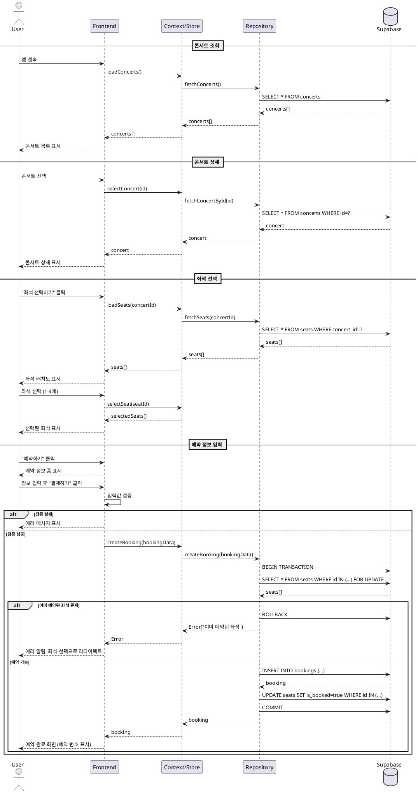

# UC-001: 콘서트 예약

## 기본 정보

| 항목 | 내용 |
|------|------|
| **ID** | UC-001 |
| **이름** | 콘서트 예약 |
| **Primary Actor** | 사용자 |
| **Precondition** | 사용자가 앱에 접속한 상태 |
| **Trigger** | 사용자가 콘서트를 예약하고 싶을 때 |

---

## Main Scenario (정상 흐름)

1. 사용자가 콘서트 목록 화면에서 원하는 콘서트를 선택한다
2. 시스템은 콘서트 상세 정보를 표시한다
3. 사용자가 "좌석 선택하기" 버튼을 클릭한다
4. 시스템은 좌석 배치도를 표시한다 (예약 가능/불가능 상태 구분)
5. 사용자가 원하는 좌석을 선택한다 (1-4개)
6. 시스템은 선택된 좌석 정보와 총 금액을 표시한다
7. 사용자가 "예약하기" 버튼을 클릭한다
8. 시스템은 예약 정보 입력 폼을 표시한다
9. 사용자가 예약자 정보를 입력한다 (이름, 전화번호, 이메일, 생년월일)
10. 사용자가 "결제하기" 버튼을 클릭한다
11. 시스템은 입력값을 검증한다
12. 시스템은 예약을 생성하고 좌석 상태를 업데이트한다
13. 시스템은 예약 완료 화면을 표시한다 (예약 번호 포함)

---

## Edge Cases (예외 흐름)

### E1: 매진된 콘서트 선택
- **조건**: 2단계에서 예약 가능한 좌석이 0개인 경우
- **처리**: "좌석 선택하기" 버튼 비활성화, "매진" 표시

### E2: 좌석 선택 개수 초과
- **조건**: 5단계에서 4개 이상 좌석 선택 시도
- **처리**: "최대 4개까지만 선택할 수 있습니다" 알림 표시

### E3: 좌석 미선택 상태에서 예약
- **조건**: 7단계에서 좌석을 선택하지 않은 경우
- **처리**: "좌석을 선택해주세요" 알림 표시

### E4: 입력값 검증 실패
- **조건**: 11단계에서 필수 필드 누락 또는 형식 오류
- **처리**: 에러 메시지 표시, 해당 필드로 포커스 이동

### E5: 동시 예약 충돌
- **조건**: 12단계에서 다른 사용자가 먼저 같은 좌석을 예약한 경우
- **처리**: "선택하신 좌석이 이미 예약되었습니다" 알림, 좌석 선택 화면으로 리다이렉트

---

## Business Rules

### BR-001: 좌석 선택 제한
- 최소 1개, 최대 4개까지만 선택 가능

### BR-002: 좌석 등급별 가격
- VIP석 (1-2행): 150,000원
- R석 (3-5행): 100,000원
- S석 (6-10행): 70,000원
- A석 (11-15행): 50,000원

### BR-003: 입력 검증 규칙
- **이름**: 2-20자, 한글/영문만
- **전화번호**: 010-XXXX-XXXX 형식
- **이메일**: 표준 이메일 형식
- **생년월일**: YYYY-MM-DD 형식, 과거 날짜만 (선택 항목)

### BR-004: 예약 번호 생성
- 형식: `BK-YYYYMMDDHHMMSS-XXXX`
- 예시: `BK-20250116142305-0001`

### BR-005: 동시성 제어
- 트랜잭션 내에서 좌석 잠금 및 예약 처리
- 이미 예약된 좌석은 선택 불가

---

## Sequence Diagram (PlantUML)

---

## Postcondition

- 예약이 성공적으로 생성됨
- 선택한 좌석들의 `is_booked` 상태가 `true`로 변경됨
- 사용자에게 예약 번호가 발급됨
- 예약 완료 화면이 표시됨

---

## Non-Functional Requirements

### 성능
- 좌석 배치도 렌더링: 1초 이내
- 예약 처리: 3초 이내

### 사용성
- 좌석 상태를 색상으로 명확히 구분 (녹색/빨간색/노란색)
- 모바일 환경에서도 좌석 선택 가능

### 신뢰성
- 동시 예약 시 데이터 무결성 보장
- 트랜잭션 실패 시 자동 롤백

---

**문서 버전**: 1.0
**작성일**: 2025-01-16
