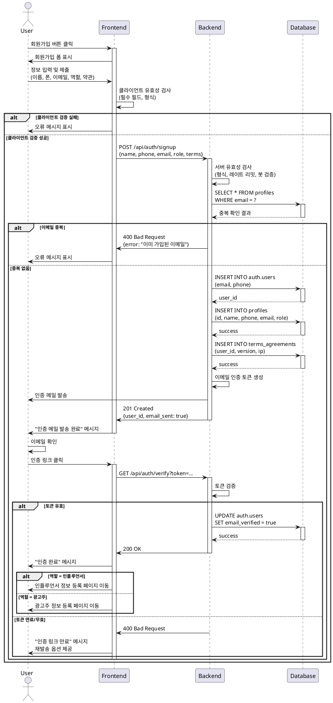

# Use Case 01: 회원가입 & 역할선택

## Primary Actor
- 신규 사용자 (미가입 상태)

## Precondition
- 사용자가 서비스 URL에 접속한 상태
- 유효한 이메일 또는 소셜 계정 보유
- 약관 동의 가능한 상태

## Trigger
- 사용자가 "회원가입" 버튼 클릭

## Main Scenario

1. 사용자가 회원가입 폼에 정보 입력
   - 이름, 휴대폰번호, 이메일
   - 약관 동의 체크
   - 역할 선택 (광고주/인플루언서)
   - 인증 방식 선택 (이메일/외부 OAuth)

2. FE가 클라이언트 유효성 검사 수행
   - 필수 필드 누락 여부
   - 이메일 형식
   - 휴대폰번호 형식
   - 약관 동의 여부

3. BE가 서버 유효성 검사 수행
   - 이메일 중복 확인
   - 휴대폰번호 중복 확인
   - 레이트 리밋 체크
   - 봇 방지 검증

4. BE가 Supabase Auth 계정 생성
   - auth.users 테이블에 사용자 생성
   - 이메일 인증 토큰 발급

5. BE가 프로필 데이터 저장
   - profiles 테이블에 기본 정보 저장
   - terms_agreements 테이블에 약관 동의 이력 저장

6. BE가 이메일 인증 메일 발송

7. FE가 성공 피드백 표시
   - "인증 메일이 발송되었습니다" 메시지
   - 이메일 인증 안내

8. 사용자가 이메일 인증 완료

9. FE가 역할별 추가 정보 입력 페이지로 이동
   - 광고주 → 광고주 정보 등록
   - 인플루언서 → 인플루언서 정보 등록

## Edge Cases

### 이메일 중복
- **증상**: 이미 가입된 이메일로 재가입 시도
- **처리**: "이미 가입된 이메일입니다" 오류 표시, 로그인 페이지 안내

### 휴대폰번호 중복
- **증상**: 이미 등록된 휴대폰번호로 가입 시도
- **처리**: "이미 등록된 휴대폰번호입니다" 오류 표시

### 유효성 검사 실패
- **증상**: 잘못된 이메일 형식, 필수 필드 누락
- **처리**: 해당 필드에 즉시 오류 메시지 표시

### 약관 미동의
- **증상**: 필수 약관 미체크 상태로 제출
- **처리**: "필수 약관에 동의해주세요" 오류 표시, 제출 차단

### 레이트 리밋 초과
- **증상**: 동일 IP에서 짧은 시간 내 다수 가입 시도
- **처리**: "잠시 후 다시 시도해주세요" 메시지, 일시적 차단

### 봇 의심 행위
- **증상**: 비정상적인 패턴 감지
- **처리**: reCAPTCHA 등 추가 인증 요구

### 이메일 인증 만료
- **증상**: 인증 링크 클릭 시 토큰 만료
- **처리**: "인증 링크가 만료되었습니다" 메시지, 재발송 옵션 제공

### 네트워크 오류
- **증상**: 가입 요청 중 네트워크 끊김
- **처리**: "네트워크 오류가 발생했습니다. 다시 시도해주세요" 메시지

## Business Rules

### 필수 입력 정보
- 이름, 휴대폰번호, 이메일, 역할 선택, 필수 약관 동의

### 이메일 형식
- RFC 5322 표준 준수
- 도메인 유효성 검증

### 휴대폰번호 형식
- 한국 휴대폰번호 형식 (010-XXXX-XXXX 또는 01X-XXXX-XXXX)
- 하이픈 자동 정규화

### 역할 제약
- 1인 1역할 (광고주 또는 인플루언서 중 선택)
- 가입 후 역할 변경 불가

### 약관 동의
- 필수 약관: 서비스 이용약관, 개인정보 처리방침
- 선택 약관: 마케팅 수신 동의
- 동의 이력 저장 (IP, 타임스탬프 포함)

### 인증 방식
- 이메일 인증: 24시간 이내 인증 필요
- OAuth: Google, Kakao, Naver 지원

### 레이트 리밋
- 동일 IP: 10분당 최대 5회 가입 시도
- 동일 이메일: 1시간당 최대 3회 인증 메일 발송

### 보안 정책
- 비밀번호 최소 8자 이상 (영문, 숫자, 특수문자 조합)
- HTTPS 필수
- SQL Injection, XSS 방어

### 데이터 저장
- 개인정보 암호화 저장
- 약관 동의 이력 영구 보관
- IP 주소 로그 저장 (부정 가입 방지)

---

## Sequence Diagram

