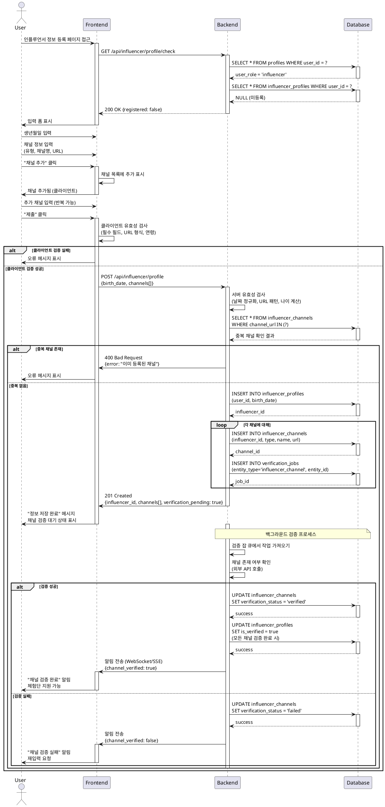

# Use Case 02: 인플루언서 정보 등록

## Primary Actor
- 인플루언서 역할로 가입한 신규 사용자

## Precondition
- 회원가입 완료 (이메일 인증 완료)
- 역할이 '인플루언서'로 설정됨
- 아직 인플루언서 정보 미등록 상태

## Trigger
- 회원가입 완료 후 자동 리디렉션
- 또는 프로필 메뉴에서 "정보 등록" 클릭

## Main Scenario

1. 사용자가 인플루언서 정보 입력 페이지 접근

2. FE가 입력 폼 표시
   - 생년월일 선택
   - SNS 채널 정보 입력 섹션

3. 사용자가 생년월일 입력

4. 사용자가 SNS 채널 추가
   - 채널 유형 선택 (Instagram, YouTube, Blog 등)
   - 채널명 입력
   - 채널 URL 입력
   - "채널 추가" 버튼 클릭

5. FE가 채널 목록에 추가 표시
   - 여러 채널 추가 가능
   - 채널별 편집/삭제 가능

6. 사용자가 모든 정보 입력 후 "제출" 클릭

7. FE가 클라이언트 유효성 검사
   - 생년월일 필수 입력
   - 최소 1개 이상 채널 등록
   - URL 형식 검증
   - 연령 정책 검증 (만 14세 이상)

8. BE가 서버 유효성 검사
   - 날짜 형식 정규화
   - URL 패턴 매칭 (플랫폼별)
   - 나이 계산 및 정책 검증
   - 중복 채널 URL 확인

9. BE가 DB에 저장
   - influencer_profiles 테이블에 기본 정보 저장
   - influencer_channels 테이블에 채널 정보 저장

10. BE가 비동기 검증 잡 생성
    - verification_jobs 테이블에 검증 작업 등록
    - 각 채널별 검증 잡 생성

11. BE가 성공 응답 반환

12. FE가 성공 피드백 표시
    - "정보가 저장되었습니다" 메시지
    - 채널별 검증 상태 표시 (검증 대기)
    - 홈으로 이동 또는 체험단 탐색 가능

13. 백그라운드에서 채널 검증 진행
    - 채널 존재 여부 확인
    - 채널 소유권 확인 (선택)
    - 메트릭 수집 (팔로워 수 등, 선택)

14. 검증 완료 시 사용자에게 알림
    - 검증 성공: is_verified = true, 체험단 지원 가능
    - 검증 실패: 재입력 요청

## Edge Cases

### 생년월일 미입력
- **증상**: 생년월일 필드 비어있음
- **처리**: "생년월일을 입력해주세요" 오류 메시지

### 연령 정책 미달
- **증상**: 만 14세 미만 생년월일 입력
- **처리**: "만 14세 이상만 가입 가능합니다" 오류 메시지

### 채널 미등록
- **증상**: 채널 추가 없이 제출
- **처리**: "최소 1개 이상의 채널을 등록해주세요" 오류 메시지

### 잘못된 URL 형식
- **증상**: 유효하지 않은 URL 입력
- **처리**: "올바른 URL 형식이 아닙니다" 오류 메시지, 해당 필드 강조

### 플랫폼 불일치
- **증상**: Instagram 선택 후 YouTube URL 입력
- **처리**: "선택한 플랫폼과 URL이 일치하지 않습니다" 오류 메시지

### 중복 채널 URL
- **증상**: 이미 다른 사용자가 등록한 채널 URL
- **처리**: "이미 등록된 채널입니다" 오류 메시지

### 채널 검증 실패
- **증상**: 존재하지 않는 채널 URL
- **처리**: 검증 상태 "실패" 표시, "채널을 확인할 수 없습니다. URL을 다시 확인해주세요" 안내

### 임시 저장
- **증상**: 사용자가 "임시저장" 버튼 클릭
- **처리**: 현재 입력값 저장, 나중에 이어서 작성 가능

### 네트워크 오류
- **증상**: 제출 중 네트워크 끊김
- **처리**: "네트워크 오류가 발생했습니다" 메시지, 재시도 옵션

### 검증 타임아웃
- **증상**: 채널 검증 작업이 장시간 지연
- **처리**: 일정 시간 후 "검증 대기" 상태 유지, 수동 재검증 옵션 제공

## Business Rules

### 필수 입력 정보
- 생년월일 필수
- 최소 1개 이상의 SNS 채널 등록

### 연령 제한
- 만 14세 이상만 인플루언서 등록 가능
- 생년월일 기준 자동 계산

### 지원 플랫폼
- Instagram, YouTube, Blog (Naver, Tistory), TikTok, Facebook
- 향후 추가 플랫폼 확장 가능

### URL 형식 검증
- Instagram: `https://www.instagram.com/{username}/`
- YouTube: `https://www.youtube.com/@{channel}` or `/channel/{id}`
- Blog: `https://{username}.blog.me/` or `https://{username}.tistory.com/`
- 대소문자 구분 없음, 자동 정규화

### 채널 개수 제한
- 최소 1개, 최대 10개까지 등록 가능
- 플랫폼 중복 가능 (Instagram 계정 여러 개 등록 가능)

### 채널 검증 프로세스
- 비동기 처리 (사용자 대기 없이 백그라운드 실행)
- 검증 우선순위: 채널 존재 여부 > 소유권 확인 (선택)
- 검증 실패 시 재입력 가능, 재검증 최대 3회

### 검증 상태
- `pending`: 검증 대기 중
- `verified`: 검증 완료
- `failed`: 검증 실패

### 프로필 완성 조건
- 모든 채널이 `verified` 상태일 때 `is_verified = true`
- 검증 완료 전까지 체험단 지원 불가

### 임시 저장
- 작성 중 데이터 자동 저장 (5분마다)
- 수동 임시저장 버튼 제공
- 임시 저장 데이터는 7일간 보관

### 데이터 저장
- 생년월일: DATE 타입, 나이는 자동 계산 (GENERATED ALWAYS AS)
- 채널 URL: 정규화 후 저장 (소문자, 트레일링 슬래시 제거)
- 메타데이터: 생성일, 수정일 자동 기록

### 수정 정책
- 등록 후 언제든지 채널 추가/삭제/수정 가능
- 생년월일 수정 시 재검증 필요 (연령 정책)
- 수정 이력 감사 로그 기록

---

## Sequence Diagram

