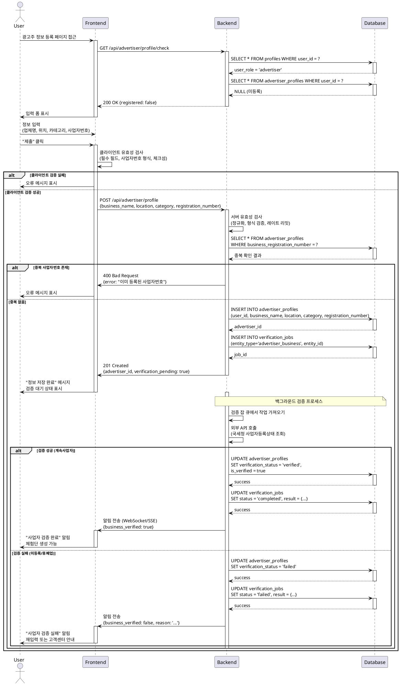

# Use Case 03: 광고주 정보 등록

## Primary Actor
- 광고주 역할로 가입한 신규 사용자

## Precondition
- 회원가입 완료 (이메일 인증 완료)
- 역할이 '광고주'로 설정됨
- 아직 광고주 정보 미등록 상태

## Trigger
- 회원가입 완료 후 자동 리디렉션
- 또는 프로필 메뉴에서 "정보 등록" 클릭

## Main Scenario

1. 사용자가 광고주 정보 입력 페이지 접근

2. FE가 입력 폼 표시
   - 업체명
   - 위치 (주소)
   - 카테고리 (업종 선택)
   - 사업자등록번호

3. 사용자가 모든 정보 입력
   - 업체명 입력
   - 위치 입력 (주소 검색 또는 직접 입력)
   - 카테고리 선택 (드롭다운)
   - 사업자등록번호 입력 (10자리 숫자)

4. 사용자가 "제출" 클릭

5. FE가 클라이언트 유효성 검사
   - 모든 필수 필드 입력 확인
   - 사업자등록번호 형식 검증 (10자리 숫자)
   - 사업자등록번호 체크섬 검증

6. BE가 서버 유효성 검사
   - 필드 정규화 (공백 제거, 대소문자 통일)
   - 사업자등록번호 형식 재검증
   - 중복 사업자등록번호 확인
   - 레이트 리밋 체크

7. BE가 DB에 저장
   - advertiser_profiles 테이블에 정보 저장
   - verification_status = 'pending'

8. BE가 비동기 검증 잡 생성
   - verification_jobs 테이블에 검증 작업 등록
   - 외부 API를 통한 사업자등록번호 진위 확인

9. BE가 성공 응답 반환

10. FE가 성공 피드백 표시
    - "정보가 저장되었습니다" 메시지
    - 검증 대기 상태 표시
    - 홈으로 이동 가능

11. 백그라운드에서 사업자등록번호 검증 진행
    - 국세청 또는 공공데이터 API 호출
    - 사업자 상태 확인 (계속사업자 여부)

12. 검증 완료 시 사용자에게 알림
    - 검증 성공: is_verified = true, 체험단 생성 권한 부여
    - 검증 실패: 재입력 요청 또는 고객센터 안내

## Edge Cases

### 필수 필드 미입력
- **증상**: 업체명, 위치, 카테고리, 사업자등록번호 중 하나라도 미입력
- **처리**: "모든 필수 항목을 입력해주세요" 오류 메시지, 해당 필드 강조

### 사업자등록번호 형식 오류
- **증상**: 10자리가 아니거나 숫자가 아닌 문자 포함
- **처리**: "사업자등록번호는 10자리 숫자여야 합니다" 오류 메시지

### 사업자등록번호 체크섬 오류
- **증상**: 유효하지 않은 사업자등록번호 (알고리즘 검증 실패)
- **처리**: "유효하지 않은 사업자등록번호입니다" 오류 메시지

### 중복 사업자등록번호
- **증상**: 이미 등록된 사업자등록번호로 재등록 시도
- **처리**: "이미 등록된 사업자등록번호입니다" 오류 메시지

### 사업자등록번호 검증 실패
- **증상**: 국세청 API에서 존재하지 않는 사업자로 확인
- **처리**: 검증 상태 "실패" 표시, "사업자등록번호를 확인할 수 없습니다. 정보를 다시 확인해주세요" 안내

### 휴업/폐업 사업자
- **증상**: 외부 API에서 휴업 또는 폐업 상태로 확인
- **처리**: "계속 사업 중인 사업자만 등록 가능합니다" 오류 메시지

### 레이트 리밋 초과
- **증상**: 짧은 시간 내 동일 IP에서 여러 번 제출
- **처리**: "잠시 후 다시 시도해주세요" 메시지, 일시적 차단

### 임시 저장
- **증상**: 사용자가 "임시저장" 버튼 클릭
- **처리**: 현재 입력값 저장, 나중에 이어서 작성 가능

### 외부 API 타임아웃
- **증상**: 사업자등록번호 검증 API 응답 지연
- **처리**: 검증 상태 "대기" 유지, 재시도 큐에 등록

### 네트워크 오류
- **증상**: 제출 중 네트워크 끊김
- **처리**: "네트워크 오류가 발생했습니다" 메시지, 재시도 옵션

## Business Rules

### 필수 입력 정보
- 업체명, 위치, 카테고리, 사업자등록번호 모두 필수

### 사업자등록번호 형식
- 10자리 숫자 (XXX-XX-XXXXX 형식)
- 하이픈 자동 제거 후 저장
- 체크섬 알고리즘 검증 필수

### 사업자등록번호 유일성
- 동일한 사업자등록번호로 중복 등록 불가
- 1개 사업자번호 = 1개 계정만 허용

### 지원 카테고리
- 음식점, 카페, 뷰티/미용, 패션, 건강/피트니스, 문화/여가, 교육, 기타
- 향후 카테고리 확장 가능

### 위치 정보
- 주소 검색 API 활용 (Kakao 주소 검색 등)
- 직접 입력도 가능하나 주소 형식 권장
- 시/도, 시/군/구까지 필수

### 검증 프로세스
- 비동기 처리 (사용자 대기 없이 백그라운드 실행)
- 외부 API: 국세청 사업자등록상태 조회 서비스
- 검증 우선순위: 사업자 존재 여부 > 계속사업 여부

### 검증 상태
- `pending`: 검증 대기 중
- `verified`: 검증 완료 (계속사업자)
- `failed`: 검증 실패 (미등록, 휴업, 폐업)

### 프로필 완성 조건
- 사업자등록번호 검증 완료 시 `is_verified = true`
- 검증 완료 전까지 체험단 생성/관리 불가

### 재검증 정책
- 검증 실패 시 재입력 후 재검증 가능 (최대 3회)
- 3회 실패 시 고객센터 문의 안내
- 수동 검증 프로세스 진행

### 임시 저장
- 작성 중 데이터 자동 저장 (5분마다)
- 수동 임시저장 버튼 제공
- 임시 저장 데이터는 7일간 보관

### 데이터 저장
- 업체명: 50자 이내
- 위치: 200자 이내
- 사업자등록번호: 암호화 저장 (민감정보)
- 메타데이터: 생성일, 수정일, IP 주소 자동 기록

### 수정 정책
- 등록 후 업체명, 위치, 카테고리는 자유롭게 수정 가능
- 사업자등록번호 수정 시 재검증 필요
- 사업자등록번호 변경은 1회만 허용, 이후 고객센터 문의
- 수정 이력 감사 로그 기록

### 보안 정책
- 사업자등록번호는 암호화 저장
- 외부 API 호출 시 HTTPS 필수
- 개인정보 보호법 준수 (사업자 정보 제3자 제공 금지)

---

## Sequence Diagram

