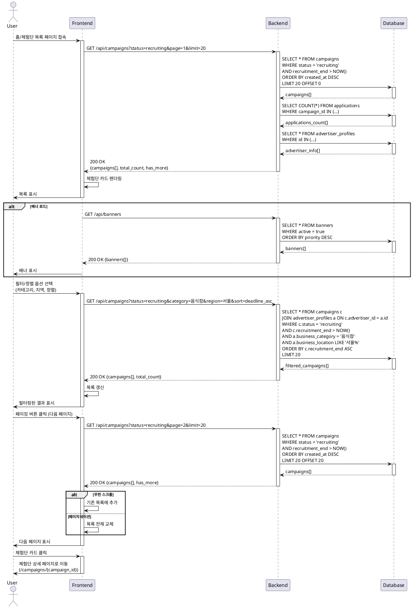

# Use Case 04: 홈 & 체험단 목록 탐색

## Primary Actor
- 로그인한 사용자 (인플루언서 또는 광고주)
- 비로그인 방문자 (선택)

## Precondition
- 사용자가 서비스에 접속한 상태
- (선택) 로그인 완료 상태

## Trigger
- 홈 페이지 접속
- 상단 메뉴에서 "체험단 목록" 클릭
- 검색 또는 필터 적용

## Main Scenario

1. 사용자가 홈 또는 체험단 목록 페이지 접근

2. FE가 목록 조회 요청
   - 기본 정렬: 등록일 최신순
   - 기본 필터: 모집 중인 체험단만

3. BE가 모집 중인 체험단 목록 조회
   - status = 'recruiting'
   - recruitment_end > 현재 시간
   - 페이징 적용 (기본 20개씩)

4. BE가 목록 데이터 반환
   - 체험단 기본 정보 (제목, 설명, 혜택, 모집 기간, 모집 인원)
   - 현재 지원자 수
   - 광고주 정보 (업체명, 카테고리)

5. FE가 체험단 카드 목록 렌더링
   - 카드 형식으로 표시
   - 각 카드에 주요 정보 요약
   - 배너 섹션 표시 (추천 체험단, 이벤트 등)

6. 사용자가 필터/정렬 옵션 선택 (선택)
   - 카테고리 필터
   - 지역 필터
   - 마감 임박순 정렬
   - 인기순 정렬

7. FE가 필터/정렬 적용하여 재조회
   - 쿼리 파라미터 업데이트
   - 목록 갱신

8. 사용자가 페이징 버튼 클릭 (더보기 또는 페이지 번호)

9. FE가 다음 페이지 데이터 요청

10. BE가 해당 페이지 데이터 반환

11. FE가 목록 갱신 또는 추가 렌더링

12. 사용자가 체험단 카드 클릭

13. FE가 체험단 상세 페이지로 이동
    - URL: `/campaigns/{campaign_id}`

## Edge Cases

### 빈 목록
- **증상**: 모집 중인 체험단이 없음
- **처리**: "현재 모집 중인 체험단이 없습니다" 안내 메시지, 알림 설정 권유

### 필터 결과 없음
- **증상**: 선택한 필터 조건에 맞는 체험단 없음
- **처리**: "조건에 맞는 체험단이 없습니다" 메시지, 필터 초기화 버튼 제공

### 페이징 끝
- **증상**: 마지막 페이지에 도달
- **처리**: "더 이상 체험단이 없습니다" 메시지, 다음 버튼 비활성화

### 로딩 지연
- **증상**: 목록 조회 응답 지연
- **처리**: 로딩 스피너 표시, 3초 이상 지연 시 "데이터를 불러오는 중입니다" 메시지

### 네트워크 오류
- **증상**: API 호출 실패
- **처리**: "목록을 불러올 수 없습니다" 오류 메시지, 재시도 버튼 제공

### 배너 로드 실패
- **증상**: 배너 이미지 또는 데이터 로드 실패
- **처리**: 배너 섹션 숨김 또는 기본 배너 표시, 주요 목록은 정상 표시

### 마감 체험단 표시
- **증상**: 조회 중 마감 시간이 지난 체험단 포함
- **처리**: 실시간으로 "모집 마감" 배지 표시, 클릭 시 상세 페이지에서 지원 불가 안내

### 캐시 데이터 불일치
- **증상**: 목록 페이지에서 본 정보와 상세 페이지 정보 불일치
- **처리**: 상세 페이지 진입 시 최신 데이터 재조회, TTL 기반 캐시 무효화

### 무한 스크롤 중복 로드
- **증상**: 무한 스크롤 사용 시 동일 페이지 중복 요청
- **처리**: 로딩 상태 플래그로 중복 요청 차단, 디바운싱 적용

### 비로그인 상태 제한
- **증상**: 비로그인 사용자가 목록 탐색
- **처리**: 목록 조회는 가능, 지원 버튼 클릭 시 로그인 페이지로 이동

## Business Rules

### 목록 표시 기준
- 기본적으로 `status = 'recruiting'`인 체험단만 표시
- `recruitment_end > NOW()`인 체험단만 표시
- 삭제되지 않은 체험단만 표시

### 정렬 옵션
- **최신순**: `created_at DESC` (기본)
- **마감 임박순**: `recruitment_end ASC`
- **인기순**: 지원자 수 기준 `applications_count DESC`
- **조회순**: 조회수 기준 (선택)

### 필터 옵션
- **카테고리**: 광고주 업종별 필터
- **지역**: 매장 위치 기준 시/도 필터
- **혜택 유형**: 무료 체험, 할인, 제품 제공 등 (선택)
- **모집 인원**: 소규모(~10명), 중규모(11~50명), 대규모(51명~)

### 페이징
- 기본 페이지 크기: 20개
- 최대 페이지 크기: 100개
- 오프셋 기반 페이징 또는 커서 기반 페이징
- 무한 스크롤 지원 (모바일)

### 카드 정보 표시
- 필수: 제목, 업체명, 카테고리, 모집 기간, 모집 인원
- 선택: 대표 이미지, 혜택 요약, 지역, 현재 지원자 수
- 마감 임박 배지: 마감 24시간 이내
- 모집 마감 배지: `recruitment_end < NOW()`

### 배너 시스템
- 상단 배너: 추천 체험단, 이벤트, 공지사항
- 배너 우선순위: 관리자 설정
- 배너 클릭 시 해당 체험단 또는 이벤트 페이지 이동

### 검색 기능 (선택)
- 검색 대상: 체험단 제목, 설명, 업체명
- 검색어 길이: 2자 이상
- 검색 결과 하이라이팅
- 최근 검색어 저장 (로컬 스토리지)

### 캐시 정책
- 목록 데이터 TTL: 5분
- 배너 데이터 TTL: 10분
- CDN 캐시 사용 권장

### 성능 최적화
- 이미지 레이지 로딩
- 가상 스크롤링 (대량 데이터)
- API 응답 압축 (gzip)
- 인덱스 활용: `campaigns(status, recruitment_end)`

### 접근 권한
- 비로그인 사용자: 목록 조회 가능, 상세 조회 가능, 지원 불가
- 인플루언서: 모든 기능 사용 가능
- 광고주: 목록 조회 가능, 지원 불가

### 데이터 일관성
- 조회 시점 기준 실시간 데이터 제공
- 지원자 수는 캐시 사용 가능 (1분 TTL)
- 모집 마감 여부는 실시간 확인

### UI/UX
- 모바일 반응형 디자인
- 카드 호버 시 미리보기 효과
- 스켈레톤 로딩 (초기 로드)
- 무한 스크롤 또는 페이지네이션 선택 가능

---

## Sequence Diagram

