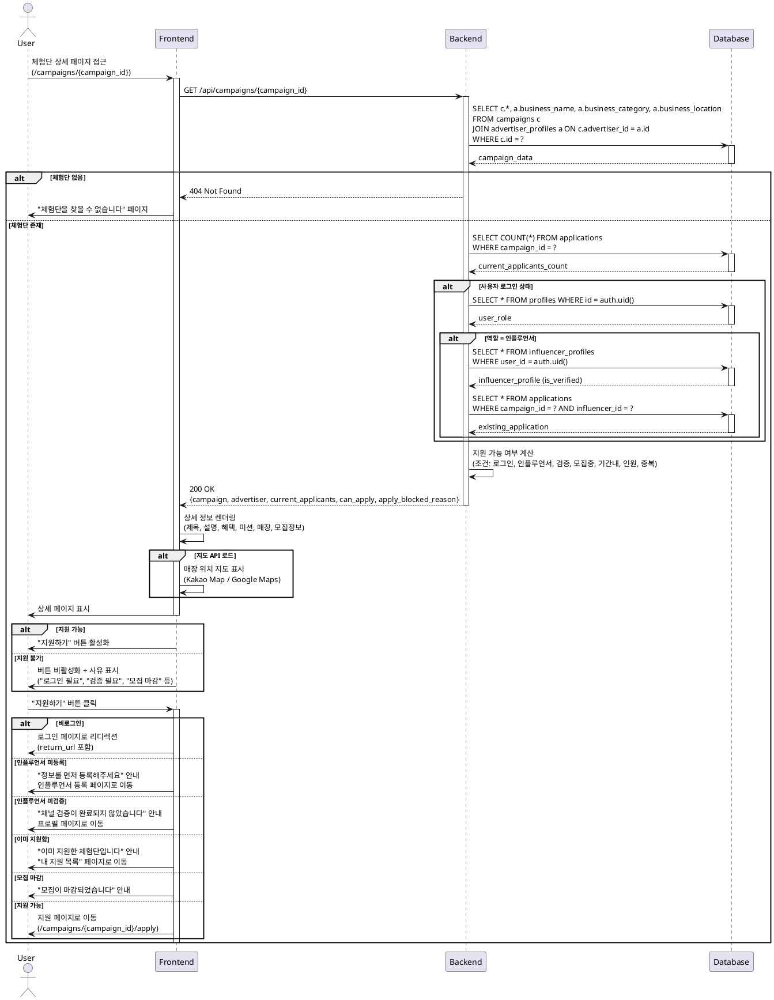

# Use Case 05: 체험단 상세

## Primary Actor
- 로그인한 사용자 (인플루언서 또는 광고주)
- 비로그인 방문자 (조회만 가능)

## Precondition
- 체험단 목록에서 특정 체험단 선택
- 또는 직접 URL로 접근

## Trigger
- 체험단 카드 클릭
- 공유된 링크로 접근
- 직접 URL 입력

## Main Scenario

1. 사용자가 체험단 상세 페이지 접근
   - URL: `/campaigns/{campaign_id}`

2. FE가 상세 정보 조회 요청

3. BE가 체험단 정보 조회
   - campaigns 테이블에서 기본 정보
   - advertiser_profiles 조인하여 광고주 정보
   - 현재 지원자 수 집계

4. BE가 사용자 권한 확인
   - 로그인 여부 확인
   - 인플루언서인 경우 등록 완료 여부 확인
   - 이미 지원한 체험단인지 확인

5. BE가 상세 데이터 반환
   - 체험단 정보 (제목, 설명, 혜택, 미션, 매장 위치, 모집 기간, 모집 인원)
   - 광고주 정보 (업체명, 카테고리, 위치)
   - 현재 지원자 수
   - 지원 가능 여부

6. FE가 상세 정보 렌더링
   - 체험단 기본 정보 섹션
   - 혜택 및 미션 섹션
   - 매장 정보 및 지도
   - 모집 정보 (기간, 인원, 현재 지원자 수)

7. FE가 지원 버튼 표시
   - 지원 가능: "지원하기" 버튼 활성화
   - 지원 불가: 버튼 비활성화 및 사유 표시

8. 사용자가 "지원하기" 버튼 클릭

9. FE가 권한 체크
   - 비로그인: 로그인 페이지로 이동
   - 인플루언서 미등록: 정보 등록 페이지로 이동
   - 인플루언서 미검증: "채널 검증 완료 후 지원 가능" 안내
   - 이미 지원: "이미 지원한 체험단입니다" 안내

10. 권한 확인 완료 시 지원 페이지로 이동
    - URL: `/campaigns/{campaign_id}/apply`

## Edge Cases

### 존재하지 않는 체험단
- **증상**: 잘못된 campaign_id 또는 삭제된 체험단
- **처리**: 404 페이지 표시, "체험단을 찾을 수 없습니다" 메시지

### 모집 마감된 체험단
- **증상**: `recruitment_end < NOW()` 또는 `status != 'recruiting'`
- **처리**: 상세 정보는 표시, 지원 버튼 비활성화, "모집이 마감되었습니다" 안내

### 모집 인원 초과
- **증상**: 현재 지원자 수 >= max_participants
- **처리**: "모집 인원이 마감되었습니다" 안내, 지원 버튼 비활성화

### 비로그인 상태
- **증상**: 로그인하지 않은 사용자가 접근
- **처리**: 상세 정보 조회 가능, "지원하기" 버튼 클릭 시 로그인 페이지로 리디렉션

### 광고주 역할 사용자
- **증상**: 광고주가 체험단 상세 페이지 접근
- **처리**: 상세 정보 조회 가능, 지원 버튼 숨김, "광고주는 지원할 수 없습니다" 안내 (선택)

### 인플루언서 미등록
- **증상**: 인플루언서 정보 미등록 상태
- **처리**: "지원하기" 버튼 클릭 시 "인플루언서 정보를 먼저 등록해주세요" 안내, 등록 페이지로 이동

### 인플루언서 미검증
- **증상**: `influencer_profiles.is_verified = false`
- **처리**: "채널 검증이 완료되지 않았습니다" 안내, 프로필 페이지로 이동 옵션

### 이미 지원한 체험단
- **증상**: applications 테이블에 이미 레코드 존재
- **처리**: "이미 지원한 체험단입니다" 안내, "내 지원 목록" 페이지로 이동 버튼 제공

### 매장 위치 정보 없음
- **증상**: store_location 데이터가 불완전하거나 지도 API 호출 실패
- **처리**: 텍스트로만 주소 표시, 지도 섹션 숨김 또는 오류 메시지

### 네트워크 오류
- **증상**: API 호출 실패
- **처리**: "상세 정보를 불러올 수 없습니다" 오류 메시지, 재시도 버튼 제공

### 페이지 새로고침 시 데이터 불일치
- **증상**: 조회 중 모집 상태 변경
- **처리**: 최신 데이터로 자동 갱신, 사용자에게 변경 알림

## Business Rules

### 상세 정보 표시
- **필수**: 제목, 설명, 혜택, 미션, 매장 위치, 모집 기간, 모집 인원
- **선택**: 대표 이미지, 추가 이미지, 태그, 주의사항
- **실시간 정보**: 현재 지원자 수, 모집 마감까지 남은 시간

### 지원 가능 조건
1. 로그인 상태
2. 역할 = 인플루언서
3. 인플루언서 정보 등록 완료
4. 채널 검증 완료 (`is_verified = true`)
5. 체험단 상태 = 모집 중 (`status = 'recruiting'`)
6. 모집 기간 내 (`recruitment_start <= NOW() <= recruitment_end`)
7. 모집 인원 미달 (현재 지원자 수 < max_participants)
8. 중복 지원 아님

### 지원 버튼 상태
- **활성화**: 모든 조건 충족
- **비활성화 + 안내**:
  - "로그인이 필요합니다" (비로그인)
  - "인플루언서 정보를 등록해주세요" (미등록)
  - "채널 검증이 필요합니다" (미검증)
  - "모집이 마감되었습니다" (기간 초과 또는 인원 초과)
  - "이미 지원한 체험단입니다" (중복 지원)

### 광고주 정보 표시
- 업체명, 카테고리, 위치
- 프로필 이미지 (선택)
- 다른 체험단 보기 링크

### 매장 위치
- 주소 텍스트 표시
- 지도 API 연동 (Kakao Map, Google Maps 등)
- 길찾기 링크 제공

### 모집 정보
- 모집 기간: 시작일 ~ 종료일 (YYYY.MM.DD HH:mm)
- 모집 인원: "N명 모집 중"
- 현재 지원 현황: "현재 M명 지원" (실시간)
- 마감 임박 표시: 24시간 이내 "마감 임박" 배지

### 접근 권한
- **비로그인**: 조회 가능, 지원 불가
- **인플루언서**: 조회 및 지원 가능 (조건 충족 시)
- **광고주**: 조회 가능, 지원 불가
- **본인이 등록한 체험단**: 광고주는 "관리" 버튼 표시, 인플루언서는 지원 불가

### 공유 기능
- URL 복사, SNS 공유 버튼 (선택)
- 오픈 그래프 메타 태그 설정 (제목, 설명, 이미지)

### 조회수 집계
- 고유 사용자 기준 (IP 또는 세션)
- 24시간 내 동일 사용자 중복 집계 방지
- 비동기 처리 (성능 최적화)

### 데이터 신선도
- 체험단 정보: 캐시 TTL 5분
- 지원자 수: 캐시 TTL 1분 또는 실시간
- 사용자 권한 정보: 세션 기반, 캐시 없음

### 성능 최적화
- 이미지 최적화 (WebP, lazy loading)
- 지도 API 지연 로딩
- 인덱스 활용: `campaigns(id, status)`, `applications(campaign_id, influencer_id)`

### UI/UX
- 모바일 반응형 디자인
- 스티키 지원 버튼 (스크롤 시 고정)
- 브레드크럼 네비게이션
- 뒤로가기 버튼 (목록으로 돌아가기)

### 보안
- campaign_id 검증 (UUID 형식)
- SQL Injection 방어
- 사용자 권한 서버 사이드 재검증

---

## Sequence Diagram

