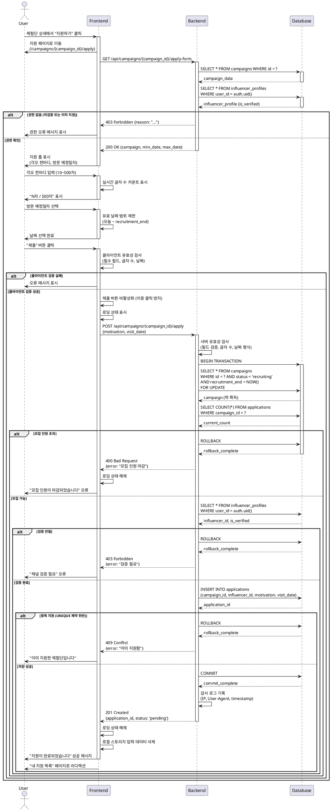

# Use Case 06: 체험단 지원

## Primary Actor
- 검증 완료된 인플루언서

## Precondition
- 로그인 상태
- 인플루언서 정보 등록 완료
- 채널 검증 완료 (`is_verified = true`)
- 체험단 상세 페이지에서 "지원하기" 버튼 클릭
- 해당 체험단에 아직 지원하지 않음

## Trigger
- 체험단 상세 페이지에서 "지원하기" 버튼 클릭

## Main Scenario

1. 사용자가 지원 페이지 접근
   - URL: `/campaigns/{campaign_id}/apply`

2. FE가 지원 폼 표시
   - 체험단 기본 정보 요약 (제목, 업체명)
   - 각오 한마디 입력 필드 (텍스트 에리어)
   - 방문 예정일자 선택 (날짜 선택기)

3. 사용자가 각오 한마디 입력
   - 최소 10자, 최대 500자

4. 사용자가 방문 예정일자 선택
   - 달력에서 날짜 선택
   - 모집 기간 내 날짜만 선택 가능

5. 사용자가 "제출" 버튼 클릭

6. FE가 클라이언트 유효성 검사
   - 각오 한마디 필수 입력 확인
   - 글자 수 제한 확인 (10~500자)
   - 방문 예정일자 필수 선택 확인
   - 날짜 유효성 확인 (과거 날짜 불가)

7. BE가 서버 유효성 검사
   - 필드 유효성 재검증
   - 모집 기간 내 여부 확인
   - 모집 인원 초과 여부 확인
   - 중복 지원 확인

8. BE가 사용자 권한 재확인
   - 로그인 상태 확인
   - 인플루언서 역할 확인
   - 채널 검증 완료 확인

9. BE가 DB에 지원 정보 저장
   - applications 테이블에 INSERT
   - status = 'pending'

10. BE가 성공 응답 반환

11. FE가 성공 피드백 표시
    - "지원이 완료되었습니다" 메시지
    - "내 지원 목록에서 확인하세요" 안내

12. FE가 리디렉션
    - "내 지원 목록" 페이지로 이동
    - 또는 홈으로 이동 옵션 제공

## Edge Cases

### 각오 한마디 미입력
- **증상**: 텍스트 에리어가 비어있음
- **처리**: "각오 한마디를 입력해주세요" 오류 메시지

### 글자 수 제한 초과/미달
- **증상**: 10자 미만 또는 500자 초과
- **처리**: "10자 이상 500자 이하로 입력해주세요 (현재 N자)" 실시간 표시

### 방문 예정일자 미선택
- **증상**: 날짜 선택 없이 제출
- **처리**: "방문 예정일자를 선택해주세요" 오류 메시지

### 과거 날짜 선택
- **증상**: 오늘보다 이전 날짜 선택
- **처리**: "오늘 이후의 날짜를 선택해주세요" 오류 메시지

### 모집 기간 외 날짜 선택
- **증상**: 체험단 모집 종료 이후 날짜 선택
- **처리**: "모집 기간 내의 날짜를 선택해주세요" 오류 메시지 (클라이언트에서 선택 차단)

### 중복 지원 시도
- **증상**: 이미 지원한 체험단에 재지원
- **처리**: "이미 지원한 체험단입니다" 오류 메시지, "내 지원 목록" 페이지로 이동

### 모집 기간 종료
- **증상**: 제출 시점에 모집 기간 종료
- **처리**: "모집이 마감되었습니다" 오류 메시지, 상세 페이지로 리디렉션

### 모집 인원 초과
- **증상**: 제출 직전 다른 사용자들의 지원으로 인원 초과
- **처리**: "모집 인원이 마감되었습니다" 오류 메시지, 상세 페이지로 리디렉션

### 권한 변경
- **증상**: 제출 중 사용자의 검증 상태 변경 (is_verified = false)
- **처리**: "채널 검증 상태를 확인해주세요" 오류 메시지

### 네트워크 오류
- **증상**: 제출 중 네트워크 끊김
- **처리**: "네트워크 오류가 발생했습니다" 메시지, 재시도 버튼 제공, 입력 데이터 보존

### 서버 오류
- **증상**: DB 저장 실패
- **처리**: "일시적인 오류가 발생했습니다. 잠시 후 다시 시도해주세요" 메시지

### 동시 제출 충돌
- **증상**: 동일 사용자가 여러 탭에서 동시 제출
- **처리**: UNIQUE 제약 조건으로 차단, "이미 지원이 처리되었습니다" 메시지

## Business Rules

### 필수 입력 정보
- 각오 한마디: 10자 이상 500자 이하 필수
- 방문 예정일자: 필수 선택

### 각오 한마디 규칙
- 최소 길이: 10자
- 최대 길이: 500자
- 허용 문자: 한글, 영문, 숫자, 특수문자, 이모지
- 금지 단어 필터링 (욕설, 비속어 등)
- 실시간 글자 수 표시

### 방문 예정일자 규칙
- 오늘 날짜 이후만 선택 가능
- 체험단 모집 종료일 이전까지만 선택 가능
- 공휴일 선택 가능 (제한 없음)
- 날짜 형식: YYYY-MM-DD

### 지원 가능 조건 (재검증)
1. 로그인 상태
2. 역할 = 인플루언서
3. 채널 검증 완료 (`is_verified = true`)
4. 체험단 상태 = 모집 중 (`status = 'recruiting'`)
5. 모집 기간 내 (`NOW() <= recruitment_end`)
6. 모집 인원 미달 (현재 지원자 수 < max_participants)
7. 중복 지원 아님 (UNIQUE 제약)

### 중복 지원 방지
- DB UNIQUE 제약: `(campaign_id, influencer_id)`
- 클라이언트 사전 체크
- 서버 사이드 재확인

### 지원 상태
- 초기 상태: `pending` (신청 완료)
- 이후 상태 전환: 광고주가 선정 시 `selected` 또는 `rejected`

### 데이터 저장
- applications 테이블에 저장
- created_at: 자동 생성 (제출 시각)
- updated_at: 자동 생성
- 감사 로그 기록 (IP, User-Agent)

### 제출 후 처리
- 즉시 "내 지원 목록"에 반영
- 광고주에게 알림 (선택)
- 지원자 수 실시간 업데이트

### 취소 정책
- 제출 후 취소 불가 (비즈니스 정책)
- 취소 필요 시 고객센터 문의
- 또는 별도 취소 기능 구현 (선택)

### UI/UX
- 입력 중 자동 저장 (로컬 스토리지)
- 페이지 이탈 시 경고 (입력 내용 있을 경우)
- 제출 버튼 이중 클릭 방지
- 로딩 상태 표시 (제출 중)

### 성능 최적화
- 낙관적 UI 업데이트 (제출 즉시 성공 가정)
- 실패 시 롤백 처리
- 제출 버튼 디바운싱

### 보안
- CSRF 토큰 검증
- 레이트 리밋: 1분당 최대 3회 제출 시도
- SQL Injection 방어
- XSS 방어 (입력 값 이스케이프)

### 알림
- 제출 성공 시 이메일/푸시 알림 (선택)
- 광고주에게 신규 지원 알림 (선택)

### 데이터 무결성
- 트랜잭션 처리 (지원 저장 + 지원자 수 증가)
- 동시성 제어 (모집 인원 초과 방지)

---

## Sequence Diagram

