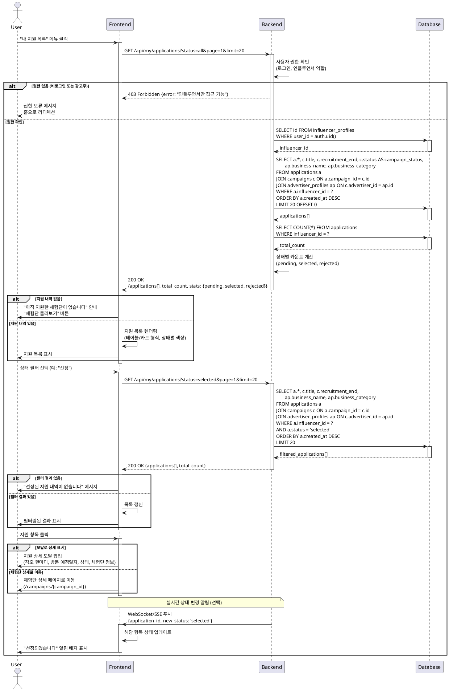

# Use Case 07: 내 지원 목록 (인플루언서 전용)

## Primary Actor
- 인플루언서 역할 사용자

## Precondition
- 로그인 상태
- 역할이 인플루언서로 설정됨
- 인플루언서 정보 등록 완료 (필수는 아니지만 권장)

## Trigger
- 상단 메뉴에서 "내 지원 목록" 클릭
- 사이드바/네비게이션에서 "마이페이지" → "지원 내역" 선택
- 지원 완료 후 자동 리디렉션

## Main Scenario

1. 사용자가 내 지원 목록 페이지 접근
   - URL: `/my/applications`

2. FE가 초기 필터 상태 설정
   - 기본: 전체 상태 표시
   - 정렬: 최신 지원순

3. FE가 지원 목록 조회 요청

4. BE가 사용자 권한 확인
   - 로그인 확인
   - 인플루언서 역할 확인
   - influencer_profile_id 조회

5. BE가 지원 목록 조회
   - applications 테이블에서 본인 지원 내역만 조회
   - campaigns 테이블 조인하여 체험단 정보 가져오기
   - advertiser_profiles 조인하여 광고주 정보 가져오기

6. BE가 목록 데이터 반환
   - 지원 ID, 체험단 제목, 업체명, 지원 일시
   - 각오 한마디, 방문 예정일자
   - 상태 (pending, selected, rejected)

7. FE가 지원 목록 렌더링
   - 테이블 또는 카드 형식
   - 상태별 색상 구분
   - 체험단별 상세 정보 표시

8. 사용자가 상태 필터 선택 (선택)
   - 전체 / 신청완료 / 선정 / 반려

9. FE가 필터 적용하여 재조회
   - 쿼리 파라미터 업데이트
   - 목록 갱신

10. 사용자가 지원 항목 클릭

11. FE가 상세 정보 표시 또는 체험단 상세 페이지로 이동
    - 팝업/모달로 상세 정보 표시
    - 또는 체험단 상세 페이지로 이동

## Edge Cases

### 지원 내역 없음
- **증상**: 아직 지원한 체험단이 없음
- **처리**: "아직 지원한 체험단이 없습니다" 안내, "체험단 둘러보기" 버튼 제공

### 필터 결과 없음
- **증상**: 선택한 상태 필터에 해당하는 지원 없음
- **처리**: "해당 상태의 지원 내역이 없습니다" 메시지, 필터 초기화 버튼

### 삭제된 체험단
- **증상**: 지원한 체험단이 삭제됨
- **처리**: 지원 내역은 유지, 체험단 정보 "삭제된 체험단" 표시, 상세 페이지 이동 불가

### 권한 오류
- **증상**: 광고주 또는 비로그인 사용자 접근
- **처리**: "인플루언서만 접근 가능합니다" 오류, 홈으로 리디렉션

### 네트워크 오류
- **증상**: API 호출 실패
- **처리**: "지원 목록을 불러올 수 없습니다" 오류, 재시도 버튼

### 로딩 지연
- **증상**: 목록 조회 응답 지연
- **처리**: 스켈레톤 로딩 또는 스피너 표시

### 페이징 끝
- **증상**: 마지막 페이지 도달
- **처리**: "모든 지원 내역을 확인했습니다" 메시지, 다음 버튼 비활성화

### 상태 변경 알림
- **증상**: 조회 중 광고주가 선정 결과 발표
- **처리**: 실시간 업데이트 (WebSocket) 또는 새로고침 안내

### 데이터 불일치
- **증상**: 캐시와 실제 데이터 불일치
- **처리**: 페이지 진입 시 최신 데이터 재조회, Pull-to-Refresh 지원

### 대량 데이터
- **증상**: 지원 내역이 수백 개 이상
- **처리**: 페이징 또는 무한 스크롤, 가상 스크롤링 적용

## Business Rules

### 목록 표시 기준
- 본인이 지원한 모든 체험단 표시
- 삭제된 체험단도 내역 유지 (감사 목적)
- 정렬: 지원 일시 최신순 (기본)

### 상태 필터
- **전체**: 모든 상태 표시
- **신청완료** (`pending`): 광고주 검토 대기 중
- **선정** (`selected`): 체험단 선정됨
- **반려** (`rejected`): 선정되지 않음

### 표시 정보
- **필수**: 체험단 제목, 업체명, 지원 일시, 상태
- **선택**: 각오 한마디, 방문 예정일자, 모집 기간, 카테고리
- **상태별 배지**: 색상 구분 (pending=노랑, selected=초록, rejected=회색)

### 정렬 옵션
- **최신 지원순**: `created_at DESC` (기본)
- **상태별**: `status ASC, created_at DESC`
- **체험단 이름순**: `campaign_title ASC`

### 페이징
- 기본 페이지 크기: 20개
- 무한 스크롤 지원 (모바일)
- 페이지네이션 지원 (웹)

### 상세 정보 표시
- 클릭 시 모달/팝업으로 상세 정보 표시
- 또는 체험단 상세 페이지로 이동 (선택)
- 표시 내용: 지원 정보 전체, 체험단 상세, 광고주 정보

### 접근 권한
- 인플루언서만 접근 가능
- RLS(Row Level Security)로 본인 데이터만 조회
- 다른 인플루언서의 지원 내역 조회 불가

### 상태 변경 알림
- 선정/반려 시 이메일/푸시 알림 (선택)
- 실시간 알림 (WebSocket/SSE, 선택)
- 배지 표시 (신규 상태 변경)

### 취소 기능
- 지원 취소 불가 (비즈니스 정책)
- 필요 시 고객센터 문의 안내
- 또는 별도 취소 버튼 구현 (선택)

### 캐시 정책
- 목록 데이터 TTL: 1분
- 실시간 데이터 우선 (상태 변경)
- Pull-to-Refresh 지원

### 성능 최적화
- 인덱스 활용: `applications(influencer_id, created_at DESC)`
- 조인 최적화 (필요한 컬럼만 SELECT)
- 페이징으로 대량 데이터 처리

### 데이터 보존
- 체험단 삭제 시에도 지원 내역 유지
- 광고주 탈퇴 시에도 지원 내역 유지 (감사 목적)
- 개인정보 보호법 준수 (회원 탈퇴 시 삭제)

### UI/UX
- 모바일 반응형 디자인
- 상태별 색상 구분 (직관적)
- 빈 상태(Empty State) 디자인
- 스켈레톤 로딩 (초기 로드)

### 통계 정보
- 상단에 요약 표시 (선택)
- 전체 지원 수, 선정 수, 반려 수, 대기 수

### 검색 기능 (선택)
- 체험단 제목, 업체명으로 검색
- 검색어 하이라이팅

---

## Sequence Diagram

