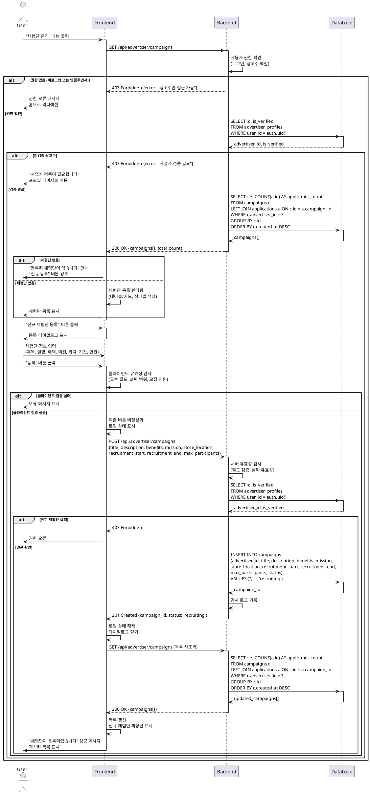

# Use Case 08: 광고주 체험단 관리

## Primary Actor
- 검증 완료된 광고주

## Precondition
- 로그인 상태
- 역할이 광고주로 설정됨
- 광고주 정보 등록 완료
- 사업자등록번호 검증 완료 (`is_verified = true`)

## Trigger
- 상단 메뉴에서 "체험단 관리" 클릭
- 대시보드에서 "내 체험단" 섹션 선택
- 홈에서 광고주 전용 메뉴 접근

## Main Scenario

### A. 체험단 목록 조회

1. 사용자가 체험단 관리 페이지 접근
   - URL: `/advertiser/campaigns`

2. FE가 목록 조회 요청

3. BE가 사용자 권한 확인
   - 로그인 확인
   - 광고주 역할 확인
   - advertiser_profile_id 조회
   - 검증 완료 여부 확인

4. BE가 내가 등록한 체험단 목록 조회
   - campaigns 테이블에서 본인 체험단만 조회
   - 지원자 수 집계

5. BE가 목록 데이터 반환

6. FE가 체험단 목록 렌더링
   - 테이블 또는 카드 형식
   - 상태별 색상 구분 (모집중, 모집종료, 선정완료)
   - 각 체험단별 지원자 수 표시

### B. 신규 체험단 등록

7. 사용자가 "신규 체험단 등록" 버튼 클릭

8. FE가 등록 다이얼로그(Dialog) 표시
   - 체험단 정보 입력 폼

9. 사용자가 체험단 정보 입력
   - 제목, 설명, 혜택, 미션
   - 매장 위치
   - 모집 시작일, 모집 종료일
   - 모집 인원

10. 사용자가 "등록" 버튼 클릭

11. FE가 클라이언트 유효성 검사

12. BE가 서버 유효성 검사
    - 광고주 권한 재확인
    - 필드 유효성 검증
    - 날짜 유효성 확인

13. BE가 DB에 체험단 저장
    - campaigns 테이블에 INSERT
    - status = 'recruiting'

14. BE가 성공 응답 반환

15. FE가 목록 갱신
    - 신규 체험단이 목록 최상단에 추가

16. FE가 성공 피드백 표시
    - "체험단이 등록되었습니다" 메시지

## Edge Cases

### 권한 없음 (미검증 광고주)
- **증상**: 사업자등록번호 미검증 상태
- **처리**: "사업자 검증이 필요합니다" 안내, 프로필 페이지로 이동

### 권한 없음 (인플루언서/비로그인)
- **증상**: 광고주가 아닌 사용자 접근
- **처리**: "광고주만 접근 가능합니다" 오류, 홈으로 리디렉션

### 체험단 없음
- **증상**: 아직 등록한 체험단이 없음
- **처리**: "등록된 체험단이 없습니다" 안내, "신규 등록" 버튼 강조

### 필수 필드 미입력
- **증상**: 체험단 정보 중 필수 필드 누락
- **처리**: "모든 필수 항목을 입력해주세요" 오류, 해당 필드 강조

### 잘못된 날짜 범위
- **증상**: 모집 종료일이 시작일보다 이전
- **처리**: "모집 종료일은 시작일 이후여야 합니다" 오류

### 과거 날짜 선택
- **증상**: 모집 시작일이 과거 날짜
- **처리**: "모집 시작일은 오늘 이후여야 합니다" 오류 (또는 허용, 비즈니스 정책에 따라)

### 모집 인원 0 또는 음수
- **증상**: 잘못된 모집 인원 입력
- **처리**: "모집 인원은 1명 이상이어야 합니다" 오류

### 글자 수 제한 초과
- **증상**: 제목, 설명 등이 최대 길이 초과
- **처리**: "최대 N자까지 입력 가능합니다" 실시간 경고

### 네트워크 오류
- **증상**: 등록 중 네트워크 끊김
- **처리**: "네트워크 오류가 발생했습니다" 메시지, 재시도 버튼, 입력 데이터 보존

### 서버 오류
- **증상**: DB 저장 실패
- **처리**: "일시적인 오류가 발생했습니다. 잠시 후 다시 시도해주세요"

### 대량 등록 시도
- **증상**: 짧은 시간 내 여러 체험단 등록
- **처리**: 레이트 리밋 적용, "잠시 후 다시 시도해주세요"

### 삭제된 체험단 표시
- **증상**: 목록 조회 중 삭제된 체험단 포함
- **처리**: 삭제된 체험단은 목록에서 제외 또는 "삭제됨" 표시

## Business Rules

### 접근 권한
- 광고주만 접근 가능
- 사업자등록번호 검증 완료 필수 (`is_verified = true`)
- RLS로 본인이 등록한 체험단만 조회/관리

### 목록 표시
- 본인이 등록한 모든 체험단 표시
- 정렬: 등록일 최신순 (기본)
- 상태별 색상 구분

### 체험단 상태
- **모집중** (`recruiting`): 현재 지원 접수 중
- **모집종료** (`closed`): 모집 마감, 선정 대기
- **선정완료** (`selected`): 인원 선정 완료
- **완료** (`completed`): 체험 활동 종료 (선택)

### 필수 입력 정보
- 제목 (최대 255자)
- 설명 (최대 2000자)
- 혜택 (최대 500자)
- 미션 (최대 500자)
- 매장 위치 (최대 500자)
- 모집 시작일
- 모집 종료일
- 모집 인원 (1명 이상)

### 날짜 규칙
- 모집 시작일: 오늘 이후 (또는 오늘 포함, 비즈니스 정책에 따라)
- 모집 종료일: 모집 시작일 이후
- 최소 모집 기간: 1일 이상 권장
- 최대 모집 기간: 제한 없음 (또는 90일 제한, 선택)

### 모집 인원 규칙
- 최소: 1명
- 최대: 제한 없음 (또는 100명 제한, 선택)
- 정수만 입력 가능

### 체험단 생성 제한
- 동시 진행 가능한 체험단 수 제한 (선택, 예: 최대 10개)
- 레이트 리밋: 1시간당 최대 5개 등록

### 초기 상태
- 등록 시 자동으로 `status = 'recruiting'`
- 모집 기간 내 자동 활성화

### 수정 정책
- 모집 중인 체험단: 일부 정보 수정 가능 (제목, 설명, 모집 인원 증가)
- 모집 종료 후: 수정 불가 (비즈니스 정책)
- 모집 인원 감소 불가 (지원자 보호)

### 삭제 정책
- 지원자가 없는 체험단: 삭제 가능
- 지원자가 있는 체험단: 삭제 불가, "모집 종료" 처리만 가능

### 통계 정보
- 각 체험단별 현재 지원자 수 표시
- 모집 인원 대비 지원률 (예: "15/20명")
- 총 체험단 수, 모집 중 수 표시 (선택)

### UI/UX
- 다이얼로그(Dialog) 형식으로 등록 폼 표시
- 입력 중 자동 저장 (로컬 스토리지, 선택)
- 제출 버튼 이중 클릭 방지
- 모바일 반응형 디자인

### 성능 최적화
- 인덱스 활용: `campaigns(advertiser_id, created_at DESC)`
- 페이징 적용 (기본 20개)

### 알림
- 신규 지원 시 알림 (선택)
- 모집 마감 임박 알림 (선택)

### 데이터 보존
- 체험단 정보 영구 보존 (감사 목적)
- 소프트 삭제 권장 (deleted_at 컬럼)

---

## Sequence Diagram

